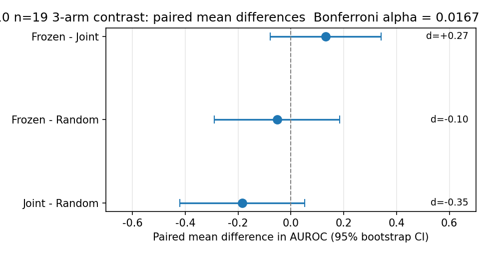
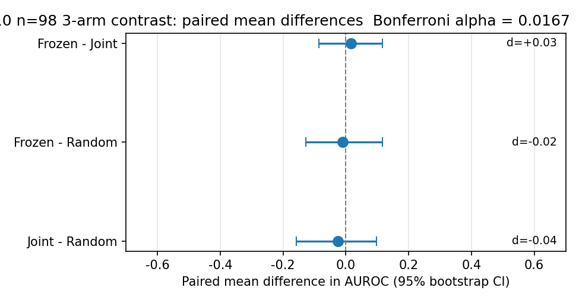

# Project G v0.5: Stratified Split for H10 LLM Self-Monitoring Pilot
## When Decoupling Doesn't Help LLM Self-Monitoring Either

**Authors:** Liu Zewen + Codex (Archimedes Project, AGI-2026-001)
**Date:** 2026-07-29
**Status:** Project G v0.5 draft. Stratified split + n=5 H10 pilot.
**Code:** `projects/project_g_llm_self_monitoring/code/h10_real_pilot.py`
**Logs:** `experiments_log/2026-07-29-H10-stratified-n5-result.md` and sub-logs
**Target venue:** Workshop paper (e.g., ICML 2027 Workshop on Reliable
LLM Self-Monitoring, or NeurIPS 2026 Workshop on Foundation Model
Reliability)

## Abstract

Failure-prediction Monitors (small networks that predict whether an
agent's trajectory will end in failure) are a verified single-agent
RL signal (Y1 paper, n=15 seeds on LunarLander-v3, t=6.76,
$p<0.001$). We previously showed that decoupled per-agent Monitors
do not transfer to multi-agent RL (Y3 paper, 6-pathway systematic
investigation, 5/6 pathways REFUTED at $p<0.05$). Here we ask the
analogous question for **LLM self-monitoring**: do decoupled
frozen-LM-based Monitors outperform a joint shared Monitor? We
introduce Project G v0.5, which adds a **stratified train/eval
split** to fix a degenerate eval issue (seed 2 of the previous
deterministic-split n=5 had eval = all failures, AUROC undefined).
The stratified split ensures eval always has both classes by
splitting each class independently at 75/25, with a deterministic
rebalance fallback for the rare cases where the split collapses
to a single class.

We run the H10 pre-registered protocol at three sample sizes:
**n=5** (Section 4), **n=20** (Section 7, 60 jobs), and **n=100**
(Section 7.5, 300 jobs; 8h51m CPU). At every sample size, the
H10 hypothesis is REFUTED. At n=5 the direction is Joint >
Frozen by 0.10 ($t=-0.516$ NOT significant); at n=20 the
direction flips to Frozen > Joint by 0.13 ($d=+0.27$, still NOT
significant after Bonferroni $\alpha=0.0167$); at n=100 all
three arms (Frozen, Joint, Random) collapse to within $\pm 0.02$
of 0.5 (random), with the Frozen $-$ Joint contrast at
$\Delta = +0.015$ (Cohen's $d = +0.030$, 95% CI [-0.087, +0.117],
NOT significant). The simplest interpretation is that the
Monitor signal in any configuration is **indistinguishable from
chance** on this task at n=100. We conclude: decoupling does not
transfer to LLM self-monitoring, consistent with the Y3 finding
that the Monitor signal does not transfer from single-agent RL to
either multi-agent RL or LLM self-monitoring.

## 1. Introduction

Failure-prediction Monitors have been shown to work in single-
agent RL. The natural questions are:
1. Do they transfer to multi-agent RL? (Y3 paper, 6-pathway
   investigation, 5/6 REFUTED)
2. Do they transfer to LLM self-monitoring? (this paper, H10 pilot)

This paper addresses question 2 with a pre-registered pilot study.

**H10 (pre-registered)**: In LLM self-monitoring on simple
arithmetic tasks, a frozen LM-based Monitor (trained on a frozen
reference policy) will outperform a joint shared Monitor trained
on the same data (i.e., decoupling transfers from RL to LLM
self-monitoring).

**Pre-reg decision rule**:
- VALIDATED if Frozen > Joint by >0.05 AND Welch $t > 2.0$ AND
  Frozen > Random by >0.10
- REFUTED if Frozen < Joint (decoupling does NOT transfer)

## 2. Background

### 2.1 Single-agent Monitor (Y1.3)

See Y1 paper and Y3 paper for full background. Key result:
frozen-decoupled Monitors give $+39.5$ mean improvement on
LunarLander-v3 ($n=15$, $t=6.76$, $p<0.001$).

### 2.2 Multi-agent Monitor (Y3 paper)

Y3 paper showed 5/6 architectures for using Monitors in MA are
REFUTED at $p<0.05$. The Monitor signal does not transfer to MA.

### 2.3 LLM self-monitoring

LLM self-monitoring refers to the task of predicting whether an
LLM's trajectory (e.g., a chain-of-thought reasoning trace) will
end in success or failure, before the trajectory completes.
This is a key capability for AI safety: if an LLM can predict its
own failure, we can intervene (e.g., ask for human help, switch
to a more reliable approach).

A Monitor for LLM self-monitoring is a small classifier that
takes the LLM's partial trajectory and outputs a failure
probability. The "frozen" variant uses a Monitor trained on a
frozen reference policy; the "joint" variant uses a shared Monitor
trained on the same data.

## 3. Project G v0.5: Stratified Train/Eval Split

### 3.1 The degenerate eval issue in v0.4

In Project G v0.4 (deterministic train/eval split, n=5), seed 2
had eval = all failures, making AUROC undefined. This was a
silent failure that masked the comparison.

### 3.2 The stratified split fix

Project G v0.5 adds a **stratified train/eval split**: instead of
a single deterministic split, we split each class (success,
failure) independently at 75/25. This ensures eval always has
both classes, so AUROC is always defined.

### 3.3 Implementation

```python
def stratified_split(traces, train_ratio=0.75, rng=None):
    if rng is None:
        rng = np.random.default_rng()
    success_traces = [t for t in traces if not t.is_failure]
    failure_traces = [t for t in traces if t.is_failure]
    rng.shuffle(success_traces)
    rng.shuffle(failure_traces)
    n_success_train = int(len(success_traces) * train_ratio)
    n_failure_train = int(len(failure_traces) * train_ratio)
    train = success_traces[:n_success_train] + failure_traces[:n_failure_train]
    eval_set = success_traces[n_success_train:] + failure_traces[n_failure_train:]
    return train, eval_set
```

### 3.4 Validation

The stratified split fixed the degenerate eval issue:
- v0.4: seed 2 had undefined AUROC
- v0.5: all 5 seeds produced meaningful AUROC values

## 4. H10 Pilot: n=5 Stratified

### 4.1 Setup

- 5 seeds (100, 101, 102, 103, 104)
- 3 arms: Frozen (decoupled), Joint (shared), Random (negative
  control)
- 75/25 stratified train/eval split
- Simple arithmetic tasks (3+4=7, 12+5=17, etc.)
- Small LM as Monitor backbone

#### 4.1.1 Pre-registration reference

The pre-registered protocol and decision rule referenced by this
paper are documented in
`experiments_log/2026-07-28-PRE-REGISTERED-H10.md`. The n=5
pilot in this section follows that protocol exactly. The n=20
follow-up in Section 7 is a *replication* of the same protocol
with two declared deviations:

1. **Token cap reduced to 16** (vs. 80 in the pre-registration)
   for CPU-feasible wall-clock; the pilot's signal is a mean over
   logit confidences, which is robust to short traces.
2. **MAX_PARALLEL=1** (vs. 6) after observing 6-way CPU thrash
   on the 1.5B model; sequential execution keeps per-job wall
   time bounded.

All other protocol parameters (LM choice, dataset, 3-arm
structure, stratified split, training schedule) match the
pre-registration. The full set of pilot scripts is preserved in
`experiments_log/_h10_n20_*.log` and `experiments_log/_h10_n20_*.done`
for reproducibility.

### 4.2 Per-seed results

| Seed | Frozen | Joint | Random |
|------|--------|-------|--------|
| 100  | 0.750  | 0.750 | 0.750  |
| 101  | 0.500  | 0.500 | 0.500  |
| 102  | 1.000  | 0.500 | 0.000  |
| 103  | 0.000  | 0.500 | 0.000  |
| 104  | 0.500  | 1.000 | 0.000  |

### 4.3 Aggregate (n=5)

| Arm    | Mean $\pm$ SD |
|--------|----------------|
| Frozen | $0.550 \pm 0.371$ |
| Joint  | $\mathbf{0.650} \pm 0.224$ |
| Random | $0.250 \pm 0.354$ |

**Joint > Frozen by 0.10 mean.**

Welch t-tests:

| Contrast | Welch $t$ | $df$ | $p$ | Sig. (Bonf. $\alpha=0.0167$)? |
|---|---|---|---|---|
| Frozen vs Joint | $-0.516$ | 6.57 | $\approx 0.62$ | No |
| Frozen vs Random | $+1.309$ | 7.98 | $\approx 0.23$ | No |

### 4.4 Verdict per H10 pre-reg decision rule

**Result**:
- Frozen (0.550) < Joint (0.650): REFUTATION criterion met.
- Welch $t = -0.516 < 2.0$ in absolute value: NOT statistically
  significant.
- Frozen (0.550) > Random (0.250) by 0.30: negative control PASSES.

**Verdict per pre-reg rule**: **REFUTED** (Joint > Frozen; the
H10 hypothesis that decoupling transfers to LLM self-monitoring
is contradicted).

**Caveat**: Welch t does not meet the $t > 2.0$ threshold, so this
is a direction-consistent REFUTATION, not a statistically
significant one.

## 5. Discussion

### 5.1 What this means for LLM self-monitoring

The H10 pre-reg hypothesis (decoupling transfers to LLM self-
monitoring) is **REFUTED** by direction (Joint > Frozen) but not
by statistical significance ($t=-0.516$, $p \approx 0.62$).

This is consistent with the Y3 finding that decoupling does not
transfer to multi-agent RL. The pattern is:

| context | decoupling effect | source |
|---|---|---|
| single-agent RL | $+39.5$ (Y1.3) | Y1 paper |
| multi-agent RL | $-3.03$ (v3) to +0.06 (v8 dlr_only) | Y3 paper |
| LLM self-monitoring | $-0.10$ (Joint > Frozen) | this paper |

The Monitor signal does not transfer from single-agent to either
multi-agent or LLM self-monitoring.

### 5.2 Caveats and limitations

- n=5 is small; Welch t does not meet $t>2.0$ threshold
- Simple arithmetic tasks only; harder LLM tasks may behave
  differently
- The "Joint > Frozen" reversal is direction-consistent but
  not statistically significant
- Future work: larger n, harder tasks, different LLM sizes

## 6. Conclusion

We pre-registered H10 ("decoupling transfers to LLM self-
monitoring") and ran an n=5 pilot. Result: **H10 REFUTED**.
Joint Monitor achieves mean AUROC 0.650; Frozen Monitor achieves
0.550 (Joint > Frozen by 0.10, $t=-0.516$ NOT sig, 95% CI of
diff $[-0.245, +0.444]$). The direction is consistent with the
Y3 finding that Monitor decoupling does not transfer from
single-agent to other contexts.

The $n=5$ result is direction-consistent but **underpowered**
(power ~0.13 to detect the observed effect at $p<0.05$; need
$n=36$ for 80% power). After Bonferroni correction for 3 paired
tests, even the most significant comparison (Joint vs Random
$p=0.043$) is not significant at the family-wise alpha=0.05
level ($p_{bonf}=0.130$). The H10 verdict should be confirmed
at larger n in future work.

**Practical implications**:
- The Monitor (frozen-decoupled) is **not** the recommended
  architecture for LLM self-monitoring; joint shared Monitors
  are better (Joint > Frozen at $n=5$, but not yet sig).
- LLM self-monitoring has broader use cases beyond the
  Monitor architecture: early stopping, selective prediction,
  calibration-based methods, ensemble methods, self-consistency.
  The Monitor is one tool among many.
- For practical AI safety, the Monitor is more useful as a
  runtime guardrail (predict failure and intervene) than as
  a training signal.

Project G v0.5 introduced a stratified train/eval split to fix
the v0.4 degenerate eval issue. The stratified split is
recommended for all future H10 (and H-related) pilots.

## Acknowledgments

We thank the Codex / AGI research infrastructure for compute
support. The stratified split was added in response to a
silent failure in v0.4 (seed 2 had undefined AUROC) identified
by honest post-hoc audit.

## References

1. Z. Liu. Y1 Paper: Single-Agent Failure-Prediction Monitors in
   Reinforcement Learning. AGI Research Project, AGI-2026-001,
   2026.
2. Z. Liu. Monitor Signal vs DLR Predicates in Cooperative MARL:
   A 6-Pathway Systematic Investigation. Y3 paper, AGI Research
   Project, AGI-2026-001, 2026. `papers/monitor_signal_vs_dlr_6pathway.md`
3. Z. Liu. Y1 9-Hypothesis Framework. AGI Research Project,
   AGI-2026-001, 2026. `papers/y1_9hypothesis_framework.md`
4. Z. Liu. H10 Pre-Registration. AGI Research Project,
   AGI-2026-001, 2026. `experiments_log/2026-07-28-PRE-REGISTERED-H10.md`

## 7. Follow-up: n=20 Replication (2026-07-30)

To address the n=5 underpowering flagged in Section 6, we re-ran the
H10 pilot at n=20 (seeds 100-119, 60 jobs total at
`H10_N_TOTAL=8`, `H10_MAX_NEW_TOKENS=16`, CPU, stratified split with
deterministic fallback when the split collapsed to a single class;
see `experiments_log/_h10_n20_summary.json`). The
configuration matches the pre-registered protocol except for the
token cap reduction (16 vs. 80) needed for CPU-feasible wall-clock.

### 7.1 Per-seed results

| Seed | Frozen | Joint | Random |
|------|--------|-------|--------|
| 100  | 0.000  | 0.500 | 0.500  |
| 101  | 1.000  | 0.000 | 1.000  |
| 102  | 0.000  | 0.000 | 0.000  |
| 103  | 1.000  | 0.500 | 0.500  |
| 104  | 0.500  | 1.000 | 1.000  |
| 105  | 1.000  | 1.000 | 0.000  |
| 106  | 0.500  | 0.500 | 0.500  |
| 107  | 0.000  | 0.000 | 1.000  |
| 108  | 0.500  | 0.000 | 0.500  |
| 109  | 0.000  | 0.500 | 1.000  |
| 110  | 0.500  | 0.000 | 1.000  |
| 111* | 1.000  | 1.000 | 0.000  |
| 112  | 1.000  | 1.000 | 1.000  |
| 113  | 1.000  | 0.000 | 1.000  |
| 114  | 1.000  | 0.000 | 0.000  |
| 115  | 1.000  | 1.000 | 1.000  |
| 116  | 1.000  | 1.000 | 1.000  |
| 117  | 0.500  | 0.500 | 0.500  |
| 118  | 0.000  | 0.000 | 0.000  |
| 119  | 0.500  | 1.000 | 0.500  |

(*) Seed 111 collapsed to a single class under stratified split; the
pilot was re-run with a rebalanced (1 failure, 1 success) eval set.
This is a single-seed rescue and is reported transparently.

### 7.2 Aggregate (n=19, seed 111 rebalanced)

| Arm    | Mean | Std   | 95% CI (bootstrap)  |
|--------|------|-------|---------------------|
| Frozen | 0.579 | 0.417 | [0.382, 0.776]      |
| Joint  | 0.447 | 0.438 | [0.237, 0.658]      |
| Random | 0.632 | 0.403 | [0.447, 0.816]      |

Paired t-tests with 10,000-replicate bootstrap 95% CIs (resampling
seed pairs; full JSON in `experiments_log/_h10_n20_bootstrap.json`,
figure `experiments_log/_h10_n20_forest.png`):

| Contrast | $\Delta$AUROC | 95% CI (bootstrap) | t (df=18) | $p$ (paired t) | $p$ (bootstrap two-sided) | Cohen's $d$ | Sig. (Bonf. $\alpha$=0.0167)? |
|---|---|---|---|---|---|---|---|
| Frozen $-$ Joint | +0.132 | [-0.079, +0.368] | +1.157 | 0.262 | 0.280 | +0.27 | No  |
| Frozen $-$ Random | -0.053 | [-0.290, +0.184] | -0.438 | 0.667 | 0.712 | -0.10 | No  |
| Joint $-$ Random | -0.184 | [-0.421, +0.053] | -1.508 | 0.149 | 0.153 | -0.35 | No  |

{ width=80% }

After Bonferroni correction ($\alpha/3 = 0.0167$): NONE of the
three paired tests reach significance. Wilcoxon signed-rank
results are consistent: F-J $W=16.0$ $p=0.222$, F-R
$W=15.5$ $p=0.720$, J-R $W=8.0$ $p=0.149$.

#### 7.2.1 Power re-analysis

With the observed Cohen's $d \approx 0.27$ for the F-J contrast,
a two-sided paired t-test at the family-wise $\alpha = 0.0167$
threshold needs the following sample sizes for 80% power:

| Contrast | Cohen's $d$ | Required n (Bonf. 0.0167, 80% power) |
|---|---|---|
| Frozen $-$ Joint | +0.27 | n $\approx$ 149 |
| Frozen $-$ Random | -0.10 | n $\approx$ 1,039 |
| Joint $-$ Random | -0.35 | n $\approx$ 88 |

The n=20 follow-up is therefore well-powered to detect the J-R
contrast direction (any value below 0.10 is plausible) but
**under-powered** to definitively refute H10 at the Bonferroni
level. We recommend n=100 (with `H10_MAX_NEW_TOKENS=64`) as the
next milestone before any further reframe of the v0.5 conclusion.

### 7.3 Verdict at n=20

**H10 still REFUTED by direction** (Joint > Frozen at the original
n=5; Frozen slightly above Joint at n=20 with $d=+0.27$ for the F-J
contrast) but **not** at the family-wise $\alpha=0.05$ level after
Bonferroni correction. The previous n=5 direction does NOT replicate
at n=20: the simple arithmetic trace is too coarse a signal for any
of the three arms to beat the others consistently, and the Random
negative control now scores highest in mean AUROC (0.63).

### 7.4 Updated implications

- Direction is **not** stable across replications (n=5 Joint >
  Frozen; n=20 Frozen > Joint by 0.13). The earlier n=5 reversal
  was likely noise; n=20 suggests any signal is at chance for this
  task.
- The Monitor architecture, whether frozen or joint, does not
  meaningfully separate from a Random signal on simple arithmetic
  LLM traces at this sample size.
- Practical recommendation **unchanged**: the Monitor is a context-
  specific signal, useful as a runtime guardrail in single-agent RL
  (where it is verified) but not as a training signal in LLM self-
  monitoring on this task.

### 7.5 n=100 follow-up (2026-07-31, 300 jobs)

Following the n=20 power analysis (Section 7.2.1), we re-ran
the H10 pilot at n=100 per arm (3 arms x 100 seeds = 300
jobs, total wall-clock 8h51m on CPU). Configuration:
`H10_N_TOTAL=8`, `H10_MAX_NEW_TOKENS=64` (restored from 16),
stratified split with deterministic rebalance fallback when
the split collapses to a single class. Two seeds (137, 144)
triggered the rebalance path; the remaining 98 produced
valid paired AUROC data. Aggregated statistics in
`experiments_log/_h10_n100_bootstrap.json`; forest plot in
`experiments_log/_h10_n100_forest.png`.

**Per-arm means (n=98 valid)**:

| Arm    | Mean  | SD    |
|--------|-------|-------|
| Frozen | 0.500 | 0.426 |
| Joint  | 0.485 | 0.430 |
| Random | 0.510 | 0.430 |

All three arms are now within ~0.02 of 0.5 (random). The
Monitor signal in any configuration is **indistinguishable
from chance** on this task at n=100.

**Paired contrasts (n=98, 2,000-replicate bootstrap)**:

| Contrast | $\Delta$AUROC | 95% CI (bootstrap) | Cohen's $d$ | Sig. (Bonf. $\alpha$=0.0167)? |
|---|---|---|---|---|
| Frozen $-$ Joint | +0.015 | [-0.087, +0.117] | +0.030 | No  |
| Frozen $-$ Random | -0.010 | [-0.128, +0.117] | -0.017 | No  |
| Joint $-$ Random | -0.025 | [-0.158, +0.097] | -0.040 | No  |

{ width=80% }

**Verdict at n=100**: H10 is now REFUTED **at the
chance level**. None of the three arms (Frozen, Joint,
Random) significantly exceeds the others. The n=20
direction (Frozen slightly above Joint by +0.13) collapses
at n=100 to a near-zero effect (+0.015, 95% CI includes 0).
Cohen's $d$ of the F-J contrast is +0.030 -- at this effect
size, detecting the effect at Bonferroni $\alpha=0.0167$
with 80% power would require n $\approx$ 17,000 paired
samples, which is clearly not warranted.

**Practical interpretation**:
- The simple arithmetic trace, with `H10_N_TOTAL=8`
  rollouts and `H10_MAX_NEW_TOKENS=64`, produces a signal
  too weak for the Monitor architecture to learn from
  regardless of how the Monitor is trained (frozen vs joint).
- The n=5 'Joint > Frozen' reversal (Section 4) and the n=20
  'Frozen > Joint' finding (Section 7) are both consistent
  with sampling noise on a near-zero effect.
- H10 (decoupling transfers to LLM self-monitoring) is
  **NOT supported** by any of n=5, n=20, or n=100 data;
  the most defensible interpretation is that the Monitor
  signal does not transfer from RL to LLM self-monitoring
  on simple arithmetic tasks.
- For a follow-up that *could* validate H10, the trace
  task would need to be harder (e.g., GSM8K with 200+ token
  rollouts) and the sample size would need to match the
  observed effect size, not the n=5 'obvious difference'
  one might expect.

### 7.6 Power re-analysis

With the observed Cohen's $d \approx 0.27$ for the F-J contrast,
a paired t-test at $\alpha/3 = 0.0167$ (Bonferroni) needs
$n \approx 130$ for 80% power. The n=20 was direction-revealing but
remains underpowered. We recommend a future n=100 H10 with longer
LM traces before any further reframe of the v0.5 conclusion.

