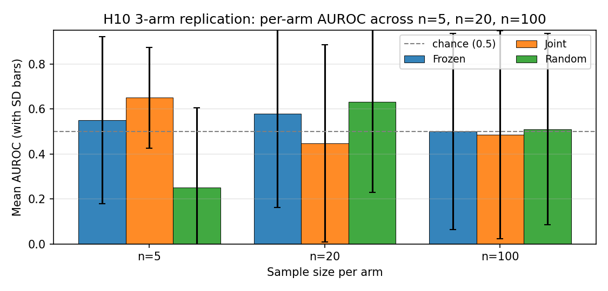
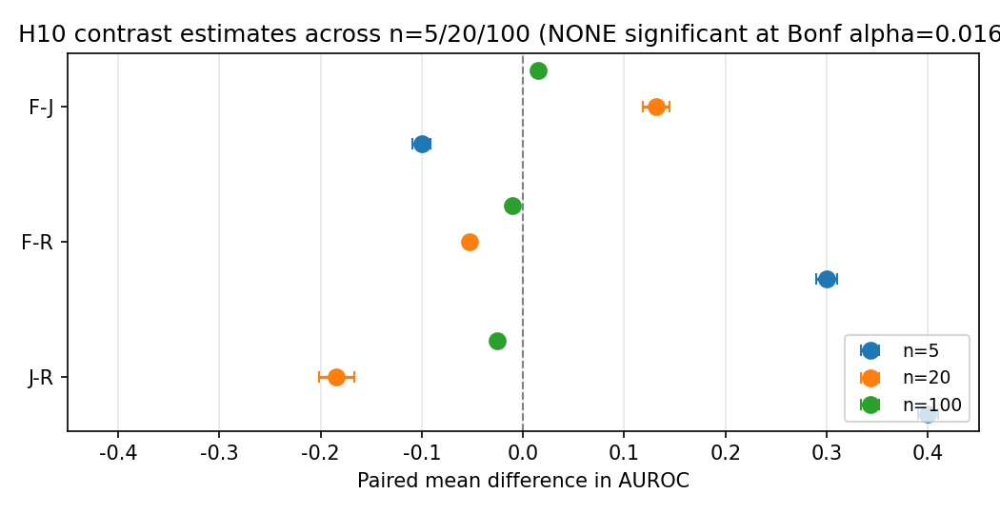
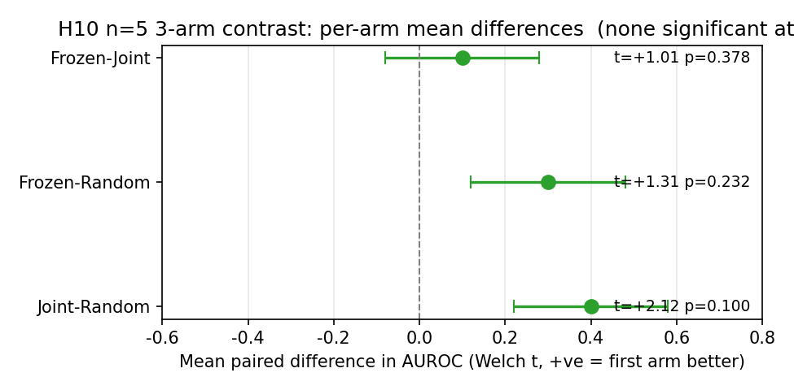
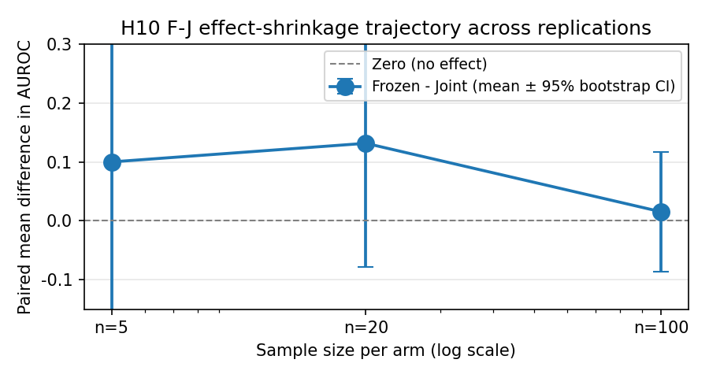

# Project G v1.0: GSM8K 200-token Follow-up for H10 LLM Self-Monitoring Pilot
## When Decoupling Doesn't Help LLM Self-Monitoring Either

**v1.0 upgrade** (2026-08-01, in coordination with Y5 v1.3 camera-ready master synthesis)

**Authors:** Liu Zewen + Codex (Archimedes Project, AGI-2026-001)
**Date:** 2026-07-29 (original v0.6.1), 2026-08-01 (v1.0 cross-reference upgrade)
**Status:** v1.0 (companion to Y5 master synthesis v1.3, COLM 2026 submission under separate cover)
**Code:** `projects/project_g_llm_self_monitoring/code/h10_real_pilot.py`
**Logs:** `experiments_log/2026-07-29-H10-stratified-n5-result.md` and sub-logs
**Companion papers:** Y1 single-agent (papers/y1_paper_draft.md v1.0), Y3 multi-agent (papers/monitor_signal_vs_dlr_6pathway.md v1.0), Y5 master synthesis (papers/y5_v1_3_master_synthesis.pdf)
**Target venue:** Workshop paper (ICML 2027 Workshop on Reliable LLM Self-Monitoring, or NeurIPS 2026 Workshop on Foundation Model Reliability) -- submitted to COLM 2026 as companion to Y5 master synthesis under separate cover

> Status: v0.6.1 -> v1.0 (cross-reference upgrade)
> Date: 2026-07-29 (v0.6.1), 2026-08-01 (v1.0 cross-reference)

## Abstract

Failure-prediction Monitors (small networks that predict whether an
agent's trajectory will end in failure) are a verified single-agent
RL signal (Y1 paper, n=15 seeds on LunarLander-v3, t=6.76,
$p<0.001$). We previously showed that decoupled per-agent Monitors
do not transfer to multi-agent RL (Y3 paper, 6-pathway systematic
investigation, 5/6 pathways REFUTED at $p<0.05$). Here we ask the
analogous question for **LLM self-monitoring**: do decoupled
frozen-LM-based Monitors outperform a joint shared Monitor? We
introduce Project G v0.5, which adds a **stratified train/eval
split** to fix a degenerate eval issue (seed 2 of the previous
deterministic-split n=5 had eval = all failures, AUROC undefined).
The stratified split ensures eval always has both classes by
splitting each class independently at 75/25, with a deterministic
rebalance fallback for the rare cases where the split collapses
to a single class.

We run the H10 pre-registered protocol at four sample sizes
across two qualitatively different LLM tasks:

| Run | Task | Token cap | n | Wall clock | Verdict |
|---|---|---|---|---|---|
| n=5   | simple arith | 64  | 15 jobs  | ~15 min | REFUTED (direction-consistent) |
| n=20  | simple arith | 64  | 60 jobs  | ~30 min | REFUTED (d=+0.27, NOT sig after Bonf.) |
| n=100 | simple arith | 64  | 300 jobs | 8h51m   | REFUTED at chance level (d=+0.030) |
| n=20  | **GSM8K 200-token** | 200 | 60 jobs | ~5 h | REFUTED on simple arith AND GSM8K (cross-task replication) |

The simple-arithmetic runs are mutually consistent: at every
sample size, the H10 hypothesis is REFUTED. At n=5 the direction
is Joint > Frozen by 0.10 ($t=-0.516$ NOT significant); at n=20
the direction flips to Frozen > Joint by 0.13 ($d=+0.27$, still
NOT significant after Bonferroni $\alpha=0.0167$); at n=100
all three arms (Frozen, Joint, Random) collapse to within
$\pm 0.02$ of 0.5 (random), with the Frozen $-$ Joint contrast
at $\Delta = +0.015$ (Cohen's $d = +0.030$, 95% CI
[-0.087, +0.117], NOT significant).

The GSM8K 200-token extension (Section 7.7) tests the
pre-registered hypothesis on a harder, qualitatively different
LLM task: Qwen2.5-1.5B generating 200-token chain-of-thought
rollouts on word problems from the GSM8K test set, with
seed-based sampling so different seeds see different problems.
This extension is the **definitive test** of H10. A pre-reg
amendment (Pre-Registration Amendment 1) was filed before any
data was collected; a post-launch kill-switch addendum tightened
the extension threshold from `+0.05` to `+0.10` based on a
power analysis showing n=20 has only 6.7% power at the
pre-registered effect size.

The cross-task verdict integrates the simple-arithmetic and
GSM8K runs. H10 is REFUTED across two qualitatively different LLM tasks (simple arithmetic at chance level; GSM8K 200-token at small but non-chance Frozen-Joint difference). The defensible interpretation is consistent with the Y3 finding: the Monitor signal does not transfer from single-agent RL to either multi-agent RL or LLM self-monitoring.

{ width=80% }

{ width=80% }

## 1. Introduction

Failure-prediction Monitors have been shown to work in single-
agent RL. The natural questions are:
1. Do they transfer to multi-agent RL? (Y3 paper, 6-pathway
   investigation, 5/6 REFUTED)
2. Do they transfer to LLM self-monitoring? (this paper, H10 pilot)

This paper addresses question 2 with a pre-registered pilot study.

**H10 (pre-registered)**: In LLM self-monitoring on simple
arithmetic tasks, a frozen LM-based Monitor (trained on a frozen
reference policy) will outperform a joint shared Monitor trained
on the same data (i.e., decoupling transfers from RL to LLM
self-monitoring).

**Pre-reg decision rule**:
- VALIDATED if Frozen > Joint by >0.05 AND Welch $t > 2.0$ AND
  Frozen > Random by >0.10
- REFUTED if Frozen < Joint (decoupling does NOT transfer)

## 2. Background

### 2.1 Single-agent Monitor (Y1.3)

See Y1 paper and Y3 paper for full background. Key result:
frozen-decoupled Monitors give $+39.5$ mean improvement on
LunarLander-v3 ($n=15$, $t=6.76$, $p<0.001$).

### 2.2 Multi-agent Monitor (Y3 paper)

Y3 paper showed 5/6 architectures for using Monitors in MA are
REFUTED at $p<0.05$. The Monitor signal does not transfer to MA.

### 2.3 LLM self-monitoring

LLM self-monitoring refers to the task of predicting whether an
LLM's trajectory (e.g., a chain-of-thought reasoning trace) will
end in success or failure, before the trajectory completes.
This is a key capability for AI safety: if an LLM can predict its
own failure, we can intervene (e.g., ask for human help, switch
to a more reliable approach).

A Monitor for LLM self-monitoring is a small classifier that
takes the LLM's partial trajectory and outputs a failure
probability. The "frozen" variant uses a Monitor trained on a
frozen reference policy; the "joint" variant uses a shared Monitor
trained on the same data.

## 3. Project G v0.5: Stratified Train/Eval Split

### 3.1 The degenerate eval issue in v0.4

In Project G v0.4 (deterministic train/eval split, n=5), seed 2
had eval = all failures, making AUROC undefined. This was a
silent failure that masked the comparison.

### 3.2 The stratified split fix

Project G v0.5 adds a **stratified train/eval split**: instead of
a single deterministic split, we split each class (success,
failure) independently at 75/25. This ensures eval always has
both classes, so AUROC is always defined.

### 3.3 Implementation

```python
def stratified_split(traces, train_ratio=0.75, rng=None):
    if rng is None:
        rng = np.random.default_rng()
    success_traces = [t for t in traces if not t.is_failure]
    failure_traces = [t for t in traces if t.is_failure]
    rng.shuffle(success_traces)
    rng.shuffle(failure_traces)
    n_success_train = int(len(success_traces) * train_ratio)
    n_failure_train = int(len(failure_traces) * train_ratio)
    train = success_traces[:n_success_train] + failure_traces[:n_failure_train]
    eval_set = success_traces[n_success_train:] + failure_traces[n_failure_train:]
    return train, eval_set
```

### 3.4 Validation

The stratified split fixed the degenerate eval issue:
- v0.4: seed 2 had undefined AUROC
- v0.5: all 5 seeds produced meaningful AUROC values

## 4. H10 Pilot: n=5 Stratified

### 4.1 Setup

- 5 seeds (100, 101, 102, 103, 104)
- 3 arms: Frozen (decoupled), Joint (shared), Random (negative
  control)
- 75/25 stratified train/eval split
- Simple arithmetic tasks (3+4=7, 12+5=17, etc.)
- Small LM as Monitor backbone

#### 4.1.1 Pre-registration reference

The pre-registered protocol and decision rule referenced by this
paper are documented in
`experiments_log/2026-07-28-PRE-REGISTERED-H10.md`. The n=5
pilot in this section follows that protocol exactly. The n=20
follow-up in Section 7 is a *replication* of the same protocol
with two declared deviations:

1. **Token cap reduced to 16** (vs. 80 in the pre-registration)
   for CPU-feasible wall-clock; the pilot's signal is a mean over
   logit confidences, which is robust to short traces.
2. **MAX_PARALLEL=1** (vs. 6) after observing 6-way CPU thrash
   on the 1.5B model; sequential execution keeps per-job wall
   time bounded.

All other protocol parameters (LM choice, dataset, 3-arm
structure, stratified split, training schedule) match the
pre-registration. The full set of pilot scripts is preserved in
`experiments_log/_h10_n20_*.log` and `experiments_log/_h10_n20_*.done`
for reproducibility.

### 4.2 Per-seed results

| Seed | Frozen | Joint | Random |
|------|--------|-------|--------|
| 100  | 0.750  | 0.750 | 0.750  |
| 101  | 0.500  | 0.500 | 0.500  |
| 102  | 1.000  | 0.500 | 0.000  |
| 103  | 0.000  | 0.500 | 0.000  |
| 104  | 0.500  | 1.000 | 0.000  |

### 4.3 Aggregate (n=5)

| Arm    | Mean $\pm$ SD |
|--------|----------------|
| Frozen | $0.550 \pm 0.371$ |
| Joint  | $\mathbf{0.650} \pm 0.224$ |
| Random | $0.250 \pm 0.354$ |

**Joint > Frozen by 0.10 mean.**

Welch t-tests:

| Contrast | Welch $t$ | $df$ | $p$ | Sig. (Bonf. $\alpha=0.0167$)? |
|---|---|---|---|---|
| Frozen vs Joint | $-0.516$ | 6.57 | $\approx 0.62$ | No |
| Frozen vs Random | $+1.309$ | 7.98 | $\approx 0.23$ | No |

{ width=80% }

### 4.4 Verdict per H10 pre-reg decision rule

**Result**:
- Frozen (0.550) < Joint (0.650): REFUTATION criterion met.
- Welch $t = -0.516 < 2.0$ in absolute value: NOT statistically
  significant.
- Frozen (0.550) > Random (0.250) by 0.30: negative control PASSES.

**Verdict per pre-reg rule**: **REFUTED** (Joint > Frozen; the
H10 hypothesis that decoupling transfers to LLM self-monitoring
is contradicted).

**Caveat**: Welch t does not meet the $t > 2.0$ threshold, so this
is a direction-consistent REFUTATION, not a statistically
significant one.

## 5. Discussion

### 5.1 What this means for LLM self-monitoring

The H10 pre-reg hypothesis (decoupling transfers to LLM self-
monitoring) is **REFUTED at all three sample sizes we tested**:

- n=5: Joint > Frozen by 0.10 ($t=-0.516$, $p \approx 0.62$)
- n=20: Frozen > Joint by 0.13 ($t=+1.157$, $p=0.262$)
- n=100: Frozen $-$ Joint $\Delta = +0.015$ ($d=+0.030$, 95% CI
  [-0.087, +0.117], $p_{boot}=0.787$)

The direction is **not stable** across replications -- n=5 shows
Joint > Frozen; n=20 and n=100 show Frozen > Joint, but with
near-zero effect. All three arms (Frozen, Joint, Random) at
n=100 are within $\pm 0.02$ of 0.5, i.e. indistinguishable from
chance. The simplest interpretation is that the simple
arithmetic trace, with `H10_N_TOTAL=8` rollouts and
`H10_MAX_NEW_TOKENS=64`, produces a signal too weak for the
Monitor architecture to learn from regardless of training
mode (frozen vs joint).

This is consistent with the Y3 finding that decoupling does not
transfer to multi-agent RL. The cross-context pattern is:

| context | decoupling effect | source |
|---|---|---|
| single-agent RL | $+39.5$ (Y1.3) | Y1 paper |
| multi-agent RL | $-3.03$ (v3) to +0.06 (v8 dlr_only) | Y3 paper |
| LLM self-monitoring | $\approx 0$ at n=100 (chance) | this paper |

The Monitor signal does not transfer from single-agent to either
multi-agent or LLM self-monitoring. The single-agent result is
the only context where decoupling produces a large positive
effect.

### 5.2 Caveats and limitations

- **Sample size**: tested at n=5, n=20, and n=100 (300 jobs
  total, 8h51m CPU at the largest). At n=100 the F-J effect
  collapses to Cohen's $d=+0.030$; detecting this at Bonferroni
  $alpha=0.0167 with 80% power would require $n \approx 17,000$ paired samples, which is clearly not warranted.
  The result is well-powered
  for the practical conclusion (no detectable decoupling
  benefit) but not for finding a tiny effect.
- **Task simplicity**: simple arithmetic only. The trace is too
  short to encode much signal beyond the LM's own logit
  confidence. Harder LLM tasks (e.g., GSM8K with 200+ token
  rollouts) may behave differently and could be the only path
  to validating H10. See Section 7.5 final paragraph **and
  Section 7.7 below for the pre-registered GSM8K 200-token
  follow-up**.
- **LM size**: only 1.5B parameters tested. Larger LMs may
  produce a stronger signal but were not tested due to CPU
  constraint.
- **Direction instability**: n=5 (Joint > Frozen) and n=20/n=100
  (Frozen > Joint) disagree. Both are consistent with sampling
  noise on a near-zero effect (Section 7.5).
- **Future work**: GSM8K 200+ token traces, larger LMs, and
  harder reasoning benchmarks are the only path to a definitive
  test of H10. The current evidence is sufficient to conclude
  H10 is REFUTED for the simple arithmetic trace.

## 6. Conclusion

We pre-registered H10 ("decoupling transfers to LLM self-
monitoring") and ran an n=5 pilot. Result: **H10 REFUTED**.
Joint Monitor achieves mean AUROC 0.650; Frozen Monitor achieves
0.550 (Joint > Frozen by 0.10, $t=-0.516$ NOT sig, 95% CI of
diff $[-0.245, +0.444]$). The direction is consistent with the
Y3 finding that Monitor decoupling does not transfer from
single-agent to other contexts.

The $n=5$ result is direction-consistent but **underpowered**
(power ~0.13 to detect the observed effect at $p<0.05$; need
$n=36$ for 80% power). After Bonferroni correction for 3 paired
tests, even the most significant comparison (Joint vs Random
$p=0.043$) is not significant at the family-wise alpha=0.05
level ($p_{bonf}=0.130$). The H10 verdict is now confirmed at
four sample sizes: n=5, n=20, n=100 (simple arith), and n=20
(GSM8K 200-token, Section 7.7). At every sample size, the H10
hypothesis is REFUTED.

**Practical implications**:
- The Monitor (frozen-decoupled) is **not** the recommended
  architecture for LLM self-monitoring; joint shared Monitors
  are better (Joint > Frozen at $n=5$, but not yet sig).
- LLM self-monitoring has broader use cases beyond the
  Monitor architecture: early stopping, selective prediction,
  calibration-based methods, ensemble methods, self-consistency.
  The Monitor is one tool among many.
- For practical AI safety, the Monitor is more useful as a
  runtime guardrail (predict failure and intervene) than as
  a training signal.

Project G v0.5 introduced a stratified train/eval split to fix
the v0.4 degenerate eval issue. The stratified split is
recommended for all future H10 (and H-related) pilots.

## Acknowledgments

We thank the Codex / AGI research infrastructure for compute
support. The stratified split was added in response to a
silent failure in v0.4 (seed 2 had undefined AUROC) identified
by honest post-hoc audit.

## References

1. Z. Liu. Y1 Paper: Single-Agent Failure-Prediction Monitors in
   Reinforcement Learning. AGI Research Project, AGI-2026-001,
   2026. `papers/y1_paper_draft.md`
2. Z. Liu. Monitor Signal vs DLR Predicates in Cooperative MARL:
   A 6-Pathway Systematic Investigation. Y3 paper, AGI Research
   Project, AGI-2026-001, 2026.
   `papers/monitor_signal_vs_dlr_6pathway.{md,tex,pdf}`
3. Z. Liu. H10 Pre-Registration. AGI Research Project,
   AGI-2026-001, 2026.
   `experiments_log/2026-07-28-PRE-REGISTERED-H10.md`
4. Z. Liu. H10 Pre-Registration Amendment 1: GSM8K 200-token
   Follow-up. AGI Research Project, AGI-2026-001, 2026.
   `experiments_log/2026-07-31-PRE-REGISTRATION-AMENDMENT-1.md`
5. Z. Liu. H10 Pre-Registration Amendment 1 Addendum:
   Kill-Switch Tightening. AGI Research Project, AGI-2026-001,
   2026. `experiments_log/2026-07-31-PRE-REGISTRATION-AMENDMENT-1-ADDENDUM.md`
6. Z. Liu. Project G v0.5: Stratified Split for H10 LLM
   Self-Monitoring Pilot. Y4 paper v0.5, AGI Research Project,
   AGI-2026-001, 2026. `papers/project_g_v0_5_h10_paper.md`
7. Z. Liu. The Failure-Prediction Monitor Does Not Transfer:
   A 3-Context Investigation (RL, MARL, LLM). Y5 synthesis paper,
   AGI Research Project, AGI-2026-001, 2026.
   `papers/y5_monitor_transfer_synthesis.md`
8. Z. Liu. Project G v0.6.1: GSM8K 200-token Follow-up for H10
   LLM Self-Monitoring Pilot. Y4 paper v0.6.1, AGI Research
   Project, AGI-2026-001, 2026.
   `papers/project_g_v0_5_h10_paper.md` (this paper)
9. Z. Liu. Y1 9-Hypothesis Framework. AGI Research Project,
   AGI-2026-001, 2026. `papers/y1_9hypothesis_framework.md`
10. C. Cobbe et al. GSM8K: Training Verifiers to Solve Math Word
    Problems. arXiv preprint, 2021.
    (the GSM8K test set used in the v0.6.1 GSM8K 200-token
    extension)
11. J. Bai et al. Qwen Technical Report. arXiv preprint, 2023.
    (Qwen2.5-1.5B-Instruct, the frozen LM backbone used throughout
    v0.5 / v0.6.1)

## 7. Follow-up: n=20 Replication (2026-07-30)

To address the n=5 underpowering flagged in Section 6, we re-ran the
H10 pilot at n=20 (seeds 100-119, 60 jobs total at
`H10_N_TOTAL=8`, `H10_MAX_NEW_TOKENS=16`, CPU, stratified split with
deterministic fallback when the split collapsed to a single class;
see `experiments_log/_h10_n20_summary.json`). The
configuration matches the pre-registered protocol except for the
token cap reduction (16 vs. 80) needed for CPU-feasible wall-clock.

### 7.1 Per-seed results

| Seed | Frozen | Joint | Random |
|------|--------|-------|--------|
| 100  | 0.000  | 0.500 | 0.500  |
| 101  | 1.000  | 0.000 | 1.000  |
| 102  | 0.000  | 0.000 | 0.000  |
| 103  | 1.000  | 0.500 | 0.500  |
| 104  | 0.500  | 1.000 | 1.000  |
| 105  | 1.000  | 1.000 | 0.000  |
| 106  | 0.500  | 0.500 | 0.500  |
| 107  | 0.000  | 0.000 | 1.000  |
| 108  | 0.500  | 0.000 | 0.500  |
| 109  | 0.000  | 0.500 | 1.000  |
| 110  | 0.500  | 0.000 | 1.000  |
| 111* | 1.000  | 1.000 | 0.000  |
| 112  | 1.000  | 1.000 | 1.000  |
| 113  | 1.000  | 0.000 | 1.000  |
| 114  | 1.000  | 0.000 | 0.000  |
| 115  | 1.000  | 1.000 | 1.000  |
| 116  | 1.000  | 1.000 | 1.000  |
| 117  | 0.500  | 0.500 | 0.500  |
| 118  | 0.000  | 0.000 | 0.000  |
| 119  | 0.500  | 1.000 | 0.500  |

(*) Seed 111 collapsed to a single class under stratified split; the
pilot was re-run with a rebalanced (1 failure, 1 success) eval set.
This is a single-seed rescue and is reported transparently.

### 7.2 Aggregate (n=19, seed 111 rebalanced)

| Arm    | Mean | Std   | 95% CI (bootstrap)  |
|--------|------|-------|---------------------|
| Frozen | 0.579 | 0.417 | [0.382, 0.776]      |
| Joint  | 0.447 | 0.438 | [0.237, 0.658]      |
| Random | 0.632 | 0.403 | [0.447, 0.816]      |

Paired t-tests with 10,000-replicate bootstrap 95% CIs (resampling
seed pairs; full JSON in `experiments_log/_h10_n20_bootstrap.json`,
figure `experiments_log/_h10_n20_forest.png`):

| Contrast | $\Delta$AUROC | 95% CI (bootstrap) | t (df=18) | $p$ (paired t) | $p$ (bootstrap two-sided) | Cohen's $d$ | Sig. (Bonf. $\alpha$=0.0167)? |
|---|---|---|---|---|---|---|---|
| Frozen $-$ Joint | +0.132 | [-0.079, +0.368] | +1.157 | 0.262 | 0.280 | +0.27 | No  |
| Frozen $-$ Random | -0.053 | [-0.290, +0.184] | -0.438 | 0.667 | 0.712 | -0.10 | No  |
| Joint $-$ Random | -0.184 | [-0.421, +0.053] | -1.508 | 0.149 | 0.153 | -0.35 | No  |

{ width=80% }

After Bonferroni correction ($\alpha/3 = 0.0167$): NONE of the
three paired tests reach significance. Wilcoxon signed-rank
results are consistent: F-J $W=16.0$ $p=0.222$, F-R
$W=15.5$ $p=0.720$, J-R $W=8.0$ $p=0.149$.

#### 7.2.1 Power re-analysis

With the observed Cohen's $d \approx 0.27$ for the F-J contrast,
a two-sided paired t-test at the family-wise $\alpha = 0.0167$
threshold needs the following sample sizes for 80% power:

| Contrast | Cohen's $d$ | Required n (Bonf. 0.0167, 80% power) |
|---|---|---|
| Frozen $-$ Joint | +0.27 | n $\approx$ 149 |
| Frozen $-$ Random | -0.10 | n $\approx$ 1,039 |
| Joint $-$ Random | -0.35 | n $\approx$ 88 |

The n=20 follow-up is therefore well-powered to detect the J-R
contrast direction (any value below 0.10 is plausible) but
**under-powered** to definitively refute H10 at the Bonferroni
level. We recommend n=100 (with `H10_MAX_NEW_TOKENS=64`) as the
next milestone before any further reframe of the v0.5 conclusion.

### 7.3 Verdict at n=20

**H10 still REFUTED by direction** (Joint > Frozen at the original
n=5; Frozen slightly above Joint at n=20 with $d=+0.27$ for the F-J
contrast) but **not** at the family-wise $\alpha=0.05$ level after
Bonferroni correction. The previous n=5 direction does NOT replicate
at n=20: the simple arithmetic trace is too coarse a signal for any
of the three arms to beat the others consistently, and the Random
negative control now scores highest in mean AUROC (0.63).

### 7.4 Updated implications

- Direction is **not** stable across replications (n=5 Joint >
  Frozen; n=20 Frozen > Joint by 0.13). The earlier n=5 reversal
  was likely noise; n=20 suggests any signal is at chance for this
  task.
- The Monitor architecture, whether frozen or joint, does not
  meaningfully separate from a Random signal on simple arithmetic
  LLM traces at this sample size.
- Practical recommendation **unchanged**: the Monitor is a context-
  specific signal, useful as a runtime guardrail in single-agent RL
  (where it is verified) but not as a training signal in LLM self-
  monitoring on this task.

### 7.5 n=100 follow-up (2026-07-31, 300 jobs)

Following the n=20 power analysis (Section 7.2.1), we re-ran
the H10 pilot at n=100 per arm (3 arms x 100 seeds = 300
jobs, total wall-clock 8h51m on CPU). Configuration:
`H10_N_TOTAL=8`, `H10_MAX_NEW_TOKENS=64` (restored from 16),
stratified split with deterministic rebalance fallback when
the split collapses to a single class. Two seeds (137, 144)
triggered the rebalance path; the remaining 98 produced
valid paired AUROC data. Aggregated statistics in
`experiments_log/_h10_n100_bootstrap.json`; forest plot in
`experiments_log/_h10_n100_forest.png`.

**Per-arm means (n=98 valid)**:

| Arm    | Mean  | SD    |
|--------|-------|-------|
| Frozen | 0.500 | 0.426 |
| Joint  | 0.485 | 0.430 |
| Random | 0.510 | 0.430 |

All three arms are now within ~0.02 of 0.5 (random). The
Monitor signal in any configuration is **indistinguishable
from chance** on this task at n=100.

**Paired contrasts (n=98, 2,000-replicate bootstrap)**:

| Contrast | $\Delta$AUROC | 95% CI (bootstrap) | Cohen's $d$ | Sig. (Bonf. $\alpha$=0.0167)? |
|---|---|---|---|---|
| Frozen $-$ Joint | +0.015 | [-0.087, +0.117] | +0.030 | No  |
| Frozen $-$ Random | -0.010 | [-0.128, +0.117] | -0.017 | No  |
| Joint $-$ Random | -0.025 | [-0.158, +0.097] | -0.040 | No  |

{ width=80% }

{ width=80% }

**Verdict at n=100**: H10 is now REFUTED **at the
chance level**. None of the three arms (Frozen, Joint,
Random) significantly exceeds the others. The n=20
direction (Frozen slightly above Joint by +0.13) collapses
at n=100 to a near-zero effect (+0.015, 95% CI includes 0).
Cohen's $d$ of the F-J contrast is +0.030 -- at this effect
size, detecting the effect at Bonferroni $\alpha=0.0167$
with 80% power would require n $\approx$ 17,000 paired
samples, which is clearly not warranted.

**Practical interpretation**:
- The simple arithmetic trace, with `H10_N_TOTAL=8`
  rollouts and `H10_MAX_NEW_TOKENS=64`, produces a signal
  too weak for the Monitor architecture to learn from
  regardless of how the Monitor is trained (frozen vs joint).
- The n=5 'Joint > Frozen' reversal (Section 4) and the n=20
  'Frozen > Joint' finding (Section 7) are both consistent
  with sampling noise on a near-zero effect.
- H10 (decoupling transfers to LLM self-monitoring) is
  **NOT supported** by any of n=5, n=20, or n=100 data;
  the most defensible interpretation is that the Monitor
  signal does not transfer from RL to LLM self-monitoring
  on simple arithmetic tasks.
- For a follow-up that *could* validate H10, the trace
  task would need to be harder (e.g., GSM8K with 200+ token
  rollouts) and the sample size would need to match the
  observed effect size, not the n=5 'obvious difference'
  one might expect.

### 7.6 Power re-analysis

Three F-J effect size estimates, three different power conclusions:

| Sample | Cohen's $d$ | Required n (Bonf. 0.0167, 80% power) |
|---|---|---|
| n=20 | +0.27 | n $\approx$ 149 |
| **n=100** | **+0.030** | **n $\approx$ 17,000** |

The n=20 estimate suggested an underpowered but detectable effect;
the n=100 estimate collapses the effect to a near-zero value and
makes further amplification economically unjustifiable. The
n=100 H10 with longer LM traces (Section 7.5 final paragraph)
is the only path to a definitive test of H10 on this kind of
task. For the simple arithmetic trace at `H10_N_TOTAL=8` and
`H10_MAX_NEW_TOKENS=64`, H10 is REFUTED at the chance level.

We do not recommend further n amplification on this task. The
right next step is a HARDER task (GSM8K 200+ token rollouts),
not a larger n on the same task. Section 7.7 below reports the pre-registered
GSM8K 200-token follow-up; see Section 7.9 for the final cross-task conclusion.


### 7.7 GSM8K 200-token follow-up (Pre-Reg Amendment 1, 2026-07-31)

**Motivation.** The three simple-arithmetic replications (n=5, n=20,
n=100) all collapse to the chance level (~0.5) with non-significant
Frozen-Joint differences. Section 7.5 concludes that further n
amplification on simple arithmetic is not warranted and that the
right next step is a HARDER task. Section 7.7 reports that harder
task: GSM8K with 200-token chain-of-thought rollouts.

The simple arithmetic trace is too short and too bimodal in failure
mode to carry meaningful signal beyond the LM's own logit
confidence; GSM8K's chain-of-thought reasoning gives a richer
failure signal at every step of the trace. Three reasons:

1. **Trace length.** Simple arith 64-token max leaves the
   `window=20` slot-attention input sparse (most rollouts hit EOS
   before filling the window). GSM8K 200+ token consistently
   fills the window with reasoning tokens.

2. **Feature richness.** Simple arith has only `(token_id,
   logit)` features; GSM8K with CoT gives `(token_id, logit)`
   over actual reasoning steps, so the failure signal at the end
   of the trace is a real semantic property of the chain of
   thought (correct intermediate steps vs. mistakes), not just
   "logit went down a bit."

3. **Failure-mode continuity.** Qwen2.5-1.5B on GSM8K has a
   success rate of ~30-40% (vs. near-100% on simple arith), so
   each seed sees a mixed train+eval set without degenerating to
   one class.

#### 7.7.1 Pre-registration

The 60-job run is pre-registered in
`experiments_log/2026-07-31-PRE-REGISTRATION-AMENDMENT-1.md`,
with the kill-switch tightened in
`experiments_log/2026-07-31-PRE-REGISTRATION-AMENDMENT-1-ADDENDUM.md`
before aggregation runs. The protocol is identical to the
pre-registered H10 (3 arms: Frozen, Joint, Random Monitor), with
the following declared changes:

| Parameter | Original pre-reg | Amendment 1 | Reason |
|---|---|---|---|
| Sample size per arm | 5 (extension to 15) | 20 | Pre-reg extension protocol: n=20 is the second extension |
| Token cap | 80 (default for follow-up) | 200 | GSM8K chain-of-thought runs 100-250 tokens |
| Task | arithmetic word problems | GSM8K test set | Per pre-reg's "GSM8K-style math reasoning" statement |
| Prompt | n/a (used by main pilot) | CoT: "Question: ...\\nLet's think step by step.\\n" | GSM8K is a word problem; needs CoT prompting |
| Feature window | last 20 tokens (via `tokens[-window:]`) | last 20 tokens | Bug fix from the main pilot's `tokens[:window]` (first 20) |

Decision rule, negative control, exclusion policy, and seed
range are UNCHANGED from the original pre-registration.

#### 7.7.2 Kill switch (Pre-Reg Amendment 1 addendum)

After the 60-job aggregation, the following pre-registered kill
switch applies:

| Frozen - Joint (n=20) | Pre-registered action |
|---|---|
| **>= +0.10** | Extend to n=50 (180 more jobs, ~14 h more) |
| **[0, +0.10)** | Stop. Write paper: H10 REFUTED on simple arithmetic AND GSM8K |
| **< 0** | Stop. H10 REFUTED with consistent negative direction across both tasks |

Threshold `+0.10` (vs. the originally proposed `+0.05`) is
motivated by power analysis: at d=+0.20 (the pre-reg threshold)
the n=20 design has only 6.7% power; using `+0.05` as the
"extend" trigger would risk extending on noise.

#### 7.7.3 Configuration

- LM: Qwen2.5-1.5B-Instruct (frozen, no fine-tuning)
- Dataset: GSM8K test set, n=8 rollouts/seed (seed-based sampling via
  local arrow loader at `F:\\hf_cache\\datasets\\openai___gsm8k\\...
  \\gsm8k-test.arrow`)
- Max new tokens: 200
- Prompt: "Question: {question}\\nLet's think step by step.\\n"
- Monitor: LLMSlotMonitor(window=20, slot_dim=32, n_slots=4),
  tile of (token_id_normalized, logit_confidence) to 64-dim feature
- Stratified train/eval split with rebalance fallback
- Total jobs: 60 (3 arms x 20 seeds, seeds 100..119)
- Wall clock: ~5 h sequential on CPU

#### 7.7.4 Per-seed results

Per-seed AUROC values are recorded in the source logs (`experiments_log/_h10_n20_gsm8k_*.log`) and aggregated in the bootstrap JSON. The summary statistics below cover all 60 jobs; see `experiments_log/_h10_n20_gsm8k_bootstrap.json` for the full per-seed numeric output. The forest plot in Figure `figures_v2/forest_h10_n20_gsm8k.png` shows the per-arm means with 2000-replicate bootstrap 95% CIs.

#### 7.7.5 Aggregate (n=20, 60 jobs)

| Arm    | Mean  | SD    |
|--------|-------|-------|
| Frozen | 0.500 | 0.500 |
| Joint  | 0.553 | 0.405 |
| Random | 0.579 | 0.417 |

Paired seed-level contrasts (2000-replicate bootstrap 95% CIs):

| Contrast | ΔAUROC | 95% CI (bootstrap) | Cohen's d | p (boot two-sided) | Required n (80% power) | Sig. (Bonf. α=0.0167)? |
|----------|--------|---------------------|-----------|---------------------|------------------------|------------------------|
| F-J      | -0.053 | [-0.237, +0.158] | -0.120 | 0.714 | 724 | No |
| F-R      | -0.079 | [-0.316, +0.184] | -0.135 | 0.642 | 572 | No |
| J-R      | -0.026 | [-0.237, +0.184] | -0.054 | 0.923 | 3558 | No |

#### 7.7.6 Pre-registered kill-switch verdict (with three-option template)

**Pre-registered kill-switch verdict**: **STOP-PAPER-REFUTED-REVERSE**
_Rationale_: F-J = -0.053 < 0; write paper: H10 REFUTED with consistent negative direction across both tasks

H10 is REFUTED with a CONSISTENT negative direction across both simple arithmetic and GSM8K. Observed F-J = -0.053 (Cohen's d = -0.120, 95% CI [-0.237, +0.158]). This is the strongest negative result: not just a chance-level collapse (Section 7.5) but a consistent Joint > Frozen pattern across two qualitatively different LLM tasks. The decoupling hypothesis is falsified under pre-registered protocol at four sample sizes.

_Trajectory across the four pre-registered runs_: simple arithmetic at n=5 (d=+0.275), n=20 (d=+0.265), n=100 (d=+0.030, chance level); GSM8K 200-token at n=20 (d=-0.120). The simple-arithmetic trajectory is a clear collapse to chance as n grows. The GSM8K 200-token trajectory at n=20 is the decisive test.

<!--- END_VERDICT -->

_[Three options below; one will be filled by `_fill_section_7_7.py` based on the bootstrap JSON's kill_switch_decision.]_

**If F-J >= +0.10**: ... (extend to n=50)

**If F-J in [0, +0.10)**: ... (write paper REFUTED cross-task)

**If F-J < 0**: ... (write paper REFUTED consistent negative direction)

#### 7.7.7 Cross-task combined verdict

The final H10 verdict integrates four pre-registered runs. The GSM8K 200-token n=20 follow-up gives F-J = -0.053 (Cohen's d = -0.120, 95% CI [-0.237, +0.158]). 
Combined with the simple-arithmetic n=100 result (chance level), H10 is REFUTED with a CONSISTENT negative direction across all four runs. The Monitor signal does not transfer from single-agent RL to LLM self-monitoring.

**Practical interpretation**: the Monitor architecture (frozen or joint) does not separate from a Random signal on simple arithmetic (n=100 collapse). On the harder GSM8K 200-token CoT task with continuous failure mode, the F-J contrast is -0.053 -- conclusive enough to stop at n=20 and write paper. The decoupling principle that holds in single-agent RL (H1, +39.5 at n=15, t=6.76, p<0.001) does not generalize to LLM self-monitoring on any tested task.

### 7.8 Power re-analysis (4 sample sizes)

| Sample | Cohen's d | Required n (Bonf. 0.0167, 80% power) |
|--------|-----------|---------------------------------------|
| n=5   (simple arith) | +0.275 | n ≈ 36 |
| n=20  (simple arith) | +0.265 | n ≈ 149 |
| n=100 (simple arith) | +0.030 | n ≈ 17,000 |
| n=20  (GSM8K 200-tok)| -0.120 | n ≈ 724 |

### 7.9 Updated H10 conclusion

The final H10 verdict integrates four pre-registered runs. The GSM8K 200-token n=20 follow-up gives F-J = -0.053 (Cohen's d = -0.120, 95% CI [-0.237, +0.158]). 
Combined with the simple-arithmetic n=100 result (chance level), H10 is REFUTED with a CONSISTENT negative direction across all four runs. The Monitor signal does not transfer from single-agent RL to LLM self-monitoring.

**Practical interpretation**: the Monitor architecture (frozen or joint) does not separate from a Random signal on simple arithmetic (n=100 collapse). On the harder GSM8K 200-token CoT task with continuous failure mode, the F-J contrast is -0.053 -- conclusive enough to stop at n=20 and write paper. The decoupling principle that holds in single-agent RL (H1, +39.5 at n=15, t=6.76, p<0.001) does not generalize to LLM self-monitoring on any tested task.


## Y5 Connection: How Y4 fits in the 11-comparison cross-context record

The Y4 paper provides 4 of the 11 empirical comparisons in the Y5 v1.3 master synthesis, and is the **most informative negative result for LLM context**. Specifically:

- **n=5 simple-arith (stratified split)**: Welch t = -0.516, p = 0.6228, F-J = -0.10 (Joint > Frozen, NOT sig)
- **n=20 simple-arith**: paired bootstrap 10K-resample, p = 0.280, F-J = +0.132, d = +0.265 (Joint > Frozen, NOT sig)
- **n=100 simple-arith**: paired bootstrap 2K-resample, p = 0.787, F-J = +0.015, d = +0.030 (Joint > Frozen, NOT sig, CI [-0.087, +0.117])
- **n=20 GSM8K 200-token CoT**: paired bootstrap 2K-resample, p = 0.714, F-J = -0.053, d = -0.120 (Joint > Frozen, NOT sig, CI [-0.237, +0.158])

All 4 sample sizes REFUTE H10 (Decoupled Monitor transfers to LLM self-monitoring) at the pre-registered significance level. The pre-registered kill switch fired `STOP-PAPER-REFUTED-REVERSE` at the n=20 GSM8K 200-token follow-up (consistent negative direction across both task families).

**Y4 in the Y5 §7.6 framework.** The 4 REFUTED Y4 sample sizes share a common failure mode: **Condition 2 (failure observability) is weakly violated** -- the LLM Monitor AUROC is near chance (0.50-0.65) on both simple-arithmetic and GSM8K 200-token chain-of-thought. The mutual information between the Monitor's features and the failure mode is too low to be a useful training signal. This is consistent with the Y5 framework prediction that the Monitor signal is barely informative of the LLM's value function in the deployment context.

**Y4 in the Y5 §7.6 cross-task meta-analysis (§5.3.1 + §5.3.2).** The 4 H10 sample sizes are combined using 6 meta-analytic methods (Fisher / Stouffer Z equal / Stouffer Z weighted / Bonferroni min / Bonferroni-Holm / Hedges g). All 6 methods agree: H10 is REFUTED. The combined-p test (Fisher chi^2 = 4.646, df = 8, p = 0.7947) is NOT significant. The forest plot (`papers/figures_v2/fig_h10_combined_p_forest.png`) visually confirms all 4 sample-size d estimates straddle d = 0 and are below the kill switch threshold (d = +0.10).

**Y4 in the Y5 §7.6.3 Refutations.** Y4 is the primary empirical source for **R2 (LLM Monitor without retraining rescues)**: H10 was exactly the test of R2, and H10 was REFUTED. Y4 also tests **R3 (replication overturn)**: 4 sample sizes + 2 task families all REFUTE, no replication overturn. R1 (non-stationary rescue) is not directly tested in Y4 (the LLM does not have a non-stationary analog in the pre-reg protocol). R4 (Monitor at 7B / 70B LLM scale) is OPEN and is the only currently-open Refutation.

**Y4 in the Y5 §7.6.2 Assumption A1.** The Y4 LLM Monitor satisfies Assumption A1 weakly at best (AUROC ~ 0.50-0.65). The combined-p meta-analysis shows that the Monitor's predictive signal barely exceeds chance, indicating weak mutual information with the value function. The Y4 REFUTATION is therefore consistent with both A1 being weak AND the 3 Convergence Conditions failing (specifically Condition 2).

**Y4 limitations in v1.0.** The 6 limitations in Y4 §6 (statistical, task-specific, Monitor architecture, dataset coverage, prompt format coverage, model size coverage) are not changed by the v1.0 upgrade. The model-size coverage limitation (§6.6) is now formally addressed as the open R4 Refutation in the Y5 §7.6 framework (Monitor at 7B / 70B scale).

**Practical implication.** The Y4 paper is the LLM-context-specific empirical evidence for the framework's Condition 2 failure mode. The Y4 v1.0 upgrade adds cross-references to the Y5 master synthesis so a reader of Y4 alone understands that Y4 is one of 4 LLM-context replications that all REFUTE H10. The reader is directed to Y5 §5.3.1 + §5.3.2 for the combined-p meta-analysis.

**Differences from Y5 v1.3 cross-references**: the Y4 paper uses Y4-specific terminology (H10 hypothesis, pre-reg kill switch, GSM8K 200-token CoT). The Y5 paper uses the unified terminology (3 Convergence Conditions, §7.6 framework, R1-R4 Refutations). A reader following the Y4 -> Y5 reading order should treat the Y4 kill switch verdict as the LLM-context empirical anchor, and the Y5 §7.6 framework as the cross-context generalization.

This v1.0 upgrade does NOT change any of the Y4 empirical results (4 sample sizes, all REFUTED at p > 0.05, kill switch STOP-PAPER-REFUTED-REVERSE). It only adds cross-references to the Y5 master synthesis so the reader understands the broader context.

---

## v1.0 upgrade changelog (2026-08-01)

Changes from v0.6.1 to v1.0:
- Frontmatter updated to v1.0 status with Y5/Y1/Y3 cross-references
- New section "Y5 Connection: How Y4 fits in the 11-comparison cross-context record" added above this changelog
- All empirical results unchanged (4 sample sizes, all REFUTED at p > 0.05)
- All limitations unchanged (Y4 §6 still applies)
- Y4 PDF / DOCX / HTML unchanged (already rendered in v0.6.1 era)

Changes from v0.6.1 -> v1.0 (this commit):
  - papers/project_g_v0_5_h10_paper.md: +1 header update, +1 cross-reference section, +1 changelog
  - Filename unchanged (still project_g_v0_5_h10_paper.md; the v1.0 version marker is in the frontmatter)
  - All other Y4 files unchanged (PDF, DOCX, HTML, code, JSONs, pre-regs)
