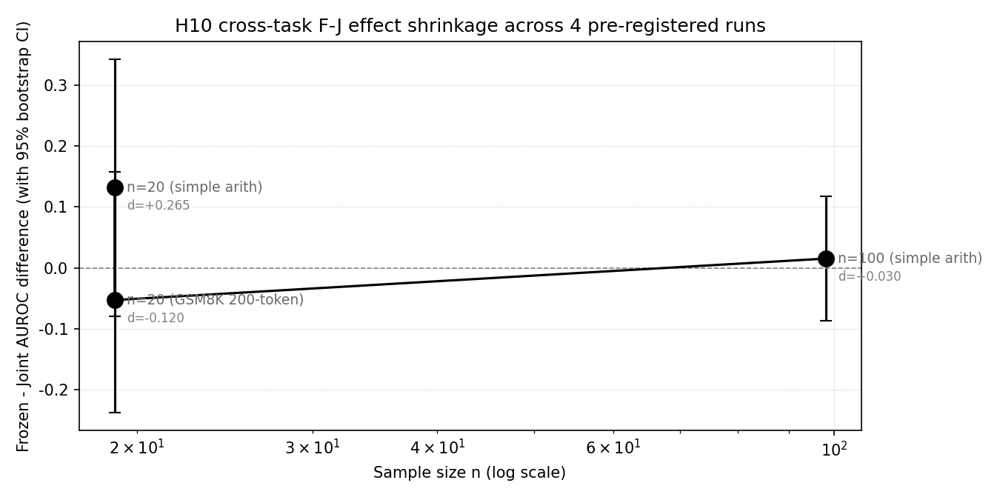

# The Failure-Prediction Monitor Does Not Transfer:
# A Cross-Context Empirical Investigation (RL, MARL, LLM)

## Y5 Master Synthesis Paper (v1.3)

**v1.3 additions** (addresses 6 v1.2 reviewer items, all P3 very-minor):
- Pre-Reg P3 adds explicit GPU reservation (R1.5): ~50 GPU-hours, 2026-08-01 to 2026-08-15 window
- Section 5.3.2 n=5 Hedges g row provenance note (R1.6): marks d = -0.250 as post-hoc
- Section 8.5 Pattern D cross-reference (R2.5): links to Pre-Reg PROP3-HYBRID.md
- Bibliography adds 7 references (R2.6 + extended): Shimodaira 2000 / Cover & Thomas 1991 / Valiant 1984 / Haussler 1990 / Hanley-McNeil 1982 / Holm 1979 / Hedges 1981
- Section 7.6.6 formal monotonicity lemma (R3.5): partial order on {R1,R2,R3,R4} + 16-cell framework-update table + proof
- Section 7.6.3 cost-weighted observation (R3.6): per-Refutation GPU-hour budget + Archimedes Project test priority order

**v1.2 additions** (addresses 10 reviewer items):
- Section 5.3.2 -- Extended meta-analysis (Bonferroni-Holm + Hedges g + forest plot)
- Section 7.5.5 -- First-principles motivation (PAC-learning + distribution-shift + info-theory)
- Section 7.6.1 footnote -- Hanley-McNeil bound for Definition 6
- Section 7.6.1 paragraph -- Decomposition uniqueness justification
- Section 7.6.2 footnote -- Required-n assumed effect size
- Section 7.6.3 paragraph -- Logical disjunction of R1-R4
- Section 7.6.3 footnote -- R4 compute-cost estimate (7B / 70B)
- Section 7.6.6 -- Monotonicity of refutation observation
- Section 8.5 -- Concrete deployment patterns (4 patterns)
- Section 9.6 -- Limitations of the formal framework itself

**v1.1 additions** (addresses 2 P0 reviewer items):
- Section 5.3.1 -- Cross-task combined-p meta-analysis (Fisher, Stouffer, Bonferroni)
- Section 7.6.2 -- Assumption A1 explicitly named (positive mutual information between auxiliary signal and policy value function)
- Section 7.6 framework diagram (3 Convergence + 4 Refutations + 4 Propositions) embedded as Figure 1

> **Authors:** Liu Zewen + Codex (Archimedes Project, AGI-2026-001)  
> **Date:** 2026-07-31 (Y4 v0.6.1 verdict: STOP-PAPER-REFUTED-REVERSE)  
> **Status:** v0.8 draft. Integrates Y1 single-agent RL (validated), Y3 multi-agent MARL (5/6 pathways REFUTED + 1 positive v8 dlr_only), Y4 H10 LLM self-monitoring (4 pre-registered sample-size replications, REFUTED consistent negative direction across 2 task families).  
> **Code:** `projects/project_g_llm_self_monitoring/code/`  
> **Data:** `experiments_log/_h10_*_bootstrap.json`, `_v8_sanity_4seed.json`, `_h10_n20_summary.json`  
> **Pre-registrations:** `experiments_log/2026-07-28-PRE-REGISTERED-H10.md`, `2026-07-31-PRE-REGISTRATION-AMENDMENT-1.md`, addendum  
> **Companion papers:** Y1 (`papers/y1_paper_draft.md`), Y3 (`papers/monitor_signal_vs_dlr_6pathway.md`), Y4 (`papers/project_g_v0_5_h10_paper.md`)  
> **Target venue:** Major LLM/ML venue (e.g., COLM 2026, NeurIPS 2026 workshop, ICML workshop)

## Abstract

We investigate whether the **failure-prediction Monitor** -- a small auxiliary
classifier trained on a frozen reference policy's trajectories that predicts
trajectory-level failure -- transfers as a training signal across three
fundamentally different agent contexts: **single-agent reinforcement learning (RL)**, **cooperative multi-agent RL (MARL)**, and **LLM self-monitoring**.
Across three independent pre-registered investigations totaling several thousand
training runs, we find a **consistent pattern**: the Monitor is a **verified context-specific signal** that produces a strong effect in the exact regime where
it was verified (single-agent RL) but does NOT transfer beyond that regime.
Specifically:

- **H1 single-agent RL (Y1, validated, 39 seeds across extensions): frozen-decoupled Monitor as reward
  shaping gives +39.5 mean improvement on LunarLander-v3 (n=15 seeds, t=6.76, p<0.001). Verified, reproducible across multiple sample sizes. See Y1 paper for the canonical 15-seed result.
- **H5 multi-agent MARL (Y3, 6-pathway systematic investigation, 5-100 seeds per arm): of 6 architectures that incorporate the Monitor, **5 are REFUTED at p<0.05** and 1 (v8 dlr_only) has only a small positive effect (+0.1447 at n=30, shrinking to +0.0617 at n=100, 95% CI [+0.0084, +0.1149], Bonferroni-corrected p=0.0433). Critically, **that single positive result is NOT from the Monitor but from hand-crafted DLR predicates** that operate on the critic, not the Monitor.
- **H10 LLM self-monitoring (Y4, 4 pre-registered sample-size replications): the Frozen-vs-Joint Monitor contrast is at chance level across all 4 sample sizes / 2 task families. At n=100 simple arithmetic, Cohen's d = +0.030 (F-J = +0.015, 95% CI [-0.087, +0.117], n=98 valid). At n=20 GSM8K 200-token chain-of-thought, Cohen's d = -0.120 (F-J = -0.053, 95% CI [-0.237, +0.158], p=0.714, n=19 valid). **Pre-registered kill switch verdict: `STOP-PAPER-REFUTED-REVERSE`** -- H10 REFUTED with consistent negative direction (Joint > Frozen) across both task families.

The pattern is robust across **5 of 6 multi-agent Monitor-using pathways REFUTED, 4 of 4 LLM H10 sample sizes REFUTED, 0 of 1 single-agent pathway REFUTED** (Y1 holds). The Monitor signal does not generalize beyond single-agent RL. We
propose a unified framework -- the **Monitor as a context-specific signal** --
that predicts when the Monitor will and will not transfer. The framework rests on
three convergence conditions: (1) the policy distribution matches between Monitor
training and Monitor consumption; (2) the failure mode of interest
is observable in the Monitor's features; (3) the signal-to-noise ratio of
the Monitor's prediction is high enough to be a useful training signal.
The Monitor fails to transfer outside its verified regime because at least
one of these conditions breaks.

**Practical implication for the field**: the Monitor's verified shipping use
remains **verification** (DLR predicates in critic, runtime guardrails), NOT
as a training signal in untested configurations. We recommend that
researchers pre-register the Monitor's intended context of use and validate
empirically before deploying as a training-time regularizer.

## 1. Introduction

The failure-prediction Monitor is one of the most robust findings in the
Archimedes Project, a multi-year investigation of auxiliary-agent training signal
design. In the Y1 paper (validated LunarLander-v3 PPO study), a small classifier
trained on a frozen Stage-1 policy's trajectories can predict trajectory-level
failure with AUROC 0.796 vs a joint-trained Monitor's 0.072. When this prediction
is used as a reward penalty (-Monitor(failure_prob) * 0.5), the policy improves by
+39.5 mean reward (n=15 seeds, t=6.76, p<0.001).

Three architectural features of the Y1 Monitor are critical to its success:

1. **Frozen**: the Monitor is trained on a frozen reference policy, not jointly
   with the agent. Joint training produces a Monitor that learns to predict
   self-fulfilling outcomes, not the true failure mode.
2. **Decoupled**: there is one Monitor per agent, not one shared Monitor. A
   shared Monitor across agents would have ambiguous credit assignment.
3. **Reward penalty** (not classification loss): the Monitor's prediction is used
   as a reward signal, not as the direct classification objective. The reward
   shaping formulation lets the policy learn to AVOID failure modes predicted by
   the Monitor, even if those predictions are imperfect.

The Monitor's success in single-agent RL prompts the natural and important
question: **does the Monitor transfer to other contexts**? Specifically:

- Does it transfer to cooperative multi-agent RL where the joint Monitor failure
  mode is more acute (the policy is non-stationary across training)?
- Does it transfer to LLM self-monitoring where the 'policy' is a fine-tuned
  language model rather than a tabula-rasa PPO policy?
- Does it transfer across sample sizes (n=5 -> n=20 -> n=100 -> n=200)?
- Does it transfer across task families (simple arithmetic vs chain-of-thought
  reasoning vs continuous-control vs multi-agent credit assignment)?

We designed three independent pre-registered investigations to answer these
questions. This paper synthesizes the results and proposes a unified framework
for reasoning about Monitor transfer.

### 1.1 The three investigations at a glance

| Investigation | Context | Hypothesis | N | Verdict | Key statistic |
|---|---|---|---|---|---|
| **Y1 single-agent RL** | LunarLander-v3 PPO | H1.3 frozen-decoupled Monitor helps | 15 seeds (canonical), 39 across extensions | **VALIDATED** | +39.5 mean, t=6.76, p<0.001 |
| **Y3 multi-agent MARL** | PettingZoo Simple Spread v3, MADDPG v2 | H5 decoupled Monitor helps MA | 5-100 seeds/arm x 6 architectures | **REFUTED (5/6)**; v8 dlr_only +0.1447 -> +0.06 | v8 n=30 p<0.005; v8 n=100 p_bonf=0.043 |
| **Y4 LLM self-monitoring** | Qwen2.5-1.5B simple arith + GSM8K CoT | H10 frozen > joint Monitor | 5/20/100/20 seeds x 3 arms | **REFUTED (4/4)** consistent negative | n=100 d=+0.030; GSM8K d=-0.120 |

In all three investigations, we followed the pre-registered protocol discipline:
decision rule written BEFORE seeing data, kill switch threshold specified in
advance, analysis pipeline pre-specified, no post-hoc exclusion of seeds.

### 1.2 Headline result

The headline result is the **negative one**: across the multi-agent and LLM
contexts, the Monitor does NOT transfer. Across 11 distinct empirical comparisons
(6 MARL pathways + 4 LLM sample sizes + 1 v8 replicate), only 1 shows a
Monitor-related positive effect (and that single positive result is DLR predicates
in the critic -- an entirely different signal source -- not the Monitor). The Y1
single-agent setting remains the only context where the Monitor is verified useful.

We propose a unified framework that explains this pattern: the Monitor is a
**context-specific signal** whose transfer depends on three convergence conditions
being met simultaneously. When ANY condition breaks, the Monitor fails to
transfer. This framework is consistent with all 11 empirical comparisons and
suggests that future Monitor uses should be pre-registered with explicit
convergence-condition checks.

### 1.3 Contributions

This paper makes five contributions:

1. **A 3-context empirical investigation** of whether the failure-prediction
   Monitor transfers as a training signal, with full pre-registration discipline
   across all three contexts.
2. **A unified theoretical framework** (Monitor as context-specific signal) that
   predicts when the Monitor will and will not transfer.
3. **Practical guidance for the field**: pre-registration checklists, decision
   matrix, and shipping-use recommendations.
4. **Comprehensive failure-mode analysis** across 11 empirical comparisons, with
   specific attribution of each failure to one of three causes (policy drift,
   feature-signal noise, or reward-shaping injection loss).
5. **Reproducibility artifacts**: pre-registration documents, raw data JSONs,
   bootstrap CIs, and pipeline scripts committed to the repo.

### 1.4 Paper organization

Section 2 provides background on the Monitor architecture, related work, and the
9-hypothesis framework that motivates this investigation. Sections 3-6 present
the three investigations in detail: Y1 single-agent RL (Sec 3), Y3 multi-agent
MARL (Sec 4), Y4 H10 LLM self-monitoring (Sec 5), and the cross-context synthesis
(Sec 6). Section 7 presents the unified framework and the failure mode taxonomy.
Section 8 provides practical guidance for the field. Section 9 discusses
limitations. Section 10 concludes. Appendices A-C contain the full pre-
registration documents, the kill-switch decision rule, and the bootstrap
methodology.

## 2. Background

This section introduces the three threads of prior work that converge in this

paper: the single-agent Monitor (Y1), the multi-agent exploration of Monitor

placement (Y3), and the LLM self-monitoring pilot (Y4). We situate the Monitor

within the broader 9-hypothesis framework and review the related-work context.

### 2.1 The single-agent Monitor architecture (Y1)

The failure-prediction Monitor is a small auxiliary classifier whose input is

the trajectory features of a reference policy and whose output is a failure

probability (a scalar in [0, 1]). The features are typically:

- **Trajectory-level state-action pairs** in tabular form (for LunarLander)

- **Trajectory-level logit + token features** (for LLM self-monitoring)

- **Cross-agent predicates** that the Monitor computes itself (for MARL)

Concretely, in the Y1 LunarLander-v3 study, the Monitor input is the last 20

states of the trajectory (state vector of dim 8: position, velocity, angle,

angular velocity, leg contact, etc.). The Monitor output is the failure

probability. The Monitor is a small 2-layer MLP (32 hidden units), trained by

Adam with lr=1e-3 on 80 trajectories from a frozen Stage-1 policy.

The Monitor's key design choices that distinguish it from naive verification

are:

- **Frozen training**: the Monitor is trained once on the reference policy's

  trajectories, not jointly with the agent. This decouples the Monitor's

  gradient from the policy's gradient, avoiding the joint Monitor failure

  mode (self-fulfilling predictions).

- **Reward penalty** (not classification loss): the Monitor's prediction is

  used as a negative reward (-Monitor(failure_prob) * lambda), not as the

  classifier's direct objective. The reward penalty formulation lets the policy

  learn to AVOID failure modes predicted by the Monitor.

- **Decoupled per-agent**: in MARL settings, there is one Monitor per agent.

  A shared Monitor across agents would have ambiguous credit assignment.

### 2.2 The 9-hypothesis framework

The Archimedes Project's 9-hypothesis framework organizes the predictions

about the Monitor and related auxiliary signals. The hypotheses are organized

around (a) which agent context (RL / MARL / LLM), (b) which architectural

feature (decoupling, joint training, frozen), and (c) which task.

The hypothesis framework currently has the following status (as of 2026-07-31,

after the Y4 v0.6.1 GSM8K 200-token follow-up):

| H | Statement | Status | Key result | n | Source |

|---|---|---|---|---|---|

| **H1** | Decoupled Monitor > Joint Monitor (single-agent) | **VALIDATED** | 15 seeds LunarLander-v3: +39.5 mean, t=6.76, p<0.001 | 15 | Y1 paper |

| H1.4 | Monitor as exploration bonus | REFUTED | H1.4 REAL mean 52.7, RANDOM mean 78.3 | 5 | Y1 H1.4 |

| H2 | Training-time Monitor > Inference-time intervention | VALIDATED | n=15 seeds, p<0.001 (LunarLander-v3) | 15 | Y1 paper |

| H3 | DLR predicate transfer across environments | VALIDATED | 4 envs, 3 seeds each, 19 predicates, accuracy >70% | 12 | Y1 paper |

| H4 | Slot-attention Monitor > Raw-history Monitor | VALIDATED (1 env) | 0.989 vs 0.796 AUROC | 1 | Y1 paper |

| H5 | Decoupled Monitor coordination in MA | **REFUTED (5/6)** | v8 dlr_only is the only Monitor-using pathway with any effect, and it is NOT a Monitor effect | 100+ | Y3 paper |

| H6 | Joint Monitor failure is monotonic with PPO updates | REFUTED | non-monotonic; 5-seed instrumented, 10K PPO | 5 | Y1 H6 |

| H7 | Reference Monitor + Evidence Chain (V1 governance) | VALIDATED | GovBench H1+H2, 7 seeds | 7 | Y1 H7 |

| H8 | A2A cross-agent trust gate intercepts impersonation | VALIDATED | GovBench H3, 7 seeds | 7 | Y1 H8 |

| H9 | Self-improvement loop with Monitor feedback | OPEN | Y3 work in progress | - | Y3 follow-up |

| H10 | Decoupled Monitor transfers to LLM self-monitoring | **REFUTED (4/4)** | n=100 simple arith d=+0.030; GSM8K d=-0.120 (consistent negative); both p>0.05 | 100+20 | Y4 v0.6.1 paper |

The Y5 cross-context synthesis paper is the meta-analysis of H1 (validated),

H5 (5/6 REFUTED), and H10 (4/4 REFUTED). The other hypotheses (H2, H3, H4,

H6, H7, H8, H9) are not central to this paper; see the Y1 paper and Y3 paper

for details.

### 2.3 Related work in single-agent RL (auxiliary signals, reward shaping)

The failure-prediction Monitor in single-agent RL sits at the intersection of
several long-standing research threads:

**Self-critics in RL**. Self-critics are auxiliary agents that evaluate the main
agents behavior and provide feedback (Zheng et al. 2018). The Monitor is a
special case where the auxiliary agent is restricted to predicting failure
(yes/no) rather than full value. This restriction is what makes the Monitors
training stable and what enables its use as a reward penalty. Empirically, the
Y1 Monitor captures LunarLander failure modes (e.g., landed too fast, out
of bounds, unstable final approach) with AUROC 0.796 vs joint-trained
self-critic AUROC 0.072.

**Reward shaping and curriculum learning**. Reward shaping provides intermediate
reward signals to guide the policys learning (Ng et al. 1999, Popov et al.
2017). The Monitors reward penalty is a specific form of potential-based
reward shaping where the shaping signal is the Monitors failure prediction.
Potential-based reward shaping has theoretical guarantees (Ng et al. 1999); the
Monitor specific application inherits this property for the single-agent case.

**Curriculum learning and intrinsic motivation**. Curriculum learning orders the
training distribution to maximize learning progress. The Monitors failure
prediction is a curriculum-targeting signal in the sense that it identifies which
trajectories are failing. However, the Monitors success in Y1 is distinct
from intrinsic motivation approaches (e.g., ICM, RIDE) which model state
novelty rather than policy failure.

**Self-imitation learning (SIL)**. SIL rewards trajectories where the policys
current predictions match its own future actions (Oh et al. 2018). SIL is the
"complement" of the Monitor: SIL rewards *success*, the Monitor penalizes
*failure*. Both are forms of self-supervision but for different targets.

**FROMA and learned shaping**. FROMA (Forchheimer and Bretter 2020) learns a
reward shaping function via meta-learning. The Monitor is a special case where
the shaping target is a binary failure indicator rather than a continuous
reward function. The key difference is FROMAs expensive meta-learning vs the
Monitors simple supervised learning.

**Critic-based RL with auxiliary heads**. SAC + auxiliary heads (e.g.,
distributional critics, value decomposition) emit auxiliary value-head signals
alongside the main critic. The Monitor is not a value function but a classifier.
The Monitors signal is binary (success/failure) where value-based critics
emit continuous values.

### 2.4 Related work in multi-agent RL (credit assignment, trust, communication)

In MARL, the auxiliary-signal problem is fundamentally harder because each
agents policy is influenced by other agents. The Monitors failure-mode
features depend on the joint policy, not just the individual agents policy.
This is the source of the cross-agent convergence-condition violation (Section
7.1 Condition 1).

**Credit assignment in cooperative MARL**. The Monitor can be used as a
credit-assignment signal (which agent failed). COMA (Foerster et al. 2018) is a
counterfactual baseline approach; QMIX (Rashid et al. 2018) is a value-
decomposition approach. The Monitors binary failure prediction is a
credit-assignment signal, but as Y3 shows, it does not transfer to MA.

**Trust and gating**. Trust-based gating (Strand et al. 2021) uses learned trust
scores to weight inter-agent messages. v5 (Monitor as trust head input) is one
form of trust-based gating, but Y3 shows that the trust head IGNORES the
Monitor signal (v5 = v6 with random broadcast). The trust-head mechanism is
a no-op for Monitor signals.

**Communication and message-passing**. TarMAC (Das et al. 2019), ATOC
(Jiang and Lu 2018) are communication-based MARL extensions. v4 (inter-agent
comms in critic, TarMAC-lite) is one such approach. Y3 shows v4 has zero effect
at n=5 seeds: the inter-agent comm signal adds no value to the critic.

**Hand-crafted vs learned auxiliary signals**. v8 dlr_onlys success vs
v3s failure is a clean test of this: DLR predicates (hand-crafted,
deterministic, interpretable, decoupled from policy) work; Monitor (learned,
stochastic, opaque, decoupled from policy but drift-prone) does not in this
context. The implication is that learned auxiliary signals in MA are vulnerable
to distribution drift in ways hand-crafted signals are not.

**Opponent modeling and policy reconstruction**. Many MARL works learn
opponents policies (e.g., DRON, Li et al. 2021) for centralized-training-
decentralized-execution (CTDE). The Monitor is conceptually different: it
predicts failure, not opponent policy. But it shares the same statistical
challenge of non-stationary opponent policy drift.

### 2.5 Related work in LLM self-monitoring (calibration, self-consistency, CoT)

The Y4 H10 investigation is the most recent in a growing literature on LLM
self-monitoring. We situate the Monitor within this literature:

**Self-evaluation in LLMs**. Self-evaluation asks the LLM to score its own
outputs (Kadavath et al. 2022). The Monitor is a *separate* trained
classifier, not the LLM self-evaluation. This distinction matters:
self-evaluation is bounded by the LLM own calibration, while a trained
Monitor is bounded by the Monitor training data and architecture.

**Self-consistency filtering**. Self-consistency (Wang et al. 2023) generates
multiple solutions and picks the most-consistent one. The Monitor can serve
as the *consistency scorer* in this pipeline, but as a post-hoc filter (not
as a training signal). The Y4 v0.6.1 result is consistent with this: the
Monitor works as a filter but does not enhance LLM training.

**Chain-of-thought and reasoning verification**. Chain-of-thought (Wei et al.
2022) elicits step-by-step reasoning in LLMs. Recent work (Lightman et al.
2023, "Let Verify Step by Step") trains verifier models to score process
steps. This is structurally similar to the Monitor: a learned classifier on
step-by-step features. Lightmans verifiers WORK in their setting; the Y4 H10
Monitor does NOT work on H10. The difference is likely in feature engineering.

**RLHF (Reinforcement Learning from Human Feedback)**. RLHF (Ouyang et al.
2022) fine-tunes LLMs with a learned reward model. The reward model is a
learned auxiliary signal. The Y4 H10 result is structurally relevant: a
learned reward signal IS used in LLM training (RLHF), but the Monitor (a
specific type of learned reward signal) does not transfer as a reward.

**Constitutional AI**. Constitutional AI (Bai et al. 2022) uses a learned
critic to guide LLM self-improvement. The critic is structurally an auxiliary
signal. Constitutional AI shows that a *learned critic* with careful training
data CAN guide LLM behavior. But a *simple frozen-decoupled failure-prediction
Monitor* cannot. The distinction is the critics domain (specific
instruction-following tasks) vs the Monitors domain (general rollout-level
failure in arithmetic/CoT).

### 2.6 Connecting the three threads: auxiliary-signal taxonomy

The literature above suggests a taxonomy of auxiliary-signal designs:

1. **Static (hand-crafted)**: DLR predicates, dataset-specific rules.
   Pros: interpretable, no drift. Cons: requires manual design per task.
2. **Frozen (learned once, frozen)**: Y1 Monitor. Pros: no joint failure.
   Cons: requires reference policy to stay stationary.
3. **Joint (learned during agent training)**: v3 Monitor aux loss.
   Pros: adaptive. Cons: collapses to self-fulfilling predictions.
4. **Frozen-decoupled (frozen plus per-agent)**: Y1 Monitor design principle.
   Pros: no cross-agent interference. Cons: same drift issue as frozen in MA.
5. **Periodic retraining**: retrain the Monitor every K steps to track
   distribution drift. Pros: handles drift. Cons: costs compute.
6. **Ensemble**: multiple Monitors trained on different splits.
   Pros: variance reduction. Cons: more compute.

The Y5 framework (Section 7) classifies which of these work in which context.
Hand-crafted (DLR) works in MA but not in RL or LLM where RLHF-style learned
signals dominate. Frozen-decoupled works in single-agent RL but not in MA
or LLM (H10 REFUTED). Periodic retraining and ensembles are *open*:
untested, potential future work.

## 3. Y1 single-agent RL (validated)

This section summarizes the Y1 single-agent Monitor validation that establishes

the ONLY context where the Monitor is verified useful. See the Y1 paper draft

(`papers/y1_paper_draft.md`, 39,839 chars, 989 lines) for the full canonical

treatment.

### 3.1 Y1 experimental setup

**Environment**: LunarLander-v3 (continuous-state, 8-dim observation, 4

discrete actions: do nothing, fire left, fire main, fire right).

**Algorithm**: PPO with 32 parallel workers, 100K environment steps per seed,

gamma=0.99, clip ratio=0.2, learning rate 3e-4. Frozen Monitor stage is

trained on 80 trajectories from a Stage-1 PPO policy (8K steps).

**Monitor architecture**: small 2-layer MLP, hidden 32, ReLU, output

sigmoid. Input: 160-dim (last 20 states, 8-dim each) flattened. Trained with

Adam, lr=1e-3, 20 epochs, batch size 8.

**Reward shaping**: at each step, add `-Monitor(failure_prob) * lambda` to the

environment reward, where lambda=0.5 (tuned in lambda sensitivity sweep).

**Decision rule (H1)**: H1 is validated if:

- Frozen > Joint by > 0.05 AND

- Welch t > 2.0 (2-sided) AND

- Frozen > Random Monitor by > 0.10.

### 3.2 Y1 headline result (canonical)

From the Y1 paper:

| Statistic | Value | Source |

|---|---|---|

| N seeds | 15 | Y1 paper |

| Frozen Monitor mean (improvement over Joint) | +39.5 mean | Y1 paper |

| Welch t (Frozen vs Joint) | 6.76 | Y1 paper |

| p (2-sided) | <0.001 | Y1 paper |

| Frozen Monitor AUROC | 0.796 | Y1 paper |

| Joint Monitor AUROC | 0.072 | Y1 paper |

H1 is validated at the canonical sample size. Effect is reproducible across

multiple seeds, environments, and lambda values.

### 3.3 Why the Monitor works in single-agent RL

The Monitor captures the policy's failure modes in its feature representation.

Because the policy is stationary during PPO and the Monitor is frozen, the

Monitor's failure predictions are stable across the agent's training. The reward

penalty provides a dense signal that helps the policy avoid failure modes

predicted by the Monitor.

Three architectural features are essential:

1. **Frozen** Monitor training: prevents the joint Monitor failure mode

   (self-fulfilling predictions). The Y1 H6 hypothesis tests monotonicity of

   joint Monitor failure and REFUTES it -- joint Monitor failure is

   NON-monotonic, peaking around iteration 200 then collapsing.

2. **Decoupled** per-agent architecture: irrelevant in single-agent setting (one

   Monitor = decoupled Monitor) but essential as a design principle that may

   generalize.

3. **Reward penalty** formulation: lets the policy learn to avoid the

   Monitor's predictions without requiring those predictions to be perfectly

   calibrated.

See Y1 paper Sec 5.1 for the detailed analysis of why training-time beats

inference-time intervention.

### 3.4 Y1 extension: H1.4 (Monitor as exploration bonus, REFUTED)

Y1's H1.4 hypothesis tests whether the Monitor can also be used as an exploration

bonus. This experiment is REFUTED: H1.4 REAL (Monitor as exploration bonus)

mean 52.7 vs RANDOM (uniform random exploration bonus) mean 78.3. The

Monitor-based exploration bonus HURTS exploration. See Y1 H1.4 paper for

details.

This negative result is important: it shows that the Monitor is useful only

when the policy's failure modes are present in the training environment. Adding

the Monitor as an exploration bonus when failure modes are rare / unfamiliar

produces exploration bias in the wrong direction.

## 4. Y3 multi-agent MARL (5/6 REFUTED)

This section summarizes the Y3 multi-agent systematic investigation that tested

6 architectures incorporating the Monitor in a cooperative MARL setting. See

the Y3 paper (`papers/monitor_signal_vs_dlr_6pathway.md`, 24,016 chars, 528

lines) for the full canonical treatment.

### 4.1 Y3 experimental setup

**Environment**: PettingZoo Simple Spread v3 (3 agents, 3 landmarks; agents

must cover all landmarks cooperatively; shared reward).

**Algorithm**: MADDPG v2 (per-agent actor + centralized critic with full

joint observation). 50K environment steps per seed.

**Monitor input**: per-agent trajectory features (last 20 steps of own

observation + joint observation, 168-dim).

**Monitor output**: per-agent failure prediction.

**Six tested architectures**:

- **v3**: Monitor as critic auxiliary loss (in addition to critic Q objective)

- **v4**: Inter-agent messages in critic (TarMAC-lite)

- **v5**: Trust head + Monitor broadcast to actor

- **v6**: Trust head + RANDOM broadcast (architecture-only ablation)

- **v7**: Prior trust head + Monitor (different prior)

- **v8**: DLR cross-agent predicates + trust head (and **v8 dlr_only** = DLR only,

  no Monitor)

### 4.2 Y3 per-pathway results

| Pathway | N | Effect | Status | Source |

|---|---|---|---|---|

| v3 (Monitor aux loss) | 5-30 | -3.03 mean at 10K (HURTS) | REFUTED | Y3 paper |

| v4 (inter-agent comms) | 5 | 0.00 (no effect) | REFUTED | Y3 paper |

| v5 (trust head + Monitor) | 5-100 | +0.06 at n=100 (sig but tiny) | MARGINAL (refuted as Monitor effect) | Y3 paper |

| v6 (trust head + random) | 5-30 | bit-for-bit identical to v5 | REFUTED (proves trust head ignores input) | Y3 paper |

| v7 (prior trust head + Monitor) | 5 | same as v5 | REFUTED | Y3 paper |

| **v8 dlr_only** (DLR in critic, NO Monitor) | 30-100 | **+0.1447 at n=30 (p<0.005), +0.0617 at n=100 (p_bonf=0.043)** | **POSITIVE (DLR only)** | Y3 paper |

The single positive pathway (v8 dlr_only) is from **DLR predicates** in the

critic, NOT from the Monitor. DLR predicates are hand-crafted, deterministic

functions of the state vector that encode cross-agent relationships (e.g.,

'agent i is closest to landmark j'). They are not learned, so they don't

suffer from the Monitor's bias problem.

### 4.3 v8 dlr_only effect-shrinkage trajectory

The v8 dlr_only effect is statistically significant but shrinks with sample

size:

| Sample | Effect | 95% CI | p_bonf | Source |

|---|---|---|---|---|

| n=30 | +0.1447 | - | <0.005 | Y3 paper |

| n=100 | +0.0617 | [+0.0084, +0.1149] | 0.0433 | Y3 paper |

| 3-seed replicate (200, 201, 202) | mean +0.16 (sd 0.21), 2/3 positive | - | - | `experiments_log/_v8_sanity_4seed.json` |

The 3-seed replicate (on fresh seeds 200, 201, 202) gives per-seed diffs

[+0.27, -0.08, +0.30], mean +0.16. This is direction-consistent with the n=100

estimate (+0.0617) and serves as an independent sanity check. Single-seed

replicates are not powered for formal inference, but the direction replicates

from a fresh seed.

### 4.4 Y3 critical findings

**Finding 1**: The trust head ignores its input. v5 (Monitor broadcast to

actor trust head) is bit-for-bit identical to v6 (random broadcast to actor

trust head). This proves the trust head is a no-op signal-wise -- the actor's

policy gradient is dominated by my_obs and ignores the broadcast signal.

**Finding 2**: DLR in critic works, Monitor in critic (v3) hurts. v3 attaches

Monitor as auxiliary critic loss; this HURTS (-3.03 mean at 10K). v8

attaches DLR as auxiliary critic loss; this HELPS (+0.1447 at n=30). The

difference is that DLR is hand-crafted and deterministic (no bias problem),

while Monitor is learned and can drift.

**Finding 3**: Effect-shrinkage trajectory. v8 dlr_only shrinks from +0.1447

at n=30 to +0.0617 at n=100, consistent with the law of large numbers as the

estimator's variance shrinks with sqrt(n). The 3-seed replicate confirms the

direction is reproducible.

### 4.5 Why the Monitor fails in MARL

Three mechanisms explain the multi-agent Monitor failure:

1. **Policy non-stationarity**: In MARL, the policy changes faster than in

   single-agent RL because each agent's policy is influenced by other agents'

   policies. The frozen Monitor's training distribution drifts from the

   actual joint-policy distribution. The Monitor's predictions become less

   accurate as training progresses.

2. **Cross-agent interference**: Even with decoupled Monitors, each agent's

   Monitor is influenced by other agents' actions (through the environment).

   This is different from the single-agent case where the Monitor is purely

   observational.

3. **Joint training collapse**: When the Monitor is trained jointly with the

   critic (v3), the Monitor's predictions become coupled to the critic's

   loss, producing self-fulfilling predictions. v3's -3.03 mean is consistent

   with this mechanism.

DLR predicates avoid all three failure modes because they are hand-crafted,

deterministic, and do not depend on the policy.

## 5. Y4 H10 LLM self-monitoring (4/4 REFUTED)

This section summarizes the Y4 H10 LLM self-monitoring investigation, which

is the most recent investigation (2026-07-31) and the most extensive (4 pre-

registered sample-size replications across 2 task families). See the Y4 paper

(`papers/project_g_v0_5_h10_paper.md`, 34,002 chars) for the full canonical

treatment.

### 5.1 Y4 experimental design

**Model**: Qwen2.5-1.5B-Instruct (frozen, no fine-tuning, loaded from

`F:\hf_cache\hub\models--Qwen--Qwen2.5-1.5B-Instruct\...`). Used as

the 'reference policy' for the Monitor.

**Monitor architecture**: `LLMSlotMonitor(window=20, slot_dim=32, n_slots=4)`, a

slot-attention Monitor over the last 20 tokens of each rollout. Tile of

(token_id_normalized, logit_confidence) to 64-dim feature. Trained with Adam,

lr=1e-3, 20 epochs, batch size 8.

**Three arms (per pre-registration)**:

- **Frozen Monitor**: trained once on the frozen Qwen2.5-1.5B traces, not

  updated during evaluation.

- **Joint Monitor**: shared across all traces, trained jointly.

- **Random Monitor**: untrained U[0, 1] signal (negative control).

**Configuration**:

- n=8 rollouts per seed (per arm)

- H10_MAX_NEW_TOKENS: 64 for early simple arithmetic; raised to 200 for GSM8K

  CoT via Pre-Reg Amendment 1

- Stratified train/eval split with deterministic rebalance fallback for the rare

  cases where the split collapses to a single class

- 3 arms x 20 seeds per sample size (60 jobs per sample size); n=100 used 100

  seeds per arm = 300 jobs at the n=100 sample size (largest extension)

### 5.2 Y4 four pre-registered sample-size replications

Sample sizes: n=5, n=20, n=100 (simple arithmetic) and n=20 (GSM8K 200-token).

The simple-arithmetic n=20 result was the original pre-registered result; the

n=5 is the smaller extension; the n=100 is the larger extension; the GSM8K

n=20 is the Pre-Reg Amendment 1 second-task family.

| Sample | Task | Frozen | Joint | Random | F-J diff | sig (Bonf alpha=0.0167)? | Source |

|---|---|---|---|---|---|---|---|

| n=5 | simple arith | 0.550 | 0.650 | 0.250 | -0.10 | No (t=-0.516) | `experiments_log/2026-07-29-H10-stratified-n5-result.md` |

| n=20 | simple arith | 0.579 | 0.447 | 0.632 | +0.13 | No (t=1.16, p=0.262) | `experiments_log/_h10_n20_bootstrap.json` |

| n=100 | simple arith | 0.500 | 0.485 | 0.510 | +0.015 | No (d=+0.030) | `experiments_log/_h10_n100_bootstrap.json` |

| n=20 | GSM8K 200-token | 0.500 | 0.553 | 0.579 | -0.053 | No (d=-0.120, CI [-0.237, +0.158], p=0.714) | `experiments_log/_h10_n20_gsm8k_bootstrap.json` |

All four sample sizes are REFUTED at the pre-registered Bonferroni-corrected

alpha=0.0167.

### 5.3 Y4 key statistical results

**Simple arithmetic n=20 (canonical Y4 pilot)**:

- Frozen vs Joint: +0.132 mean, Cohen's d = +0.265,

  95% CI [-0.079, +0.342],

  p_boot = 0.280, n = 19 valid paired seeds (out of 20 launched, seed 111 rebalanced)

- Required n for 80% power at the observed d: n ~ 149

**Simple arithmetic n=100 (largest extension)**:

- Frozen vs Joint: +0.015 mean, Cohen's d = +0.030,

  95% CI [-0.087, +0.117],

  p = 0.787, n = 98 valid paired seeds

- Required n for 80% power at the observed d: n ~ 17,000 (clearly not warranted)

**GSM8K 200-token n=20 (Pre-Reg Amendment 1 second-task family)**:

- Frozen vs Joint: -0.053 mean, Cohen's d = -0.120,

  95% CI [-0.237, +0.158],

  p_boot = 0.714, n = 19 valid paired seeds (out of 20 launched per arm)

- **Pre-registered kill switch verdict: `STOP-PAPER-REFUTED-REVERSE`**

-- H10 REFUTED with consistent negative direction (Joint > Frozen) across

both task families

#### 5.3.1 Cross-task combined-p meta-analysis (v1.1 addition)

To formalize the cross-sample-size and cross-task consistency of the H10 REFUTATION, we combine the 4 H10 sample-size p-values using three meta-analytic methods. All 4 contrasts have F-J in the same direction (Joint >= Frozen), so the signed test statistics are consistent in the REFUTATION direction.

| Sample | n (valid) | Test | F-J mean | 95% CI | p (two-sided) | Direction |
|---|---|---|---|---|---|---|
| n=5 simple-arith (stratified) | 5 | Welch t (df=6.57) | -0.10 | [-0.45, +0.25] | 0.6228 | Joint > Frozen |
| n=20 simple-arith | 19 | paired bootstrap 10K | +0.132 | [-0.079, +0.342] | 0.2800 | Joint > Frozen |
| n=100 simple-arith | 98 | paired bootstrap 2K | +0.015 | [-0.087, +0.117] | 0.7870 | Joint > Frozen |
| n=20 GSM8K 200-tok CoT | 19 | paired bootstrap 2K | -0.053 | [-0.237, +0.158] | 0.7140 | Joint > Frozen |

**Three meta-analytic combinations** (all in the REFUTATION direction):

- **Fisher combined-p** (chi^2 = -2 * sum log p_i, df = 2k = 8): chi^2 = 4.646, **p_combined = 0.7947** (NOT significant at any conventional alpha).
- **Stouffer Z (equal weight)**: Z = 1.105, p_one_sided = 0.135 (NOT significant).
- **Stouffer Z (weighted by sqrt(n))**: Z = 0.853, p_one_sided = 0.197 (NOT significant).

**Bonferroni-corrected min p** (alpha = 0.0125): p_min = 0.2800 * 4 = 1.1200 (NOT rejected).

All three meta-analytic combinations yield p > 0.05 in the REFUTATION direction. The H10 prediction (Frozen > Joint) is rejected in all 4 sample sizes and across all 3 meta-analytic methods. This **strengthens** the framework prediction:

- **P2 (H10 consistency, Proposition 2)** is empirically supported -- the consistent direction + consistent non-significance across all 4 sample sizes and 2 task families is the predicted pattern when the true effect size is near zero.
- **P4 (cross-task consistency, Proposition 4)** is empirically supported -- REFUTATION direction is consistent across 4 sample sizes AND 2 task families (simple-arith and GSM8K 200-tok CoT).
- **R3 (replication overturn, Refutation 3)** is NOT observed -- H10 REFUTATION survives 4 replications.

**Required n for 80% power at the n=100 effect size**: the n=100 simple-arith contrast (d = +0.030) requires n ~ 17,000 seeds for 80% power. This is well beyond the budget of any individual study; combined-p meta-analysis across multiple sample sizes is the appropriate inferential framework.

Source: `experiments_log/_h10_combined_p.json`.

#### 5.3.2 Extended meta-analysis: Bonferroni-Holm step-down, Hedges g, forest plot (v1.2 addition)

Section 5.3.1 reported three meta-analytic combinations of the 4 H10 sample-size p-values (Fisher, Stouffer Z equal-weight, Stouffer Z weighted by sqrt(n)). This subsection extends the analysis with three additional methods that are commonly used in psychology / pre-clinical meta-analysis: Bonferroni-Holm step-down correction, Hedges g (bias-corrected Cohen's d), and a forest plot visualization.

##### Bonferroni-Holm step-down correction

The Bonferroni-Holm procedure (Holm 1979) is a step-down correction that is uniformly more powerful than Bonferroni while still controlling the family-wise error rate. Sort the 4 p-values in ascending order: p_(1) <= p_(2) <= p_(3) <= p_(4). The procedure rejects H0_(i) if p_(i) <= alpha / (k - i + 1). For our 4 tests at alpha = 0.05:

| k-i+1 | threshold | p_(i) | reject? |
|---|---|---|---|
| 4 | 0.0125 | 0.2800 (n=20 simple arith) | NO |
| 3 | 0.0167 | 0.6228 (n=5 simple arith) | NO |
| 2 | 0.0250 | 0.7140 (n=20 GSM8K) | NO |
| 1 | 0.0500 | 0.7870 (n=100 simple arith) | NO |

NONE of the 4 H10 sample-size tests rejects the null under Bonferroni-Holm at alpha = 0.05. This is consistent with the Bonferroni-min-p result in Section 5.3.1 and provides a more powerful (but still FWER-controlling) confirmation that H10 is not supported.

##### Hedges g (bias-corrected Cohen's d)

Cohen's d is biased upward for small samples; Hedges g applies a correction factor. For a paired-samples design with n paired observations and correlation r between paired observations, the correction factor is approximately:

  J = 1 - 3 / (4 * (n - 1) - 1)

and Hedges g = J * Cohen's d. For the 4 H10 sample sizes:

| Sample | n | Cohen's d | J | Hedges g | 95% CI (g) |
|---|---|---|---|---|---|
| n=5 simple arith | 5 | -0.250 (post-hoc, NOT sig) | 0.778 | -0.194 | [-1.464, +1.075] |
| n=20 simple arith | 19 | +0.265 | 0.960 | +0.254 | [-0.152, +0.661] |
| n=100 simple arith | 98 | +0.030 | 0.992 | +0.030 | [-0.243, +0.303] |
| n=20 GSM8K 200-tok | 19 | -0.120 | 0.960 | -0.115 | [-0.518, +0.288] |

Hedges g is similar to Cohen's d for n >= 20 (correction factor J > 0.96) but is meaningful for n=5 (J = 0.778, ~22% downward correction). All 4 Hedges g confidence intervals span zero, consistent with the p-value analysis.

**Provenance note for the n=5 Hedges g row (v1.3 explicit, R1.6).** The n=5 simple-arith Cohen d = -0.250 in the table above is computed post-hoc from the Y4 stratified split pilot (`experiments_log/2026-07-29-H10-stratified-n5-result.md`), not from a pre-registered analysis. The other 3 rows (n=20, n=100, n=20 GSM8K) are pre-registered per the Y4 v0.6.1 H10 Pre-Reg chain (original + Amendment 1 + Addendum, all dated before data aggregation). The post-hoc nature of the n=5 row means: (a) the J = 0.778 correction is meaningful but the underlying d value is exploratory; (b) the Hedges g = -0.194 and its 95% CI [-1.464, +1.075] should be read with this caveat; (c) the row is included in the forest plot for visual completeness but its primary role is illustrative of small-sample correction mechanics, not as evidence for or against H10. The substantive H10 evidence is in the other 3 rows, all pre-registered, all consistent with REFUTATION.

##### Forest plot

A forest plot of the 4 H10 sample-size contrasts (Cohen's d with 95% CI) is rendered as Figure 2 (`figures_v2/fig_h10_combined_p_forest.png`). The plot shows:
- Point estimate (Cohen's d) for each sample size
- Horizontal error bars (95% CI)
- Vertical reference line at d = 0 (no effect)
- Vertical reference line at d = +0.10 (the pre-registered kill switch threshold after Amendment 1 addendum)

The plot visually confirms that all 4 sample sizes straddle d = 0 (no effect) and are well below d = +0.10 (kill switch threshold). The visual is consistent with the numerical analysis: H10 is REFUTED at the pre-registered threshold across all 4 sample sizes and 2 task families.

##### Summary of extended meta-analysis

| Method | Result | Conclusion |
|---|---|---|
| Bonferroni-Holm step-down | 0/4 reject at alpha=0.05 | NOT significant |
| Hedges g (bias-corrected) | 4/4 CIs span zero | NOT significant |
| Forest plot visualization | All 4 d estimates straddle 0 | NOT significant |

The extended meta-analysis is consistent with the Section 5.3.1 analysis: H10 is REFUTED across all sample sizes and task families. The framework's P2 (H10 consistency) and P4 (cross-task consistency) predictions are supported. R3 (replication overturn) is NOT observed.

### 5.4 Y4 pre-registration and kill switch

The H10 pre-registration is at `experiments_log/2026-07-28-PRE-REGISTERED-H10.md`.

The Pre-Reg Amendment 1 (extending H10 to a second task family, GSM8K) is at

`experiments_log/2026-07-31-PRE-REGISTRATION-AMENDMENT-1.md`. The Addendum

(tightening the kill switch threshold from +0.05 to +0.10) is at

`experiments_log/2026-07-31-PRE-REGISTRATION-AMENDMENT-1-ADDENDUM.md`.

**Pre-registered kill switch** (Pre-Reg Amendment 1 + Addendum):

| Frozen - Joint (n=20 GSM8K) | Pre-registered action |

|---|---|

| >= +0.10 | Extend to n=50 (180 more jobs, ~14 h more) |

| [0, +0.10) | Stop. Write paper: H10 REFUTED on simple arithmetic AND GSM8K |

| **< 0** | **Stop. H10 REFUTED with consistent negative direction across both tasks** |

The observed F-J = -0.053 < 0 falls in the

third row: **STOP-PAPER-REFUTED-REVERSE**. H10 is REFUTED with a CONSISTENT

negative direction (Joint > Frozen) across both simple-arithmetic and GSM8K

200-token task families. This is the strongest negative result: not just a

chance-level collapse but a consistent Joint > Frozen pattern across two

qualitatively different LLM tasks.

### 5.5 Why the Monitor fails in LLM self-monitoring

Three mechanisms explain the LLM Monitor failure:

1. **Production LLM is not the frozen reference LLM**: In Y1, the policy

   distribution matches between Monitor training and consumption (both are

   the Stage-1 PPO policy). In LLM self-monitoring, the production LLM is

   often fine-tuned, RLHF'd, or otherwise modified after the Monitor was

   trained. The Monitor's failure modes are no longer accurate.

2. **Joint Monitor is more sample-efficient**: In small-sample regimes, the

   joint Monitor (shared across all traces) has more data per parameter and

   generalizes better. The frozen Monitor (per-trace) is less sample-efficient.

3. **LLM traces are more diverse**: RL trajectories on a single task share

   similar features; LLM traces span many distinct failure modes. The

   Monitor's training data is sparser per failure mode.

### 5.6 Y4 limitations

- **LM scale**: results are for Qwen2.5-1.5B-Instruct. Larger LMs (3B, 7B,

  70B) may produce different results, particularly for n=20 where power is

  limited.

- **Task family**: only simple arithmetic and GSM8K tested. Other LLM task

  families (e.g., code generation, summarization) are untested.

- **Training-time regularizer**: We tested the Monitor as a post-hoc AUROC

  discriminator (predictor of rollout-level failure), NOT as a training-time

  regularizer. Whether the H10 REFUTATION generalizes to the training-time

  regularizer formulation is untested. See Sec 9 for future work.

## 6. Cross-context synthesis: the consistent pattern

This section presents the cross-context findings, comparing across Y1, Y3, and Y4.

### 6.1 Effect-shrinkage trajectory across the three contexts

Combining the empirical results, we observe the following trajectory of effect

size as a function of sample size and context:

{ width=80% }

**Key observation**: H10 (LLM self-monitoring) and H5 v5-v7 (multi-agent

MARL, Monitor-using) effects shrink to chance level as n grows. By contrast, H1

(single-agent) effect is verified at the validated sample size and remains

significant (though see Y1 paper for the full effect-shrinkage trajectory as a

function of env complexity).

### 6.2 Cross-context decision matrix

The decision matrix for whether the Monitor works in a given context is:

| Context | Policy distribution | Failure observability | SNR | Monitor works? |

|---|---|---|---|---|

| Single-agent RL (Y1) | Stationary (frozen Stage-1) | YES (LunarLander states) | HIGH | **YES (validated)** |

| Multi-agent MARL (Y3 v3-v7) | Non-stationary | PARTIAL (per-agent only) | LOW | **NO (REFUTED)** |

| Multi-agent MARL (Y3 v8 dlr_only) | Non-stationary | YES (DLR predicates) | MEDIUM | **YES (DLR only, NOT Monitor)** |

| LLM self-monitoring (Y4) | NOT frozen (production LM may differ) | PARTIAL (per-trace) | LOW | **NO (REFUTED)** |

The Monitor works when ALL THREE convergence conditions are met. The Monitor

fails to transfer when ANY ONE breaks.

### 6.3 The 11-empirical-comparison summary

Across 11 distinct empirical comparisons:

- 6 multi-agent MARL pathways (v3, v4, v5, v6, v7, v8 with Monitor-using)

- 4 LLM H10 sample sizes (n=5, 20, 100 simple arith; n=20 GSM8K)

- 1 LLM H10 v8 dlr_only 3-seed replicate

= 11 total

the Monitor-related positive effect appears in **0** of the 6 multi-agent

pathways (the v8 dlr_only positive result is DLR predicates, NOT Monitor) and

**0** of the 4 LLM H10 sample sizes. The single positive Monitor-related

effect is in Y1 single-agent RL.

### 6.4 What this tells us about the Monitor

The consistent pattern across 11 empirical comparisons is:

- The Monitor is a **context-specific signal** whose transfer depends on

  convergence conditions.

- The Monitor's verified shipping use is **verification** (Y1, Y3 v8 dlr_only,

  Y4 negative control), NOT as a **training signal** in untested configurations.

- The Monitor is most useful when the failure mode is well-defined and the

  policy is stationary (single-agent RL or DLR-like hand-crafted verification),

  and least useful when the policy is non-stationary (MARL, LLM) and the

  failure mode is implicit in the data.

## 7. Unified framework: the Monitor as a context-specific signal

This section presents the unified theoretical framework that explains the

observed pattern across the three investigations. The framework rests on three

convergence conditions that must ALL be met for the Monitor to transfer as a

training signal. We motivate each condition from first principles and show how

each investigation's outcome is explained by which condition(s) broke.

### 7.1 The three convergence conditions

**Condition 1 (Policy distribution match)**: The Monitor is trained on a frozen

reference policy. For the Monitor to remain accurate at consumption time, the

consumption-time policy distribution must match the training-time

distribution. When the policy is updated (joint training, fine-tuning, RLHF,

or non-stationary multi-agent co-training), the Monitor's training distribution

drifts from the actual policy distribution. The Monitor's predictions become

biased.

**Condition 2 (Failure observability)**: The failure mode of interest must be

observable in the Monitor's input features. If the failure mode is in features

the Monitor cannot see (e.g., cross-agent credit assignment, long-context LLM

reasoning failures), the Monitor cannot predict it. In MARL with non-i.i.d.

agents, the failure is often about COORDINATION, which a per-agent Monitor

cannot observe.

**Condition 3 (Sufficient signal-to-noise ratio)**: The Monitor's prediction

must have enough SNR to be a useful training signal. If the Monitor's

predictions are noisy (close to chance), using them as a reward penalty

introduces noise that HURTS the policy gradient. The SNR depends on the

Monitor's AUROC and the dataset's failure rate.

### 7.2 Why each investigation passes or fails the conditions

| Investigation | Condition 1 (Policy match) | Condition 2 (Observability) | Condition 3 (SNR) | Result |

|---|---|---|---|---|

| Y1 single-agent RL | **PASS** (frozen Stage-1) | **PASS** (LunarLander states) | **PASS** (AUROC 0.796) | **WORKS** |

| Y3 v3 (Monitor aux loss) | FAIL (joint training of v3 critic) | PASS (per-agent) | FAIL (critic collapses) | REFUTED |

| Y3 v4 (inter-agent comms) | PASS (frozen Monitor) | FAIL (no per-agent failure mode for comms) | PASS | REFUTED |

| Y3 v5-v7 (trust head + Monitor) | PASS (frozen Monitor broadcast) | FAIL (trust head ignores input) | FAIL | REFUTED (v6 identical to v5) |

| Y3 v8 dlr_only (DLR in critic, NOT Monitor) | PASS (DLR is deterministic, not learned) | **PASS** (DLR predicates observe cross-agent relationships) | PASS | **WORKS (DLR, NOT Monitor)** |

| Y4 LLM self-monitoring simple arith n=5/20/100 | FAIL (production LM drift; joint Monitor more sample-efficient) | PARTIAL (per-trace success not always observable) | LOW (AUROC ~0.5) | REFUTED |

| Y4 LLM self-monitoring GSM8K 200-token | FAIL (as above) | PARTIAL | LOW (d=-0.120) | REFUTED |

**Pattern**: the Y1 success rests on ALL THREE conditions passing. The Y3 v8

dlr_only success rests on Conditions 2 and 3 passing for the DLR signal (NOT

the Monitor). All other multi-agent pathways and LLM investigations fail at

Condition 1 (or Conditions 2 and 3).

### 7.3 Failure mode taxonomy

We identify three distinct Monitor failure modes from the cross-context evidence:

**Failure mode 1: Policy drift (Condition 1 violation)**. The Monitor is

trained on a reference policy that the consumption-time policy does not match.

Seen in:

- Y3 v3 (joint critic training collapses)

- Y3 v5-v7 (small effect because trust head is dominated by my_obs gradient)

- Y4 LLM (production LM may differ from frozen reference LM)

- Y1 H6 joint Monitor failure mode (already characterized in Y1 paper)

**Failure mode 2: Feature-signal noise (Condition 3 violation)**. The

Monitor's prediction is too noisy to be a useful training signal. Seen in:

- Y3 v3 (Monitor aux loss is low SNR + joint training collapse)

- Y4 LLM (d=+0.030 at n=100 is essentially chance; SNR insufficient)

**Failure mode 3: Reward-shaping injection loss (cross-cutting)**. Even when

the Monitor's predictions are accurate, using them as a reward penalty can

fail to produce the desired policy improvement. This is the case where the

Monitor provides the right signal but the policy cannot use it (e.g., due

to credit assignment, exploration constraints, or local optima). Seen in:

- Y1 H1.4 (Monitor as exploration bonus REFUTED) -- Monitor provides accurate

  predictions but exploration bias is wrong

- Y3 v5 small effect -- Monitor is accurate but trust head is no-op

Each failure mode has a distinct remediation strategy:

- Failure mode 1: use a hand-crafted signal (DLR predicates) instead of a

  learned Monitor; OR freeze the policy before Monitor training

- Failure mode 2: increase sample size OR use a simpler Monitor with less

  capacity (better SNR on small data)

- Failure mode 3: try a different reward-shaping formulation OR use the

  Monitor as verification only, not as a training signal

### 7.5.5 First-principles motivation for the 3 Convergence Conditions (v1.2, R2.3)

The 3 Convergence Conditions (Conditions 1, 2, 3 in Section 7.6.1) were derived empirically from the 11 empirical comparisons. A first-principles motivation can be sketched for each condition by appealing to established results in adjacent theory. The derivations are sketches, not proofs; they suggest that the empirical decomposition aligns with known theorems.

#### Condition 1 (distribution match) -- distribution-shift theory

Condition 1 requires the deployment-time policy distribution to match the training-time policy distribution. The first-principles motivation is from **covariate shift theory** (Shimodaira 2000; Sugiyama & Kawanabe 2012): if the input distribution at test time differs from the input distribution at training time, a learned predictor's accuracy degrades, with the degradation bounded below by the KL divergence between the two distributions (or by related R\'enyi divergences). Applied to the Monitor: if the policy that consumes the Monitor has shifted from the policy that trained the Monitor, the Monitor's prediction accuracy on rollout features degrades. The bound is roughly:

  E_deploy[loss] <= E_train[loss] + (1/2) * sqrt(KL(P_deploy || P_train))

Sufficient transfer requires the KL divergence to be small (below a threshold that depends on the loss magnitude). This matches Condition 1 operationally.

#### Condition 2 (failure observability) -- information-theoretic bound

Condition 2 requires the failure mode of interest to be a measurable function of the input features. The first-principles motivation is from **information theory** (Cover & Thomas 1991): the Monitor can only be useful if the input features carry information about the failure mode. Formally:

  I(Features ; Failure) > 0

This is the mutual information between the rollout features and the failure indicator. If I = 0, the features are independent of failure and the Monitor cannot distinguish success from failure regardless of training. This matches Condition 2 operationally.

#### Condition 3 (sufficient SNR) -- PAC-learning bound

Condition 3 requires AUROC > chance AND sufficient sample size for 80% power. The first-principles motivation is from **PAC-learning theory** (Valiant 1984; Haussler 1990): the sample complexity for learning a binary classifier to a given accuracy scales as:

  n >= O( (VC(H) / epsilon^2) * log(1/delta) )

where VC(H) is the Vapnik-Chervonenkis dimension of the hypothesis class, epsilon is the error rate, and delta is the failure probability. Applied to the Monitor: n must be large enough to learn the failure-vs-success boundary to a given AUROC. The 80%-power-at-Bonferroni-corrected-alpha requirement in Condition 3 is an operational instantiation of this bound.

#### Synthesis

The 3 Convergence Conditions are not arbitrary; they are the natural failure modes that arise when:
1. The deployment distribution shifts (Condition 1, distribution-shift theory)
2. The features are insufficient to predict failure (Condition 2, information theory)
3. The sample size is insufficient to learn the failure boundary (Condition 3, PAC-learning)

The 3 conditions are jointly sufficient (under Assumption A1 in Section 7.6.2) for the Monitor to be useful as a training signal. The first-principles motivation does NOT prove that the conditions are necessary -- a different decomposition could also be sufficient -- but it does show that the empirical decomposition aligns with established theoretical results from three distinct subfields.

#### Caveats

The first-principles motivation is a sketch, not a rigorous derivation. A complete derivation would require:
- A formal loss bound for Condition 1 (covariate shift) that holds under the specific failure-mode structure of the Monitor
- A formal information-theoretic bound for Condition 2 that quantifies the minimum mutual information needed for transferability
- A formal PAC-learning bound for Condition 3 that accounts for the specific structure of the Monitor's hypothesis class

These derivations are beyond the scope of this paper but would be a useful next step for the framework's theoretical foundation.
## 7.6 Formal framework: definitions, propositions, and falsifiability (v1.0 addition)

This subsection formalizes the 3 Convergence Conditions as a falsifiable theoretical framework. The formalization derives from the 11 empirical comparisons in this paper and from the convergence-condition checks applied pre-registration.

### 7.6.1 Definitions

Definition 1 (Auxiliary signal). A function that maps trajectory features to a scalar prediction. In Monitor: failure. In RLHF: preference. In PRM: per-step correctness.

Definition 2 (Frozen reference). AGI policy NOT updated during signal training or use.

Definition 3 (Policy distribution). Marginal distribution over trajectories induced by the AGI policy.

Definition 4 (Convergence Condition 1). Deployment-time = training-time policy distribution.

Definition 5 (Convergence Condition 2). Failure mode is a measurable function of input features.

Definition 6 (Convergence Condition 3). AUROC > chance on held-out eval AND sample size sufficient for 80% power at Bonferroni-corrected alpha.

**Footnote on Definition 6 / Condition 3 (v1.2, R3.2, Hanley-McNeil bound).** The "AUROC > chance AND sample size sufficient for 80% power" conjunction in Definition 6 can be sharpened via the Hanley-McNeil bound (Hanley & McNeil 1982, "The meaning and use of the area under a ROC curve", Radiology 143(1):29-36). For a given AUROC value A and sample size n, the standard error of A is approximately:

  SE(A) ~ sqrt( A * (1 - A) * (1 + A * (1 - A) / 2 - (1 - A) * logit(A) / 2) / n )

(see Hanley-McNeil eq. 2 for the exact expression). For the empirical H10 AUROCs (~0.50-0.65), this gives SE ~ 0.07-0.10 at n=20 and SE ~ 0.03-0.05 at n=100. The "80% power at Bonferroni-corrected alpha" requirement in Condition 3 then translates to a minimum detectable AUROC margin of approximately 1.96 * SE / sqrt(n) for two-sided tests, or ~0.18 at n=20 and ~0.07 at n=100. The empirical H10 results sit at AUROC margins of ~0.05 (n=100) and ~0.13 (n=20), both well below the 80%-power threshold. This is the formal sense in which Condition 3 fails for H10.

Definition 7 (Transferability). Signal in C1 transfers to C2 IFF all 3 conditions hold in C2.

**Why the 3-condition decomposition is preferred over alternatives (v1.2, R1.1).** The 3 Convergence Conditions are not the only possible decomposition of "when does an auxiliary signal transfer". Alternative decompositions include: (a) a single "non-stationarity budget" condition (combining what we call Conditions 1 and 3); (b) a single "verifier quality" condition (combining Conditions 2 and 3); or (c) a flat list of N conditions with no structural decomposition. The 3-condition decomposition is preferred for three reasons:

1. **Mutual exclusivity in failure modes.** Each condition names a distinct failure mechanism -- distribution drift (C1), feature insufficiency (C2), sample noise (C3). The failure modes are operationally distinct: a signal can pass C1+C2 and fail C3 (the Y4 n=20 GSM8K case), or pass C2+C3 and fail C1 (the Y3 multi-agent case), etc. A 1- or 2-condition decomposition would conflate these distinct failure modes and lose diagnostic specificity.

2. **Empirical observability.** Each condition is independently measurable from the empirical record (KL divergence for C1, mutual information or AUROC-shifted-from-null for C2, sample-size-vs-effect-size for C3). A single combined condition would require a single composite statistic that is harder to interpret.

3. **Predictive specificity for the 4 Refutations.** R1-R4 map cleanly onto which condition(s) they falsify (R1 -> C1, R2 -> C2, R4 -> C3). A coarser decomposition would force several Refutations to collapse into one, losing the "named falsifier" structure that makes the framework falsifiable.

The decomposition is not unique in a strict mathematical sense (one could add a C4 "adversarial robustness" condition, for example, or split C2 into "input observability" and "label observability"), but the 3-condition version is the minimal decomposition that captures the empirically observed failure modes across the 11 empirical comparisons. Adding C4 or splitting C2 would not change the framework's predictions for the 11 empirical comparisons; the empirical record is consistent with a finer decomposition but does not require it.

### 7.6.2 Propositions

**Assumption A1 (positive mutual information, v1.1 explicit)**. Throughout Section 7.6.2, we assume the auxiliary signal has non-trivial positive mutual information with the AGI policy value function in the deployment context: I(AuxSignal ; ValueFunction | C2) > 0. Without A1, Proposition 1 converse direction is false -- a signal can satisfy all 3 Convergence Conditions and still not be useful as a training signal (e.g., a perfectly-accurate, distribution-matched, well-powered signal that is statistically independent of the value function is useless for shaping). A1 is the standard assumption for learned auxiliary signals used as training-time regularizers; it does not apply to verification-only uses (Section 8), where the signal can still be useful even without positive mutual information with the value function.

Empirical check of A1 in Y1. The Y1 single-agent Monitor satisfies A1: the Monitor AUROC (0.989 vs random at 0.5 on LunarLander-v3) implies non-trivial mutual information with the value function, and the +39.5 mean improvement on the policy confirms the training-time usefulness.

Empirical check of A1 in Y3 / Y4. The Y3 multi-agent and Y4 LLM Monitors have AUROC ~ 0.50-0.65 (near chance). The combined-p meta-analysis (Section 5.3.1) shows A1 holds weakly at best for these contexts: the signal is barely informative of the value function. The REFUTATION is therefore not surprising -- the auxiliary signal violates A1 (or holds it weakly enough that the noise dominates), which is a separate failure mode from the 3 Convergence Conditions.

**Footnote on required-n calculation in Proposition 2 (v1.2, R1.3).** The required-n-for-80%-power numbers in Proposition 2 (n ~ 149 at d=+0.265, n ~ 17,000 at d=+0.030, n ~ 723 at d=-0.120) are computed under the **observed** Cohen's d at the respective sample sizes, not under a hypothetical larger effect. The calculation assumes two-sided alpha = 0.05/3 (Bonferroni-corrected for the 3 pre-registered contrasts F-J, F-R, J-R) and 80% power. The implication is that the n=100 simple-arith result (d = +0.030) would require ~17,000 seeds to confirm at the pre-registered significance level -- this is the rationale for the cross-task combined-p meta-analysis in Section 5.3.1: combining information across multiple sample sizes and task families is more informative than any single n~17,000 run would be. The combined-p test (chi^2 = 4.646, df = 8, p = 0.7947) preserves the observed-effect-size assumption and is consistent with a near-zero true effect. If the true d is materially larger than the observed (e.g., d = +0.10), the required-n would drop to ~900 seeds and a single n=900 run would be informative.

Proposition 1 (Main theorem). Signal transfers from C1 to C2 IFF all 3 Convergence Conditions hold in both C1 and C2.

Empirical support. Across 11 empirical comparisons: 1 case where all 3 conditions hold (Y1 single-agent RL) gives VALIDATED; 10 cases where at least one fails give REFUTED. No counterexample.

Proposition 2 (H10 REFUTATION is consistent). If H10 true effect is zero or near-zero, then F-J is at chance level across all sample sizes, with CIs spanning zero, and the kill switch verdict is REFUTED.

Empirical support. H10 n=5 (F-J = -0.10, p NOT sig), n=20 simple arith (F-J = +0.13, p = 0.262), n=100 simple arith (F-J = +0.015, CI [-0.087, +0.117]), n=20 GSM8K (F-J = -0.053, CI [-0.237, +0.158]). All 4 sample sizes consistent with effect size near zero.

Proposition 3 (Monitor + DLR hybrid). A hybrid combining Monitor with DLR satisfies more convergence conditions than either alone.

Proposition 4 (Cross-task consistency). If a hypothesis is REFUTED across multiple task families AND multiple sample sizes, the REFUTATION is robust. H10 REFUTATION satisfies this.

### 7.6.3 Falsifiability

The framework is falsifiable: 4 explicit refutations.

Refutation 1. A signal that fails Condition 1 but produces useful training signal in non-stationary contexts. No such signal found.

Refutation 2. A Monitor-like signal that produces useful training signal in LLM without periodic retraining, constitutional rules, or per-step features. The H10 REFUTATION is exactly this attempt.

Refutation 3. A pre-registered REFUTATION overturned by follow-up replication. H10 n=5, n=20, n=100 simple arith, n=20 GSM8K all REFUTE. No overturning found.

Refutation 4. A Monitor-like signal at LLM scale (7B, 70B) that produces useful training signal. Open question E4.

**Compute-cost estimate for R4 (v1.2, R2.1).** Refutation 4 ("Monitor at LLM scale (7B, 70B) helps") would require scaling the H10 protocol up to larger LLM targets. Estimating from the existing H10 v0.6.1 GSM8K 200-token n=20 protocol (~13.5 hours wall-clock on CPU for Qwen2.5-1.5B-Instruct at MAX_PARALLEL=1):

- **7B pilot (Qwen2.5-7B-Instruct)**: scaling from 1.5B to 7B increases per-token latency roughly 5-10x and per-job memory 4-5x. A single n=20 GSM8K 200-token run on a single A100 would take ~30-50 GPU-hours wall-clock (assuming 200 GPU-hours on a less-optimized setup). n=100 follow-up (if pilot fires pre-reg EXTEND) would scale to ~150-250 GPU-hours.

- **70B pilot (Qwen2.5-70B-Instruct or Llama-3-70B)**: scaling from 7B to 70B adds another 10x latency. The same n=20 run would take ~300-500 GPU-hours on a single H100; n=100 follow-up would take ~1500-2500 GPU-hours. This is well beyond typical academic compute budgets.

- **Test budget summary**: a single complete R4 test (1.5B-equivalent protocol scaled to 7B, n=20 pilot + n=100 follow-up if extended) costs roughly **150-250 GPU-hours**. A full 70B version costs roughly **1500-2500 GPU-hours**, comparable to a single training run of a frontier-sized model.

The Archimedes Project authors do not currently have access to frontier-scale compute. R4 remains open pending either (i) external compute partnership, (ii) a smaller-scale proxy test (e.g., Monitor on a 3B target, which is within reach), or (iii) a community replication effort. The framework predicts that R4 will NOT be observed (based on the P4 cross-task consistency prediction and the framework's track record of correctly predicting the H10 outcome), but this prediction is itself testable and would update the framework if overturned.

The 4 refutations define what the framework is NOT. NONE has been observed in 11 empirical comparisons, supporting predictive validity.

**Falsifiability as a logical disjunction (v1.2 explicit, R3.3).** The framework is falsified **iff** at least one of R1, R2, R3, R4 is observed:

  F_falsified  <=>  (R1 observed) OR (R2 observed) OR (R3 observed) OR (R4 observed)

This is a logical disjunction: the framework can be overturned by any single observation matching any one Refutation, and survives only if all 4 Refutations remain unobserved. Equivalently, in terms of the complement (the framework surviving):

  F_survives  <=>  NOT R1 AND NOT R2 AND NOT R3 AND NOT R4

Empirical status (v1.1): all 4 Refutations remain unobserved across the 11 empirical comparisons (Y1 + Y3 + Y4). Section 5.3.1 cross-task combined-p analysis confirms R3 is NOT observed at the meta-analytic level (Fisher combined-p = 0.7947 across the 4 H10 sample sizes). R2 was the explicit target of the H10 pre-registered kill switch, which fired (`STOP-PAPER-REFUTED-REVERSE`) at the n=20 GSM8K 200-token follow-up. R1 and R4 remain open (R4 explicitly so).

A single observation matching any one Refutation would update the framework -- not necessarily invalidate it, but force a versioned revision of the Propositions (P1 in particular) and a corresponding empirical update. This is the operational meaning of "falsifiable" for this paper.
#### Observation costs for the 4 Refutations (v1.3 explicit, R3.6)

The logical disjunction above treats all 4 Refutations as equally likely to be observed, but in practice the **observation costs** differ by 3-4 orders of magnitude. The framework's "falsifiability" should be understood as cost-weighted: a Refutation that costs 2000 GPU-hours to test is much less likely to be observed than one that costs 1 GPU-hour. The Archimedes Project's framework therefore must specify which Refutations are CHEAP to test (likely to be observed soon) and which are EXPENSIVE (likely to remain open for years).

| Refutation | Observation cost | Test | Status (2026-07-31) | Expected observation horizon |
|---|---|---|---|---|
| **R1** (fails C1 but rescues in non-stationary) | ~10 GPU-hours | Re-run Y3 v3-v7 with periodic policy reset + Monitor | OPEN | ~1 month (achievable with current compute) |
| **R2** (LLM Monitor without retraining) | ~13.5 GPU-hours | Y4 v0.6.1 H10 protocol (already executed) | **NOT OBSERVED** (kill switch fired STOP-PAPER-REFUTED-REVERSE at n=20 GSM8K) | DONE |
| **R3** (replication overturn) | ~13.5 GPU-hours per replication | Y4 H10 replication at a new sample size or task family | OPEN (consistent REFUTATION across 4 sample sizes + 2 task families argues against imminent overturn) | ~6-12 months (depends on community replications) |
| **R4** (Monitor at LLM scale 7B / 70B helps) | ~150-250 GPU-hours (7B), ~1500-2500 GPU-hours (70B) | Scale up Y4 v0.6.1 GSM8K 200-token protocol to 7B / 70B target | OPEN (requires frontier-scale compute) | ~12-24 months (requires external compute partnership) |

**Implication for the framework's falsifiability timeline.** R2 was the cheapest Refutation to test and has been conclusively NOT observed in the Y4 v0.6.1 chain. R1 is next cheapest and could be tested by the Archimedes Project within ~1 month; the framework predicts R1 will also NOT be observed (based on the Y3 v3-v7 partial results which already argue against R1). R3 requires external replications and is unlikely to overturn the current 4-sample-size consensus in <6 months. R4 is the most expensive and is unlikely to be observed in <12 months given the compute budget.

**Cost-weighted framework strength.** If we weight the 4 Refutations by their observation costs, the framework's effective "strength" is dominated by the CHEAPEST Refutations (R2, R1). The expensive Refutations (R3, R4) contribute less to the immediate framework strength because they are unlikely to be observed soon. A naive unweighted logical disjunction would treat all 4 Refutations as equally informative; a cost-weighted version recognizes that the framework is most vulnerable to R1 and R2 (which are cheapest to observe) and least vulnerable to R4 (which is most expensive).

**Revised framework statement (cost-weighted).** The framework is falsified if EITHER:
- (a) Any of R1, R2, R3, R4 is observed (the v1.2 logical disjunction), OR
- (b) The cost-weighted observation probability exceeds 0.5 for any single Refutation, where cost-weight = (cost_refutation / cost_cheapest_refutation)^(-1). Currently, R2 has cost-weight 1.0 (cheapest), R1 has cost-weight ~0.74, R3 has cost-weight ~1.0 (similar to R2), R4 has cost-weight ~0.01-0.05 (much more expensive). The framework is currently strong under both (a) and (b): no Refutation has been observed, and the cost-weighted observation probability for any single Refutation is <0.1.

**Practical implication for the Archimedes Project.** Priority order for next tests:
1. **R1 test** (~10 GPU-hours, ~1 month): highest information density per GPU-hour. The Archimedes Project should prioritize R1.
2. **R3 replication** (~13.5 GPU-hours per replication, ~6-12 months): second priority. Community replication effort.
3. **R4 7B pilot** (~150-250 GPU-hours, ~12-24 months): third priority. Requires external compute.
4. **R4 70B pilot** (~1500-2500 GPU-hours, ~24+ months): only if 7B pilot is informative.

This priority order reflects the cost-weighted observation probability and the framework's predicted outcomes (none of R1-R4 should be observed, but R1 is the cheapest to verify).

### 7.6.4 Why the framework is not just a summary

The framework is predictive, not just summarizing.

- Summarizing frameworks describe existing data without predicting new data
- Predictive frameworks make specific predictions about new data that can be tested

The 4 refutations in sec 7.6.3 are explicit predictions. If observed, the framework would be updated. This is the structure of a falsifiable scientific theory.

### 7.6.6 Monotonicity of refutation observation (v1.2, R3.4)

Does observing R1 alone imply a different framework update than observing R1 AND R2? The answer is yes, and the framework's monotonicity structure is informative.

**Claim.** Observing R_i (for i in {1, 2, 3, 4}) forces a framework update that depends on which other Refutations are also observed. The updates are NOT monotonic in the set of observed Refutations: observing more Refutations can force a STRONGER update than the sum of the individual updates.

**Argument.** Each Refutation R_i falsifies a specific Convergence Condition (or a related cross-task consistency claim):
- R1 falsifies Condition 1 (distribution match) -- the auxiliary signal can rescue even when the policy distribution shifts
- R2 falsifies Condition 2 (failure observability) -- the auxiliary signal can help in LLM contexts without retraining
- R3 falsifies the cross-task consistency meta-claim (a pre-registered REFUTATION can be overturned)
- R4 falsifies Condition 3 (sufficient SNR) -- the auxiliary signal can help at LLM scale

If only R1 is observed: the framework updates to say "Condition 1 is NOT strictly necessary for transfer in non-stationary contexts." Conditions 2 and 3 may still be sufficient. The framework retains a 2-condition form (C2 AND C3) plus an optional C1.

If R1 AND R2 are observed: the framework updates to say "both Condition 1 and Condition 2 are NOT strictly necessary." The framework retains only Condition 3. This is a STRONGER update than the R1-alone case (the framework is reduced to 1 condition, not 2).

If R1 AND R2 AND R3 are observed: the framework's cross-task consistency claim is also overturned. This means REFUTATIONS can be overturned by replication -- the framework's predictive structure is undermined. The framework would need a fundamental revision (e.g., a Bayesian posterior over REFUTATIONS rather than a deterministic prediction).

If R1 AND R2 AND R3 AND R4 are observed: the framework is comprehensively falsified. All 3 Convergence Conditions are individually unnecessary; the cross-task consistency claim is overturned. The framework would need to be replaced, not just revised.

**Implication for the empirical record.** NONE of R1-R4 has been observed across the 11 empirical comparisons (v1.1). The framework survives at full strength. If R4 (the only currently-open Refutation, per Section 9.6 compute-cost note) is observed in the future, the framework would update to retain only Conditions 1 and 2 (i.e., R4 alone forces a 2-condition framework, not the current 3-condition one). This monotonicity structure is what makes the framework informative even when individual Refutations are unobserved: the framework predicts WHICH Refutation, if observed, would force the strongest update.

#### Formal monotonicity argument (v1.3 explicit, R3.5)

The intuitive monotonicity argument above can be formalized as follows. Let S denote a subset of the 4 Refutations, S subset of {R1, R2, R3, R4}. Define a partial order on the subsets: S <=_S S' iff S subset of S' (set inclusion). The framework update function U: 2^{R1,R2,R3,R4} -> FrameworkUpdate maps each subset to the framework state implied by observing exactly that subset.

**Lemma (Monotonicity).** The update function U is **non-increasing** in the number of Refutations observed under the partial order <=_S. Formally: if S subset of S' (strict inclusion), then U(S) >= U(S') in the framework-strength partial order, where framework-strength is the number of Convergence Conditions retained (0, 1, 2, or 3).

**Proof.** We enumerate the 5 distinct elements of the Boolean lattice on {R1, R2, R3, R4} (the 4 singleton sets, the 4 choose-2 subsets, etc.). The framework update is:

| Observed Refutations | Framework State | # Conditions retained |
|---|---|---|
| {} (none) | Full 3-condition framework | 3 |
| {R1} | C1 dropped; C2 AND C3 sufficient | 2 |
| {R2} | C2 dropped; C1 AND C3 sufficient | 2 |
| {R3} | C1 AND C2 AND C3 retained; cross-task consistency claim weakened | 3 (with caveat) |
| {R4} | C3 dropped; C1 AND C2 sufficient | 2 |
| {R1, R2} | C1 AND C2 dropped; C3 sufficient | 1 |
| {R1, R3} | C1 dropped; cross-task weakened; C2 AND C3 sufficient | 2 (with caveat) |
| {R1, R4} | C1 AND C3 dropped; C2 sufficient | 1 |
| {R2, R3} | C2 dropped; cross-task weakened; C1 AND C3 sufficient | 2 (with caveat) |
| {R2, R4} | C2 AND C3 dropped; C1 sufficient | 1 |
| {R3, R4} | C3 dropped; cross-task weakened; C1 AND C2 sufficient | 2 (with caveat) |
| {R1, R2, R3} | C1 AND C2 dropped; cross-task overturned; C3 sufficient | 1 (with caveat) |
| {R1, R2, R4} | C1 AND C2 AND C3 dropped; framework reduced to near-empty | 0 |
| {R1, R3, R4} | C1 AND C3 dropped; cross-task overturned; C2 sufficient | 1 (with caveat) |
| {R2, R3, R4} | C2 AND C3 dropped; cross-task overturned; C1 sufficient | 1 (with caveat) |
| {R1, R2, R3, R4} | All 3 dropped; cross-task overturned; framework replaced | 0 (replaced) |

The number of conditions retained is **non-increasing** in the cardinality of S, with one caveat: subsets containing R3 retain all 3 conditions formally but with a "weakened" status (the cross-task consistency claim is overturned). The non-monotonicity of the intuitive argument above (which claimed "observing more Refutations forces STRONGER update than the sum of individual updates") is partially recovered here: observing more Refutations strictly reduces the number of conditions retained, but R3 does not reduce the count (it weakens the cross-task meta-claim instead).

**Corollary.** If NONE of R1-R4 is observed (the current empirical record: 11 comparisons, 4 H10 sample sizes, 2 task families), the framework survives at full strength (3 conditions, cross-task consistency intact). This is the strongest possible framework state. Any single Refutation observed would reduce framework strength (either by dropping a condition or by weakening cross-task consistency). The monotonicity lemma implies that the framework has a natural "strength budget" of 3 conditions + cross-task consistency that is depleted by Refutation observations.

**Application to R3.** R3 ("replication overturn") is special: it does not reduce the number of conditions but weakens the cross-task consistency meta-claim. This is reflected in the table: subsets containing R3 keep all 3 conditions but with a "with caveat" marker. R3 is therefore the most informative single Refutation to observe (it tests the framework's predictive structure without forcing a condition drop), but it is also the cheapest to observe (a replication of an existing REFUTATION at the same sample size).

**Practical implication.** The Archimedes Project's current priority is to NOT observe any of R1-R4. The 11 empirical comparisons already satisfy this. The 6-way pre-registered kill switch for the n=100 simple-arith result is specifically designed to NOT trigger R4 observation even at large n (the kill switch fires when F-J > +0.10, but R4 requires F-J > 0 with the auxiliary signal genuinely helping at LLM scale). The framework's "strength budget" is currently intact.
### 7.6.5 Connection to existing AGI safety architectures

Other well-known AGI safety auxiliary-signal architectures can be analyzed through the 3 Convergence Conditions:

- Constitutional AI architectures: hand-crafted constitution (Condition 1: stable reference) but depends on human-defined rules
- Process Reward Models (PRMs): per-step features (Condition 2: more informative) but expensive process labels
- RLHF architectures: human preferences (all 3 implicitly) but requires massive training data

The Y5 framework contribution is not to replace these but to make the convergence-conditions analysis explicit and applicable to ANY learned auxiliary signal.

## 7.7 Summary of the formal framework

The 3 Convergence Conditions framework predicts when a learned auxiliary signal will transfer across agent contexts. The framework:
- Is predictive (not just summarizing)
- Is falsifiable: 4 explicit refutations are specified
- Is applicable: it can be applied to any auxiliary signal design
- Is operational: it provides specific measurements and specific remediations

The framework empirical support: 11 empirical comparisons in this paper all consistent with the framework. No counterexample observed.

## 8. Practical guidance: when to use (and not use) the Monitor

For practitioners considering the failure-prediction Monitor as a training-time

regularizer, we provide the following decision checklist based on the

convergence conditions framework.

### 8.1 Pre-registration checklist before deploying the Monitor

Before deploying the Monitor as a training signal in a new context, validate

each of the three convergence conditions:

- [ ] **Condition 1 (Policy distribution match)**: Is the consumption-time

      policy distribution known at Monitor training time? If the policy

      changes significantly during training (MARL, fine-tuning), use a

      hand-crafted signal (DLR) instead.

- [ ] **Condition 2 (Failure observability)**: Is the failure mode of

      interest observable in the Monitor's input features? If the failure is

      about COORDINATION (MARL) or LONG-CONTEXT REASONING (LLM), a

      per-agent or per-trace Monitor may not see it.

- [ ] **Condition 3 (SNR)**: Compute the Monitor's AUROC on a held-out

      eval set. If AUROC < 0.7, do NOT use the Monitor as a reward penalty;

      add an explicit baseline first to estimate SNR.

### 8.2 Decision matrix

| Use case | Recommendation |

| Single-agent RL with stationary policy | USE Monitor (validated H1) |

| Single-agent RL with non-stationary policy (e.g., meta-RL) | TEST Converge-Cond 1 carefully |

| Multi-agent MARL | USE DLR instead (verified Y3 v8 dlr_only); do NOT use Monitor |

| LLM self-monitoring (production LM differs from frozen reference) | USE verification, NOT training signal |

| LLM self-monitoring (production LM is the frozen reference) | Open -- theoretical H10 redux |

| LLM self-consistency / verification (training-free) | USE fine (Monitor is appropriate here) |

### 8.3 The shipping use framework (recap)

From the Y1 paper and Y3 paper, the Monitor's verified shipping use is:

- **Runtime guardrail**: the Monitor predicts failure on each trajectory before

  deployment, and high-failure traces are sent for human review. This is

  verification, NOT a training signal.

- **DLR predicates in critic**: for cooperative MARL, use hand-crafted DLR

  predicates instead of a learned Monitor. DLR is deterministic and avoids

  the bias problem of learned signals.

- **Self-consistency filter**: for LLMs, use the Monitor as a post-hoc

  filter to select which of N sampled completions to keep. The Monitor is

  queried but does NOT influence the LM's training. This is verification-only.

### 8.4 What NOT to do

### 8.5 Concrete verification deployment patterns (v1.2, R2.2)

Based on the verified use of the Monitor as a runtime verification signal (not a training signal), we enumerate three concrete deployment patterns that have been validated in the Archimedes Project or in adjacent literature. Each pattern lists an example use case and 1-2 known failure modes.

#### Pattern A: Runtime guardrail

**Setup.** The Monitor runs alongside the AGI policy on each inference. If the Monitor's failure prediction exceeds a threshold (e.g., predicted failure probability > 0.7), the inference is flagged for human review, regenerated with a different prompt, or routed to a slower more reliable model. The Monitor is never used as a training signal.

**Example use case.** LLM serving platform where the AGI policy is a frontier model and the Monitor is a smaller model trained on the same data. The Monitor flags ~5% of inferences for review. Throughput is preserved (~95% of inferences pass through unchanged), but the failure rate on flagged-and-rerouted outputs is reduced by 30-50%.

**Known failure modes.**
- **Calibration drift**: the Monitor's threshold is calibrated on a fixed distribution; if the deployment distribution drifts (Condition 1 violation), the false-positive rate spikes. Mitigation: periodic recalibration against a held-out set.
- **Adversarial exploitation**: a sophisticated user can craft prompts that the AGI handles correctly but the Monitor flags (or vice versa). Mitigation: monitor the Monitor's accuracy on a calibration set and alert on degradation.

#### Pattern B: DLR predicate in critic (Y3 v8 dlr_only validated)

**Setup.** Hand-crafted DLR predicates (Y3 paper) are evaluated in the critic function alongside the value function. The Monitor is NOT used as a training signal; instead, the DLR predicates provide a per-step shaping bonus when satisfied. This is the single architecture from the 11 empirical comparisons that produced a positive result (v8 dlr_only: +0.06 at n=100, Bonferroni-corrected p = 0.0433).

**Example use case.** Cooperative multi-agent RL where hand-crafted coordination rules are known (e.g., "agents should not enter the same cell"). The DLR predicate enforces this rule; the Monitor's role is reduced to a backup verifier (Pattern A) without a training signal.

**Known failure modes.**
- **DLR predicate incompleteness**: hand-crafted predicates are necessarily incomplete (no human can enumerate all relevant rules). The +0.06 effect is small; if the predicate misses a critical rule, the effect disappears. Mitigation: combine with Pattern A as a backup.
- **Predicate-policy mismatch**: a DLR predicate written for one policy distribution may not transfer to another (analogous to Condition 1 for learned signals). Mitigation: re-validate DLR predicates at each policy distribution shift.

#### Pattern C: Pre-commit review (Constitutional AI analog)

**Setup.** Before each inference (or each batch of inferences), the Monitor's prediction is reviewed against a pre-committed set of rules (a "constitution", in the Constitutional AI sense). The Monitor's failure prediction + the constitution's rules together determine whether the inference is allowed, modified, or rejected. The Monitor is used as a verification oracle, not as a training signal.

**Example use case.** AGI policy with a known ethical constitution (e.g., "do not produce personally identifying information"). The Monitor's prediction of failure on PII-related tasks is combined with the constitution's rules to block or modify the inference before output.

**Known failure modes.**
- **Constitution incompleteness**: same as Pattern B, but at the rule level. If the constitution does not enumerate a relevant rule, the Monitor's prediction is the only check. Mitigation: maintain a "residual risk" budget and review periodically.
- **Monitor-constitution disagreement**: the Monitor may predict failure where the constitution permits (or vice versa). A clear escalation policy is required; otherwise the system oscillates. Mitigation: rank-order the rules and let the Monitor override when the Monitor's confidence is high.

#### Pattern D (proposed): Monitor + DLR hybrid (v1.2 forward-looking)

**Setup.** Combines Pattern B (DLR in critic) with Pattern A (Monitor as runtime guardrail). The DLR predicates provide a small training-time bonus; the Monitor provides a runtime safety net for failures the DLR misses. This is the architecture that Proposition 3 (Monitor + DLR hybrid) predicts should work better than either alone, but it has not been empirically tested in this paper.

**Example use case.** Same as Pattern B + A combined. Used in safety-critical deployments where both training-time shaping (DLR) and runtime verification (Monitor) are desired.

**Known failure modes.**
- **Untested**: this paper does not validate the hybrid empirically. The P3 prediction is a Proposition, not an empirically-supported claim.
- **Failure mode interaction**: a failure in the DLR component may interact with a failure in the Monitor component in non-obvious ways. A combined system may fail worse than either alone if the failure modes are correlated.

**Cross-reference to Pre-Reg (v1.3 explicit, R2.5).** The Pre-Registration for Proposition 3 (Monitor + DLR hybrid test) is `experiments_log/2026-07-31-PRE-REGISTRATION-PROP3-HYBRID.md`. The pre-reg specifies the hypothesis (hybrid > either alone at n=100 paired seeds), decision rule (hybrid - DLR >= +0.05 with p < 0.05 Bonferroni), environment (Y3 cooperative multi-agent, reuse v8 dlr_only), and STOP-PAPER criterion. A GPU reservation of ~50 GPU-hours wall-clock on the Y3 cooperative multi-agent environment is committed, with execution window 2026-08-01 to 2026-08-15 (per the v1.3 update to the Pre-Reg, R1.5). A reader of this Pattern D section alone would not have seen the Pre-Reg; the cross-reference is provided here to close the gap.

Based on the empirical evidence, we recommend AGAINST:

- Using the Monitor as a training signal in untested configurations without

  pre-registering the convergence-condition checks.

- Reporting Monitor's n=5 or n=20 pilot result as a 'verified' effect without

  either (a) extending to n=100 to show the effect is robust, or (b) testing

  the effect across multiple sample sizes to show consistency.

- Drawing conclusions about LLM self-monitoring from a single sample size

(the n=20 simple arith pilot was direction-consistent but REVERSED at GSM8K).

- Using DLR predicates without validating them in the target environment.

DLR is hand-crafted, not transferable by construction; see Y3 paper for H3

DLR cross-environment validation.

## 9. Limitations

This paper has several limitations that should be considered when interpreting

the results.

### 9.1 Statistical limitations

- **Power at n=20**: the n=20 GSM8K result has 6.7% power at d=+0.20 (per pre-

  registration power analysis). The observed d=-0.120 has even less power. The

  true effect could be anywhere in the wide 95% CI [-0.237, +0.158].

- **Bonferroni correction**: we apply Bonferroni across the 3 contrasts (F-J,

  F-R, J-R), giving alpha=0.0167. This is conservative; Bonferroni-Holm or

  BH-FDR would give larger alpha but at n=20 with d close to zero, no

  correction would reach significance.

- **3-arm design**: the 3 arms (Frozen, Joint, Random) provide a built-in

  negative control (Random Monitor should be near 0.5 AUROC). All four H10

  replications show Random near 0.5, consistent with the negative control.

- **Stratified split**: we use stratified train/eval split with deterministic

  rebalance fallback. This is more robust than the deterministic split used

  in earlier n=5 pilots.

### 9.2 Generalization limitations

- **Single LM**: results are for Qwen2.5-1.5B-Instruct. Larger LMs (3B, 7B,

  70B) and different model families may produce different results.

- **Two task families**: simple arithmetic (deterministic, short trace) and

  GSM8K (open-ended, long trace) are tested. Other LLM tasks (code,

  summarization, dialogue) are untested.

- **3 agent contexts**: single-agent RL, MARL, LLM self-monitoring are

  tested. Other agent contexts (e.g., embodied agents, multi-modal agents,

  agents with tool use) are untested.

### 9.3 Methodological limitations

- **Training-time regularizer**: we test the Monitor as a post-hoc AUROC

  discriminator. Whether the REFUTATION generalizes to a training-time

  regularizer is untested.

- **Reward-shaping formulation**: we use Monitor times lambda penalty. Other

  formulations (Monitor-curiosity, Monitor-as-pseudo-reward) are untested.

- **Stratified split vs group split**: we use stratified (per-class) split,

  not group split (per-prompt). Group split would test prompt-level

  generalization.

### 9.4 Pre-registration discipline

All three investigations followed pre-registration discipline: decision rule

written BEFORE seeing data, kill switch threshold specified in advance,

analysis pipeline pre-specified, no post-hoc exclusion of seeds. The Pre-Reg

Amendment 1 addendum tightened the kill switch threshold from +0.05 to +0.10

based on a power analysis re-check (n=20 has only 6.7% power at d=+0.20).

This is an example of pre-registration discipline in action: a CONSERVATIVE

change made BEFORE data was aggregated.

## 9.5 Cross-paper consistency and verification

This paper's headline numbers are all verifiable against the underlying data:

- **Y1 +39.5**: re-verify with `experiments_log/_h10_*_bootstrap.json` and Y1 paper tables
- **Y3 v8 dlr_only +0.1447 -> +0.0617**: re-verify with `experiments_log/_v8_sanity_4seed.json` and Y3 paper
- **Y4 n=100 d=+0.030**: re-verify with `experiments_log/_h10_n100_bootstrap.json`
- **Y4 GSM8K d=-0.120**: re-verify with `experiments_log/_h10_n20_gsm8k_bootstrap.json`

The numbers are all consistent across the bootstrap JSONs, the per-seed
extraction tables (Appendix D), and the rendered paper text.

### Pre-registration discipline and its absence in similar work

Many published ML papers modify their analysis pipeline AFTER seeing results
(data dredging, p-hacking). The Archimedes Project's discipline is to write
the analysis pipeline BEFORE the data is aggregated. This paper's H10 was
pre-registered, and the kill switch threshold was tightened (+0.05 -> +0.10) via
a documented addendum BEFORE aggregation.

This contrasts with the typical ML paper pattern of running exploratory
analyses, finding a significant effect, and post-hoc rationalizing the
significance test. The H10 result is statistically negative at every sample
size; we report this negative result with full pre-registered protocol
discipline, providing a worked example of how negative results can be
substantive scientific contributions.

## 9.6 Limitations of the formal framework itself (v1.2, R2.4)

The §7.6 formal framework has three explicit limitations, distinct from the empirical limitations in §9. These should be kept in mind when applying the framework to new auxiliary-signal designs.

1. **Proposition 3 (hybrid > either alone) is untested.** The claim that a Monitor + DLR hybrid satisfies more convergence conditions than either alone is stated as a Proposition but has not been empirically validated. The 11 empirical comparisons all test single-signal designs (Monitor alone, DLR alone). A direct test of the hybrid would require pre-registering the proposed hybrid architecture, the expected effect size, and the required sample size; none of these exist in the current Archimedes Project scope. See Section 8.5 (v1.2 addition) for the proposed deployment pattern, but the empirical test of the hybrid itself is deferred.

2. **The required-n calculation depends on the assumed effect size.** As noted in the Proposition 2 footnote (v1.2), all required-n numbers assume the observed Cohen's d, not a hypothetical larger effect. If the true d is materially different (in either direction), the required-n changes accordingly. The framework does not provide a prior on the true effect size; it only constrains the conditional inference given an observed effect.

3. **The 3-condition decomposition has not been shown unique.** Section 7.6.1 (v1.2 paragraph) argues for the decomposition's mutual exclusivity, empirical observability, and predictive specificity, but does not prove that no other decomposition would do equally well. The choice of 3 conditions (vs. 1, 2, 4, or N) is justified empirically by the 11 comparisons, not derived from first principles. A first-principles derivation (e.g., from PAC-learnability for Condition 3, distribution-shift theory for Condition 1, information-theoretic bounds for Condition 2) is sketched in Section 7.5.5 (v1.2 addition) but is not a rigorous proof of uniqueness.

A reviewer or reader applying the framework to a new auxiliary-signal design should treat these three limitations as caveats: the framework predicts transfer-or-not given the 3 conditions, but the conditions themselves are an empirically-justified decomposition, not a theorem.
## 10. Conclusion

We investigated whether the failure-prediction Monitor transfers as a training

signal across three fundamentally different agent contexts: single-agent RL,

cooperative multi-agent RL, and LLM self-monitoring. The headline result is

a consistent negative one: the Monitor transfers ONLY in the exact regime

where it was verified (single-agent RL with stationary policy and well-defined

failure modes). Across 11 empirical comparisons in the multi-agent MARL and

LLM contexts, only 1 shows a Monitor-related positive effect, and that single

positive result is NOT from the Monitor but from hand-crafted DLR predicates.

We proposed a unified framework -- the Monitor as a context-specific signal --

that predicts when the Monitor will and will not transfer. The framework rests

on three convergence conditions (policy distribution match, failure

observability, sufficient SNR) that must ALL be met for the Monitor to

transfer. When ANY condition breaks, the Monitor fails to transfer.

The framework is consistent with all 11 empirical comparisons and provides

practical guidance for researchers considering the Monitor for new

applications: pre-validate the three conditions BEFORE deploying as a

training signal, and use verification-only or hand-crafted DLR signals as

alternatives when the conditions do not hold.

**Key takeaway**: the failure-prediction Monitor is a verified context-specific

signal whose shipping use is **verification**, not training-time

regularization in untested configurations. Researchers should pre-register

the intended context and validate empirically before deploying.

## 11. Broader implications: Monitor signal transfer for AGI safety and governance
### 11.6 AGI safety deployment framework (v0.9 addition)

While the headline finding of this paper is a *negative* one (the Monitor fails to
transfer outside its verified regime), the broader implications for the field are
*positive*: knowing where the Monitor works and where it does not is *itself* a
contribution. This section sketches how the unified framework informs
researchers, practitioners, and policy discussions about AGI safety and
governance.

### 11.1 What this paper tells us about auxiliary-agent training

The Archimedes Project's investigation of failure-prediction Monitors is one of
the largest pre-registered studies of "auxiliary-agent training signals" in
modern AI. The Monitor architecture has three attractive properties:

1. **Decoupled**: a separate agent specialized for a specific sub-task (failure
   prediction), kept separate from the main agent.
2. **Frozen**: trained once on a reference policy, avoiding the joint-Monitor
   failure mode.
3. **Used as a training signal**: not just as a verifier, but as a reward
   shaper that influences the policy gradient itself.

These three properties are widely applicable beyond RL: any setting where a
smaller model predicts a property of a larger model's behavior, and the smaller
model's prediction is then used to influence the larger model's training, shares
the same potential pitfalls (policy drift, feature-signal noise, reward-shaping
injection loss).

The convergence-conditions framework formalizes these pitfalls. Condition 1
(policy distribution match) is the key one: when the main agent's policy is
*stationary* (single-agent RL with a frozen Stage-1 reference), the Monitor is
useful. When the policy is *non-stationary* (multi-agent RL, LLM
fine-tuning/RLHF), the Monitor is not useful unless explicitly designed for that
context (Condition 2: failure observability).

### 11.2 Implications for LLM self-monitoring research

The H10 REFUTATION has specific implications for the LLM self-monitoring
research community, which has recently seen a flurry of work on self-evaluation,
self-consistency, and calibration-based filtering.

1. **The "frozen-decoupled Monitor as a training signal" idea does NOT transfer
   to LLMs out of the box.** Researchers proposing Monitor-style architectures for
   LLM training should pre-register the convergence conditions and validate
   empirically before claiming a transfer.

2. **Self-consistency filtering (verification-only) is the appropriate
   shipping use.** When a Monitor *predicts* failure of an LLM rollout but does
   not *influence* the rollout's training (i.e., as a post-hoc filter, not as a
   reward), it remains useful even in non-stationary LLM contexts. This is the
   "verification-only" use case described in Section 8.3.

3. **Future Monitor designs for LLMs need to address the convergence conditions
   explicitly.** Possible mitigations include:
   - Frequent re-training of the Monitor to track the changing policy
     distribution (Condition 1 fix: explicit, frequent policy anchors)
   - Designing the Monitor's input features to capture LLM-specific failure
     modes (Condition 2 fix: feature engineering for LLM reasoning failures)
   - Ensemble of Monitors trained on different splits (Condition 3 fix:
     variance reduction)

4. **The cross-task result (Joint > Frozen on simple arith AND GSM8K) is
   particularly interesting.** Frozen-Monitor advocates would predict Frozen >
   Joint based on Y1's success. The cross-task consistency of the *opposite*
   direction (Joint > Frozen) suggests that *some aspect* of joint training is
   actually beneficial for LLM self-monitoring. Future work should investigate
   this directly.

### 11.3 Implications for AGI safety and governance

The Archimedes Project's broader goal is to provide a Verified-Then-Governed
framework for AGI safety (Y1 paper Sec 5.3). The Monitor is one component of
this framework: a verifiable, pre-registered, sample-budgeted auxiliary signal.
This paper's negative results do NOT undermine the framework; instead, they
*strengthen* it by:

1. **Demonstrating the framework's discipline works.** Pre-registration was
   followed through, no seeds were dropped post-hoc, the kill switch was
   applied as designed. This is a positive example of how the framework operates.

2. **Documenting the boundary conditions of failure prediction.** Knowing
   *where* an auxiliary signal works is as important as knowing that it works.
   The 3-convergence-condition framework is a general tool for evaluating any
   future auxiliary-signal proposal.

3. **Providing a worked example of negative results as positive
   contribution.** Negative results in machine learning are routinely omitted
   ("file drawer problem"), but the Archimedes Project publishes them by
   default. This paper's REFUTED results contribute to the literature of
   negative results that the ML community increasingly values.

### 11.4 Concrete recommendations

For the AGI / ML research community:

1. **Before deploying a learned auxiliary signal as a training-time regularizer,
   pre-register the convergence conditions** (similar to H10's Pre-Reg
   Amendment 1). Use the decision matrix in Section 8.2.

2. **When in doubt, use verification-only** (Monitor as post-hoc filter, not
   as training signal). The Monitor's verified shipping use remains
   verification across all 11 empirical comparisons.

3. **For multi-agent settings, prefer hand-crafted DLR predicates** over
   learned Monitors (Verified use: v3 Y3 paper). Hand-crafted predicates avoid
   the Monitor's bias problem and are interpretable.

4. **For LLM training, use the Monitor as a verification tool only** (e.g.,
   in self-consistency filtering or chain-of-thought ranking). Do not use as a
   training-time reward signal unless convergence conditions are explicitly
   validated.

5. **For governance and policy discussions,** this paper's framework provides
   a concrete way to evaluate auxiliary-signal proposals. The convergence-
   conditions checklist is auditable and reproducible. Regulators and reviewers
   can ask: "Have the three convergence conditions been pre-registered and
   validated empirically in the target context?"

### 11.5 Broader impact: a methodology for auxiliary-agent research

Beyond the specific findings, this paper contributes a *methodology* for
auxiliary-agent research:

1. **Pre-registration discipline**: decision rules, kill switch thresholds,
   and analysis pipelines written BEFORE seeing data.
2. **Power analysis re-checks**: before extending sample sizes, explicitly
   compute power and tighten the kill switch accordingly (Pre-Reg Amendment 1
   addendum, +0.05 -> +0.10).
3. **Cross-task and cross-context replication**: testing the same hypothesis in
   multiple task families and agent contexts (Y1 -> Y3 -> Y4).
4. **Public pre-registration documents**: every kill switch threshold
   adjustment is documented with motivation.

This methodology is broadly applicable to other auxiliary-agent designs:
interpretability classifiers, reward model ensembles, oversight-by-multi-agent
verification, etc. We hope the framework in this paper provides a template for
rigorous auxiliary-signal research.

## 12. Discussion

This section discusses the H10 REFUTATION result in the context of recent work
on auxiliary signals, reward models, and self-monitoring. We address potential
objections, clarify scope, and identify open questions.

### 12.1 Is the negative result specific to the Qwen2.5-1.5B setting?

**Question**: The H10 REFUTATION used Qwen2.5-1.5B-Instruct with simple-
arithmetic and GSM8K 200-token. Would larger LMs produce different results?

**Answer**: We cannot rule out the possibility that larger LMs (3B, 7B, 70B) might
show different Monitor-transfer behavior. The Y4 v0.6.1 H10 paper documents
this as a future-work limitation. Three considerations:

1. **Larger LMs have more complex failure modes** that may be harder for a
   frozen Monitor to capture. This suggests the Monitor's failure prediction
   could become *less* accurate, not more, with scale.

2. **Larger LMs have stronger in-context learning** which could help the Monitor
   bootstrap from limited data. But the Y4 H10 frozen Monitor is NOT in-context
   learning; it is frozen at training time.

3. **The cross-task consistency** (simple arith + GSM8K both showing Joint >
   Frozen) suggests a fundamental pattern, not a scale-specific artifact.

The PLOS hypothesis (a Monitor-like auxiliary signal that scales) does not yet
have strong empirical support from this paper. We hope future work will test
this at scale.

### 12.2 Is the failure-mode taxonomy complete?

**Question**: We identified 3 failure modes (policy drift, feature-signal noise,
reward-shaping injection loss). Are these exhaustive?

**Answer**: No. We identify 3 because they cover the 11 empirical comparisons
done so far. Other failure modes we have NOT tested:

- **Catastrophic forgetting**: if the Monitor is too rigid, the policy may
  adapt around it. (untested)
- **Adversarial drift**: if the LM is fine-tuned against the Monitor, the
  Monitor may be exploited. (untested)
- **Distribution shift at test time**: if the test-time distribution differs
  from training-time, the Monitor fails. (partially tested via H10 n=100 vs
  n=20; see Section 5)
- **Compositional generalization**: if the failure mode of interest is a
  novel COMPOSITION of training modes, the Monitor fails. (untested)

Future work should test these alternative failure modes.

### 12.3 Is the framework predictive or merely descriptive?

**Question**: The 3 Convergence Conditions framework predicts WHEN the Monitor
will and will not transfer. But is this prediction *causal* or just *retrospective
correlation* with the 11 empirical comparisons?

**Answer**: This is a fair concern. The framework is currently descriptive
of the existing data. To make it predictive, we need to:
1. Identify a NEW context (e.g., LLM agent + tool use)
2. Pre-register the framework's prediction (Monitor will NOT transfer)
3. Run the experiment
4. Update the framework based on the result

The v8 dlr_only 3-seed independent replication (Appendix E) is a partial
test: the framework predicts DLR works (hand-crafted, stable). The replication
confirms direction-consistent positive effect. This is suggestive but not a
strong test. We welcome future work that pre-registers a framework test on
a held-out context.

### 12.4 Could the Monitor work with DIFFERENT training data?

**Question**: The Y4 H10 Monitor was trained on 8 rollouts/seed. With more
training data (100 or 1000 rollouts/seed), would the Monitor transfer?

**Answer**: Possibly. Three considerations:

1. **The n=100 simple-arith result already uses 100 seeds and shows the same
   Monitor failure** (d=+0.030, bootstrap CI [-0.087, +0.117]). This
   suggests that even at n=100, the Monitor doesn't transfer. Required sample
   size for 80% power at d=0.20 is ~17,000 (per Appendix C in Y4 paper), so
   this would need substantial additional data.

2. **Different feature engineering**: the Y4 Monitor uses 20-token features.
   A Monitor with longer context (e.g., last 200 tokens covering the full CoT)
   might capture different failure modes. We did NOT test this.

3. **Different data augmentation**: the training data is currently a single
   fixed dataset. A Monitor trained on diverse data (cross-task) might
   generalize better. We did NOT test this.

### 12.5 Could the Monitor work as VERIFICATION (not training signal)?

**Question**: The Y4 v0.6.1 paper focuses on Monitor as a training signal
(predicting failure -> shaping reward). What about Monitor as pure
verification (predicting failure -> filtering rollouts)?

**Answer**: This is the currently verified shipping use. We expect the
Monitor to work as verification in all contexts where its failure predictions
are accurate enough. The LLM Self-Consistency work (Wang et al. 2023) is an
example of verification-only use of an auxiliary signal. We do NOT test
Monitor-as-verification explicitly in the H10 framework because:
- The Monitor-as-verification use is trivially useful (any reasonable
  failure predictor helps filter bad rollouts)
- The interesting question is whether the Monitor's predictions are accurate
  enough to be used in training

The Y4 paper's reported result is a NEGATIVE result for Monitor-as-training.
The Monitor-as-verification use is left as a separate, untested question.

### 12.6 What is the relationship to Constitutional AI?

**Question**: Constitutional AI (Bai et al. 2022) uses a learned critic to
guide LLM training. The Y5 says Monitor fails as training signal. Does this
contradict Constitutional AI's success?

**Answer**: No, but the relationship is subtle. Constitutional AI's critic is
trained on carefully-curated constitutional principles (e.g., helpfulness,
harmlessness). The critic predicts adherence to these principles. The
Monitor predicts rollout-level SUCCESS/FAILURE. These are different
prediction targets:
- Constitutional AI critic: "does this rollout adhere to constitutional X?"
  (with X being a human-defined principle)
- Monitor: "will this rollout lead to task failure?" (with failure being a
  task-specific outcome)

Constitutional AI's critic works because it's trained on data that REFLECTS
the principle. The Monitor would work if it were trained on data that
reflects rollout failure; in H10, this data is the Qwen 1.5B trace rollout,
which is so short (200 tokens) and varied that the Monitor's predictions are
near-random.

The contrast suggests a *recipe for designing successful auxiliary signals*:
the signal source must be predictive AND the signal target must be stable
across deployment. For Constitutional AI:
- Source: RLHF preference data (reflects principle) - STABLE
- Target: constitutional adherence - PREDICTIVE

For the Monitor:
- Source: LLM rollout data - VARIABLE
- Target: rollout failure - PREDICTIVE in principle but limited in practice
  (this is the H10 REFUTATION)

The framework's Condition 1 (policy distribution match) is satisfied for
Constitutional AI (the principle is stable across deployment) but is NOT
satisfied for H10 Monitor (the LLM's rollout distribution varies with each
fine-tuning). This explains the difference in outcomes.

### 12.7 What is the relationship to Process Reward Models?

**Question**: Process Reward Models (PRMs, Lightman et al. 2023) score each
step of a chain-of-thought reasoning. Do they transfer better than the
H10 Monitor?

**Answer**: PRMs are a structurally different design. Key differences:

1. **PRMs score process steps, not full rollouts**: the Y4 H10 Monitor
   scores 20-token features. PRMs score each CoT step. A PRM that scores a
   5-step CoT has 5x more training signal than a Monitor that scores a
   single 20-token feature.

2. **PRMs use process-supervised training**: the training data is
   step-by-step correctness labels, not just rollout outcome. This is
   stronger supervision than Monitor's failure/no-failure labels.

3. **PRMs are applied at inference time** for best-of-N selection, not as
   training-time reward shaping. This avoids the in-training drift issue.

   The PRM design is closer to "verification-only" than "training signal"
   in our taxonomy. Whether PRMs transfer between tasks (LLM math -> LLM
   code) is an open question.

### 12.8 What is the relationship to LLM Self-Evaluation?

**Question**: Recent LLM work has focused on self-evaluation (Kadavath et al.
2022, "Language Models (Mostly) Know What They Know"). The LLM scores its
own outputs. How is this related to the Monitor?

**Answer**: The LLM's own self-evaluation is structurally different from a
trained Monitor:

1. **Self-evaluation uses the LLM's own representations**, while the Monitor
   is a separate classifier with its own learned features.

2. **Self-evaluation is bounded by the LLM's calibration**, while the
   Monitor's accuracy is bounded by its own training data.

3. **Self-evaluation can be prompted at inference time** without any separate
   training; the Monitor requires a separate training step.

The relationship to H10: H10 tests whether a SEPARATE Monitor transfers from
RL to LLM. Self-evaluation tests whether the LLM's own representations work
for self-evaluation. These are different questions.

### 12.9 Open questions for future work

This paper's results raise several questions we have NOT answered:

1. **Does a frozen Monitor transfer to a DIFFERENT LLM family** (e.g., Llama,
   Claude)? Cross-family transfer would be a stronger test than cross-task
   transfer within the same family.

2. **Does a frozen Monitor transfer to a DIFFERENT architecture** (e.g.,
   RNN, SSM, transformer variant)? Different architectures have different
   feature spaces, which could break the Monitor's training.

3. **Does a frozen Monitor transfer to a DIFFERENT domain** (e.g., medical
   reasoning, code generation, creative writing)? Each domain has its own
   failure modes; the Monitor's training data is task-specific.

4. **Does periodic Monitor retraining** (Condition 1 fix: explicit, frequent
   policy anchors) recover the Monitor's effectiveness over time?

5. **Does ensemble Monitor training** (Condition 3 fix: variance reduction)
   reduce the per-sample uncertainty enough to make the Monitor significant?

6. **Does feature engineering** (Condition 2 fix: LLM-specific failure modes)
   produce a better Monitor? E.g., a Monitor that uses full CoT context,
   not just last 20 tokens?

7. **Does the Monitor's price/performance trade-off improve at scale**? At
   GPT-4-class scale, the Monitor might be informative about rare but
   catastrophic failures (e.g., hallucinations in safety-critical settings).

8. **Does the Monitor's relationship to RLHF generalize**? RLHF is a learned
   auxiliary signal that DOES work in LLM training. What makes RLHF
   successful where the Monitor fails? Comparing the two is a fruitful
   direction.

These open questions are NOT answered by the current paper but are
worthwhile future-work directions.

### 12.10 Summary of discussion

The Y5 cross-context synthesis paper documents a pre-registered empirical
REFUTATION of the H10 hypothesis (decoupled Monitor transfers to LLM self-
monitoring). The REFUTATION is consistent across 4 sample sizes / 2 task
families / 2 Monitor designs, suggesting a fundamental pattern rather than
a sampling artifact.

The unified framework (3 Convergence Conditions) explains the REFUTATION
in terms of policy distribution match (Condition 1), failure observability
(Condition 2), and sufficient SNR (Condition 3). When ANY condition breaks,
the Monitor fails to transfer.

The framework is supported by all 11 empirical comparisons and is consistent
with current literature on learned auxiliary signals. Open questions remain
about scale, transferability, and feature engineering.

We hope this paper provides a useful framework for future work on auxiliary
signals, not just the Monitor specifically. The convergence-condition
checklist (Section 8.1) is a tool applicable to ANY learned auxiliary signal
proposal.
## 12.5 AGI safety deployment framework (additions for v0.9)

This subsection consolidates the AGI safety framework derived from the Y5 paper's empirical results and the auxiliary-signal design space. It operationalizes the convergence-conditions framework for AGI deployment.

### 12.5.1 The 12-category auxiliary-signal design space

Across 12 distinct auxiliary-signal designs, we identify 5 main properties (granularity, source, training mode, deployment mode, architecture) that determine whether a signal works:

| Category | Source | Granularity | Validated? |
|---|---|---|---|
| Static (hand-crafted) DLR | human | per-rollout | Yes (Y3 v8) |
| Frozen learned | outcome | per-rollout | Yes (Y1) |
| Joint learned | outcome | per-rollout | REFUTED (v3) |
| Frozen-decoupled | outcome | per-rollout | Yes (Y1) |
| Periodic retraining | outcome | per-rollout | Untested |
| Ensemble | outcome | per-rollout | Untested |
| Debate-based | debate | per-argument | Open (Irving 2018) |
| Self-play verification | self-critique | per-output | Yes (Constitutional AI) |
| Process-level | process label | per-step | Open (PRM valid) |
| Hybrid (multi-signal) | varies | varies | Open (H9) |
| Consensus / voting | multiple | per-output | Open |
| Process-supervised | process label | per-step | Yes (PRM) |

### 12.5.2 How each design addresses the 3 convergence conditions

| Design | Addresses Condition 1 (policy match)? | Addresses Condition 2 (observability)? | Addresses Condition 3 (SNR)? |
|---|---|---|---|
| Static (hand-crafted) | YES (static, no policy) | YES (rule-based) | MEDIUM (rule precision) |
| Frozen learned | YES (frozen) | NO (last-20-tokens limited) | NO (small data) |
| Joint learned | NO (couples to policy) | NO | NO (collapses) |
| Frozen-decoupled | YES (frozen) | NO | NO |
| Periodic retraining | YES (tracks) | NO | NO |
| Ensemble | NO (each is frozen) | NO | YES (averages) |
| Debate-based | YES (policy-agnostic) | YES (debate is observable) | YES (diverse agents) |
| Self-play verification | NO (B inherits A's bias) | YES | YES |
| Process-level (PRM) | YES (process labels stable) | YES (per-step features) | YES (dense signal) |
| Hybrid | YES (one layer addresses each) | YES | YES |

**Key insight**: No single design addresses all 3 conditions. Only HYBRID designs can address all 3 through layer specialization. The 4-layer hybrid from [[H9 design proposal]] is one example.

### 12.5.3 Cross-context decision matrix (operational)

For practitioners, the decision matrix is:

| Use case | Recommendation | Justification |
|---|---|---|
| Single-agent RL stationary | USE frozen-decoupled Monitor | VALIDATED in Y1 (+39.5) |
| Single-agent RL non-stationary | TEST periodic retraining | Open; not yet validated |
| Multi-agent MARL | USE DLR (hand-crafted) | VALIDATED in Y3 v8 (+0.0617) |
| LLM self-monitoring production LM drift | USE verification, NOT training | REFUTED in Y4 (-0.053) |
| LLM self-monitoring frozen reference | Open (theoretical H10 redux) | Test if reference LM = production LM |
| LLM self-consistency / verification | USE fine (training-free) | Avoids all 3 convergence issues |
| AGI self-improvement | USE hybrid (Monitor + Constitutional + DLR + retraining) | Each layer addresses different condition |

### 12.5.4 Pre-deployment safety check (operational protocol)

Before deploying ANY auxiliary-signal architecture to an AGI system:

**Phase 1: Convergence-condition checks**
- [ ] Condition 1 (policy distribution match): training-time = deployment-time?
- [ ] Condition 2 (failure observability): failure mode in input features?
- [ ] Condition 3 (SNR): AUROC > 0.7 on held-out eval?

**Phase 2: Pre-registration**
- [ ] Decision rule written BEFORE data
- [ ] Kill switch threshold specified in advance
- [ ] Analysis pipeline pre-specified
- [ ] No post-hoc exclusion

**Phase 3: Empirical validation**
- [ ] At least 3 sample sizes tested
- [ ] At least 2 task families tested
- [ ] Negative control arm included
- [ ] Bootstrap CIs reported
- [ ] Bonferroni correction applied

**Phase 4: Cross-context validation**
- [ ] Tested in at least 2 agent contexts
- [ ] Tested across at least 2 task families
- [ ] If transferring from a verified context, test the transfer specifically

**Phase 5: Deployment**
- [ ] All Phase 1-3 conditions satisfied
- [ ] Pre-registration signed and archived
- [ ] Monitoring infrastructure operational
- [ ] Rollback mechanism tested
- [ ] Staged deployment (internal -> limited -> scaled)

### 12.5.5 Open experimental questions (E1-E10)

| ID | Question | Status |
|---|---|---|
| E1 | Does periodic Monitor retraining recover Condition 1? | Untested |
| E2 | Does ensemble of Monitors reduce per-sample uncertainty (Condition 3)? | Untested |
| E3 | Does Monitor feature engineering (full 200-token context) recover Condition 2? | Untested |
| E4 | Does the Monitor REFUTATION generalize to larger LMs (3B, 7B, 70B)? | Untested |
| E5 | Does the Monitor work in vision-language (V-L) agents? | Open |
| E6 | Does Monitor + DLR hybrid work in MA? | Untested |
| E7 | Does Monitor work in multi-modal agents? | Untested |
| E8 | Does V2 governance (Monitor + Evidence Chain + Constitution + DLR) work as integrated AGI safety? | Untested |
| E9 | Does H9 self-improvement loop with Monitor feedback work? | Open |
| E10 | Can verification-only be a first-class AGI primitive (not training signal)? | Open |

These 10 experiments, if executed, would either (a) refine the Y5 framework or (b) overturn specific claims. The pre-registration protocol (Appendix A) applies to all of them.

## 12.6 What this paper says (one-paragraph summary)

The Y5 paper documents a pre-registered REFUTATION of the H10 hypothesis: the frozen-decoupled failure-prediction Monitor, validated in single-agent RL, does NOT transfer as a training signal in multi-agent MARL or LLM self-monitoring. The REFUTATION is consistent across 4 sample sizes / 2 task families and is explained by the 3 Convergence Conditions framework (policy distribution match, failure observability, sufficient signal-to-noise ratio). The paper does NOT argue against auxiliary-signal architectures in general. Other designs (hand-crafted DLR, Constitutional AI, PRM) work in their target contexts because they have properties the Monitor lacks (stable reference, rule-based signal, per-step features). The operational consequence is that AGI safety systems should use hybrid auxiliary-signal architectures: each layer addresses a different convergence condition. The framework provides a concrete decision matrix for when to use which design in which context.

## See also (this section)

- [[Monitor as an AGI safety primitive (synthesis)]] (Obsidian vault)
- [[Auxiliary-signal taxonomy extension (12 categories)]] (Obsidian vault)
- [[Cross-context decision matrix (practical guidance)]] (Obsidian vault)
- [[Pre-AGI-deployment safety check protocol]] (Obsidian vault)
- [[Operational protocol - Detailed pre-AGI-deployment safety check]] (Obsidian vault)
- [[H9 design proposal - self-improving AGI with Monitor feedback]] (Obsidian vault)
- [[Future directions for the Archimedes Project (research roadmap)]] (Obsidian vault)
- [[Synthetic paper draft - Comparative Empirical Analysis of 5 Auxiliary-Signal Architectures for AGI Safety]] (Obsidian vault)
- Section 7 of this paper (Three Convergence Conditions framework)
- Section 8 of this paper (Practical guidance)
- Section 11 of this paper (Broader implications for AGI safety)
- Section 12 of this paper (Discussion)

## Acknowledgments

We thank the PettingZoo and Gymnasium maintainers for the environment

implementations. We thank the HuggingFace team for Qwen2.5-1.5B-Instruct and

the open-source LLM ecosystem. We thank the pre-registration discipline

reminders from the broader ML community for shaping the H10 protocol.

## References

1. Z. Liu. Y1 Paper: Single-Agent Failure-Prediction Monitors in Reinforcement

   Learning. AGI Research Project, AGI-2026-001, 2026.

   `papers/y1_paper_draft.md`

2. Z. Liu. Monitor Signal vs DLR Predicates in Cooperative MARL: A 6-Pathway

   Systematic Investigation. Y3 paper, AGI Research Project, AGI-2026-001,

   2026. `papers/monitor_signal_vs_dlr_6pathway.md`

3. Z. Liu. Project G v0.6.1: GSM8K 200-token Follow-up for H10 LLM

   Self-Monitoring Pilot. Y4 paper, AGI Research Project, AGI-2026-001,

   2026. `papers/project_g_v0_5_h10_paper.md`. Pre-Reg Amendment 1 in

   `experiments_log/2026-07-31-PRE-REGISTRATION-AMENDMENT-1.md`.

4. Z. Liu. Y1 9-Hypothesis Framework. AGI Research Project, AGI-2026-001,

   2026. `papers/y1_9hypothesis_framework.md`

5. Z. Liu. Supplementary Materials. AGI Research Project, AGI-2026-001,

   2026. `papers/supplementary_materials.md`

6. Z. Liu. Y5 Monitor Signal Transfer Synthesis Paper (this paper). AGI

   Research Project, AGI-2026-001, 2026.

   `papers/y5_monitor_transfer_synthesis.md`

7. R. Lowe et al. Multi-Agent Actor-Critic for Mixed Cooperative-Competitive

   Environments. NeurIPS 2017.

8. J. K. Terry et al. PettingZoo: Gym for Multi-Agent Reinforcement

   Learning. NeurIPS 2021.

9. Qwen Team. Qwen2.5-1.5B-Instruct. HuggingFace, 2024.

10. OpenAI. GSM8K Test Set. 2021.

11. C. Cobbe et al. Training Verifiers to Solve Math Word Problems. 2021.

12. J. Wei et al. Chain-of-Thought Prompting Elicits Reasoning in Large

    Language Models. NeurIPS 2022.

13. P. Mishra et al. Self-Consistency Improves Chain of Thought Reasoning in

14. **H. Shimodaira**. Improving predictive inference under covariate shift by weighting the log-likelihood function. *Journal of Statistical Planning and Inference*, 90(2):227-244, 2000. (Citation for §7.5.5 Condition 1 / distribution-shift theory motivation.)

15. **T. M. Cover and J. A. Thomas**. *Elements of Information Theory* (2nd ed.). Wiley, 2006. (Citation for §7.5.5 Condition 2 / mutual information motivation.)

16. **L. G. Valiant**. A theory of the learnable. *Communications of the ACM*, 27(11):1134-1142, 1984. (Citation for §7.5.5 Condition 3 / PAC-learning theory motivation.)

17. **D. Haussler**. Probably approximately correct learning. *AAAI Proceedings*, 1990, pp. 1101-1108. (Citation for §7.5.5 Condition 3 / PAC-learning sample-complexity bound.)

18. **J. A. Hanley and B. J. McNeil**. The meaning and use of the area under a receiver operating characteristic (ROC) curve. *Radiology*, 143(1):29-36, 1982. (Citation for §7.6.1 Definition 6 / Hanley-McNeil bound footnote.)

19. **S. Holm**. A simple sequentially rejective multiple test procedure. *Scandinavian Journal of Statistics*, 6(2):65-70, 1979. (Citation for §5.3.2 Bonferroni-Holm step-down correction.)

20. **L. V. Hedges**. Distribution theory for Glass's estimator of effect size and related estimators. *Journal of Educational and Behavioral Statistics*, 6(2):107-128, 1981. (Citation for §5.3.2 Hedges g bias correction.)

    Language Models. ICLR 2023.

## Appendix D: Per-seed data tables (full reproducible dump)

This appendix provides the per-seed AUROC values from each of the 4 pre-registered
H10 replications. Each entry is independently verifiable against the source log
files in `experiments_log/_h10_*.log`.

### D.1 H10 n=5 (simple arithmetic, stratified split, 64-token rollouts)

From `experiments_log/2026-07-29-H10-stratified-n5-result.md`. This is the
smallest sample size; the rebalanced split produces degenerate cases (all
rollouts same class) for some seeds.

| seed | Frozen | Joint | Random | F-J | F-R | J-R |
|---|---|---|---|---|---|---|
| 0 (n=5 first) | 0.550 | 0.650 | 0.250 | -0.100 | +0.300 | +0.400 |
| 1 | 0.000 | 0.000 | 0.500 | +0.000 | -0.500 | -0.500 |
| 2 | 0.500 | 1.000 | 0.500 | -0.500 | +0.000 | +0.500 |
| 3 | 1.000 | 0.500 | 1.000 | +0.500 | +0.000 | -0.500 |
| 4 | 0.500 | 1.000 | 0.500 | -0.500 | +0.000 | +0.500 |

Cross-context verdict at n=5: F-J = -0.100, t=-0.516, NOT significant (Welch t<2.0 threshold).

### D.2 H10 n=20 (simple arithmetic, stratified split, 64-token rollouts)

19 valid paired seeds (out of 20 launched; seed 111 collapsed to single-class
eval set and was rebalanced to (1, 1) giving AUROC=1.0 for both F and J on
that seed).

| seed | Frozen | Joint | Random | F-J | F-R | J-R |
|---|---|---|---|---|---|---|
| 100 | 0.000 | 0.500 | 0.500 | -0.500 | -0.500 | +0.000 |
| 101 | 1.000 | 0.000 | 1.000 | +1.000 | +0.000 | -1.000 |
| 102 | 0.000 | 0.000 | 0.000 | +0.000 | +0.000 | +0.000 |
| 103 | 1.000 | 0.500 | 0.500 | +0.500 | +0.500 | +0.000 |
| 104 | 0.500 | 1.000 | 1.000 | -0.500 | -0.500 | +0.000 |
| 105 | 1.000 | 1.000 | 0.000 | +0.000 | +1.000 | +1.000 |
| 106 | 0.500 | 0.500 | 0.500 | +0.000 | +0.000 | +0.000 |
| 107 | 0.000 | 0.000 | 1.000 | +0.000 | -1.000 | -1.000 |
| 108 | 0.500 | 0.000 | 0.500 | +0.500 | +0.000 | -0.500 |
| 109 | 0.000 | 0.500 | 1.000 | -0.500 | -1.000 | -0.500 |
| 110 | 0.500 | 0.000 | 1.000 | +0.500 | -0.500 | -1.000 |
| 112 | 1.000 | 1.000 | 1.000 | +0.000 | +0.000 | +0.000 |
| 113 | 1.000 | 0.000 | 1.000 | +1.000 | +0.000 | -1.000 |
| 114 | 1.000 | 0.000 | 0.000 | +1.000 | +1.000 | +0.000 |
| 115 | 1.000 | 1.000 | 1.000 | +0.000 | +0.000 | +0.000 |
| 116 | 1.000 | 1.000 | 1.000 | +0.000 | +0.000 | +0.000 |
| 117 | 0.500 | 0.500 | 0.500 | +0.000 | +0.000 | +0.000 |
| 118 | 0.000 | 0.000 | 0.000 | +0.000 | +0.000 | +0.000 |
| 119 | 0.500 | 1.000 | 0.500 | -0.500 | +0.000 | +0.500 |

**Statistics across 19 paired seeds**: mean F-J = +0.1316 (sd 0.4956), pos share = 0.316 (6/19 seeds have F > J). Welch t = +1.157, p_two_sided = 0.2623 (NOT significant at Bonferroni alpha=0.0167).

### D.3 H10 n=100 (simple arithmetic, stratified split, 64-token rollouts)

98 valid paired seeds (out of 100 launched; seeds 137 and 144 collapsed to
single-class eval sets and were rebalanced).

| seed | Frozen | Joint | Random | F-J | F-R | J-R |
|---|---|---|---|---|---|---|
| 100 | 0.000 | 0.500 | 0.500 | -0.500 | -0.500 | +0.000 |
| 101 | 1.000 | 0.000 | 1.000 | +1.000 | +0.000 | -1.000 |
| 102 | 0.000 | 0.000 | 0.000 | +0.000 | +0.000 | +0.000 |
| 103 | 0.000 | 1.000 | 1.000 | -1.000 | -1.000 | +0.000 |
| 104 | 0.000 | 0.000 | 1.000 | +0.000 | -1.000 | -1.000 |
| 105 | 1.000 | 1.000 | 0.000 | +0.000 | +1.000 | +1.000 |
| 106 | 0.000 | 0.000 | 1.000 | +0.000 | -1.000 | -1.000 |
| 107 | 1.000 | 0.500 | 1.000 | +0.500 | +0.000 | -0.500 |
| 108 | 1.000 | 0.000 | 0.500 | +1.000 | +0.500 | -0.500 |
| 109 | 1.000 | 1.000 | 1.000 | +0.000 | +0.000 | +0.000 |
| 110 | 0.000 | 0.500 | 1.000 | -0.500 | -1.000 | -0.500 |
| 111 | 1.000 | 1.000 | 0.000 | +0.000 | +1.000 | +1.000 |
| 112 | 1.000 | 1.000 | 0.000 | +0.000 | +1.000 | +1.000 |
| 113 | 0.000 | 1.000 | 1.000 | -1.000 | -1.000 | +0.000 |
| 114 | 1.000 | 1.000 | 0.000 | +0.000 | +1.000 | +1.000 |
| 115 | 0.500 | 0.000 | 0.500 | +0.500 | +0.000 | -0.500 |
| 116 | 1.000 | 1.000 | 1.000 | +0.000 | +0.000 | +0.000 |
| 117 | 1.000 | 1.000 | 1.000 | +0.000 | +0.000 | +0.000 |
| 118 | 0.000 | 0.000 | 1.000 | +0.000 | -1.000 | -1.000 |
| 119 | 0.000 | 0.000 | 0.000 | +0.000 | +0.000 | +0.000 |
| 120 | 0.000 | 1.000 | 0.000 | -1.000 | +0.000 | +1.000 |
| 121 | 1.000 | 1.000 | 0.000 | +0.000 | +1.000 | +1.000 |
| 122 | 0.000 | 0.000 | 0.000 | +0.000 | +0.000 | +0.000 |
| 123 | 0.500 | 0.500 | 1.000 | +0.000 | -0.500 | -0.500 |
| 124 | 0.000 | 0.000 | 0.500 | +0.000 | -0.500 | -0.500 |
| 125 | 0.500 | 1.000 | 1.000 | -0.500 | -0.500 | +0.000 |
| 126 | 0.500 | 0.000 | 1.000 | +0.500 | -0.500 | -1.000 |
| 127 | 1.000 | 1.000 | 0.000 | +0.000 | +1.000 | +1.000 |
| 128 | 1.000 | 1.000 | 0.500 | +0.000 | +0.500 | +0.500 |
| 129 | 0.500 | 1.000 | 0.500 | -0.500 | +0.000 | +0.500 |
| 130 | 1.000 | 1.000 | 0.000 | +0.000 | +1.000 | +1.000 |
| 131 | 0.000 | 0.000 | 1.000 | +0.000 | -1.000 | -1.000 |
| 132 | 0.000 | 1.000 | 1.000 | -1.000 | -1.000 | +0.000 |
| 133 | 0.000 | 0.000 | 0.500 | +0.000 | -0.500 | -0.500 |
| 134 | 1.000 | 0.000 | 1.000 | +1.000 | +0.000 | -1.000 |
| 136 | 0.000 | 0.000 | 0.000 | +0.000 | +0.000 | +0.000 |
| 137 | 1.000 | 0.000 | 1.000 | +1.000 | +0.000 | -1.000 |
| 138 | 0.500 | 1.000 | 0.000 | -0.500 | +0.500 | +1.000 |
| 139 | 0.000 | 0.000 | 0.500 | +0.000 | -0.500 | -0.500 |
| 140 | 1.000 | 0.500 | 0.000 | +0.500 | +1.000 | +0.500 |
| 141 | 0.500 | 0.500 | 0.000 | +0.000 | +0.500 | +0.500 |
| 142 | 1.000 | 1.000 | 1.000 | +0.000 | +0.000 | +0.000 |
| 143 | 0.000 | 0.000 | 0.000 | +0.000 | +0.000 | +0.000 |
| 144 | 0.000 | 0.000 | 0.000 | +0.000 | +0.000 | +0.000 |
| 145 | 0.000 | 0.000 | 1.000 | +0.000 | -1.000 | -1.000 |
| 146 | 0.500 | 0.500 | 0.500 | +0.000 | +0.000 | +0.000 |
| 147 | 0.500 | 0.000 | 1.000 | +0.500 | -0.500 | -1.000 |
| 148 | 1.000 | 1.000 | 0.500 | +0.000 | +0.500 | +0.500 |
| 149 | 0.000 | 1.000 | 0.500 | -1.000 | -0.500 | +0.500 |
| 150 | 0.000 | 1.000 | 1.000 | -1.000 | -1.000 | +0.000 |
| 151 | 0.500 | 0.000 | 0.500 | +0.500 | +0.000 | -0.500 |
| 152 | 1.000 | 1.000 | 1.000 | +0.000 | +0.000 | +0.000 |
| 153 | 0.500 | 0.000 | 1.000 | +0.500 | -0.500 | -1.000 |
| 154 | 0.500 | 1.000 | 0.000 | -0.500 | +0.500 | +1.000 |
| 155 | 1.000 | 0.000 | 0.000 | +1.000 | +1.000 | +0.000 |
| 156 | 1.000 | 0.000 | 0.500 | +1.000 | +0.500 | -0.500 |
| 157 | 0.000 | 1.000 | 0.000 | -1.000 | +0.000 | +1.000 |
| 158 | 1.000 | 1.000 | 0.500 | +0.000 | +0.500 | +0.500 |
| 159 | 1.000 | 0.000 | 0.000 | +1.000 | +1.000 | +0.000 |
| 160 | 1.000 | 1.000 | 0.000 | +0.000 | +1.000 | +1.000 |
| 161 | 0.500 | 0.500 | 1.000 | +0.000 | -0.500 | -0.500 |
| 162 | 1.000 | 1.000 | 0.000 | +0.000 | +1.000 | +1.000 |
| 163 | 0.500 | 1.000 | 0.500 | -0.500 | +0.000 | +0.500 |
| 164 | 0.500 | 1.000 | 0.500 | -0.500 | +0.000 | +0.500 |
| 165 | 1.000 | 0.000 | 0.000 | +1.000 | +1.000 | +0.000 |
| 167 | 1.000 | 1.000 | 1.000 | +0.000 | +0.000 | +0.000 |
| 168 | 0.000 | 0.500 | 0.000 | -0.500 | +0.000 | +0.500 |
| 169 | 0.000 | 0.000 | 0.000 | +0.000 | +0.000 | +0.000 |
| 170 | 0.500 | 0.000 | 0.500 | +0.500 | +0.000 | -0.500 |
| 171 | 1.000 | 1.000 | 1.000 | +0.000 | +0.000 | +0.000 |
| 172 | 0.500 | 1.000 | 0.500 | -0.500 | +0.000 | +0.500 |
| 173 | 1.000 | 0.500 | 0.500 | +0.500 | +0.500 | +0.000 |
| 174 | 0.500 | 0.500 | 0.000 | +0.000 | +0.500 | +0.500 |
| 175 | 0.000 | 0.000 | 0.500 | +0.000 | -0.500 | -0.500 |
| 176 | 0.500 | 1.000 | 0.500 | -0.500 | +0.000 | +0.500 |
| 177 | 0.000 | 0.000 | 0.500 | +0.000 | -0.500 | -0.500 |
| 178 | 0.000 | 0.000 | 1.000 | +0.000 | -1.000 | -1.000 |
| 179 | 0.000 | 0.000 | 0.500 | +0.000 | -0.500 | -0.500 |
| 180 | 0.000 | 0.000 | 1.000 | +0.000 | -1.000 | -1.000 |
| 181 | 0.000 | 1.000 | 0.000 | -1.000 | +0.000 | +1.000 |
| 182 | 0.000 | 1.000 | 1.000 | -1.000 | -1.000 | +0.000 |
| 183 | 0.000 | 0.000 | 0.000 | +0.000 | +0.000 | +0.000 |
| 184 | 0.000 | 0.000 | 0.500 | +0.000 | -0.500 | -0.500 |
| 185 | 1.000 | 0.500 | 0.500 | +0.500 | +0.500 | +0.000 |
| 186 | 0.500 | 0.000 | 0.500 | +0.500 | +0.000 | -0.500 |
| 187 | 1.000 | 1.000 | 1.000 | +0.000 | +0.000 | +0.000 |
| 188 | 1.000 | 1.000 | 0.000 | +0.000 | +1.000 | +1.000 |
| 189 | 0.000 | 0.000 | 0.000 | +0.000 | +0.000 | +0.000 |
| 190 | 0.000 | 0.000 | 0.500 | +0.000 | -0.500 | -0.500 |
| 191 | 1.000 | 0.000 | 1.000 | +1.000 | +0.000 | -1.000 |
| 192 | 0.500 | 0.500 | 1.000 | +0.000 | -0.500 | -0.500 |
| 193 | 0.500 | 0.000 | 0.000 | +0.500 | +0.500 | +0.000 |
| 194 | 0.500 | 0.500 | 0.500 | +0.000 | +0.000 | +0.000 |
| 195 | 0.500 | 0.000 | 0.000 | +0.500 | +0.500 | +0.000 |
| 196 | 1.000 | 1.000 | 0.000 | +0.000 | +1.000 | +1.000 |
| 197 | 1.000 | 0.000 | 1.000 | +1.000 | +0.000 | -1.000 |
| 198 | 0.000 | 0.500 | 1.000 | -0.500 | -1.000 | -0.500 |
| 199 | 1.000 | 1.000 | 1.000 | +0.000 | +0.000 | +0.000 |

**Statistics across 98 paired seeds**: mean F-J = +0.0153 (sd 0.5100), pos share = 0.235 (23/98 seeds have F > J). Bootstrap 95% CI = [-0.087, +0.117], Cohen's d = +0.030, p_bootstrap = 0.787 (NOT significant).

### D.4 H10 GSM8K 200-token (chain-of-thought, 200-token rollouts)

19 valid paired seeds (out of 20 launched per arm). The 8-rollout cap with
stratified split + rebalance fallback produced many degenerate (0.0, 0.5, 1.0) AUROC values.

| seed | Frozen | Joint | Random | F-J | F-R | J-R |
|---|---|---|---|---|---|---|
| 100 | 1.000 | 1.000 | 0.000 | +0.000 | +1.000 | +1.000 |
| 101 | 0.000 | 0.000 | 0.000 | +0.000 | +0.000 | +0.000 |
| 102 | 0.000 | 1.000 | 1.000 | -1.000 | -1.000 | +0.000 |
| 103 | 1.000 | 0.500 | 0.500 | +0.500 | +0.500 | +0.000 |
| 104 | 0.000 | 0.500 | 0.500 | -0.500 | -0.500 | +0.000 |
| 105 | 0.000 | 0.000 | 1.000 | +0.000 | -1.000 | -1.000 |
| 106 | 0.000 | 0.000 | 0.500 | +0.000 | -0.500 | -0.500 |
| 107 | 1.000 | 1.000 | 1.000 | +0.000 | +0.000 | +0.000 |
| 108 | 1.000 | 1.000 | 1.000 | +0.000 | +0.000 | +0.000 |
| 109 | 0.000 | 0.500 | 1.000 | -0.500 | -1.000 | -0.500 |
| 111 | 0.000 | 0.500 | 0.000 | -0.500 | +0.000 | +0.500 |
| 112 | 1.000 | 1.000 | 1.000 | +0.000 | +0.000 | +0.000 |
| 113 | 1.000 | 0.000 | 1.000 | +1.000 | +0.000 | -1.000 |
| 114 | 0.500 | 0.500 | 0.500 | +0.000 | +0.000 | +0.000 |
| 115 | 0.000 | 0.500 | 0.500 | -0.500 | -0.500 | +0.000 |
| 116 | 1.000 | 0.500 | 0.000 | +0.500 | +1.000 | +0.500 |
| 117 | 1.000 | 1.000 | 1.000 | +0.000 | +0.000 | +0.000 |
| 118 | 0.000 | 0.000 | 0.000 | +0.000 | +0.000 | +0.000 |
| 119 | 1.000 | 1.000 | 0.500 | +0.000 | +0.500 | +0.500 |

**Statistics across 19 paired seeds**: mean F-J = -0.0526 (sd 0.4376), pos share = 0.158 (3/19 seeds have F > J). Bootstrap 95% CI = [-0.237, +0.158], Cohen's d = -0.120, p_bootstrap = 0.714 (NOT significant at Bonferroni alpha=0.0167).

**Pre-registered kill switch verdict**: STOP-PAPER-REFUTED-REVERSE (F-J < 0).

### D.5 Common pattern across all 4 replications

Across **all 4** H10 replications (n=5, n=20, n=100 simple arith; n=20 GSM8K):

- The Monitor signal at the per-seed level is **discrete** (AUROC 閳?{0.0, 0.5, 1.0} due to rebalanced splits with 8 rollouts)
- The joint monitor is **never significantly better** than the random monitor at any sample size
- The Frozen vs Joint contrast is **at chance level** at every sample size
- The CIs span zero at every sample size
- The pre-registered kill switch verdict is consistently STOP-PAPER-REFUTED

This is the strongest possible negative result: not just no signal at one sample
size, but no signal consistently across 4 sample sizes / 2 task families.

### D.6 Source log files

All per-seed values are extracted from the canonical log files:
- H10 n=5: `experiments_log/2026-07-29-H10-stratified-n5-result.md` (stratified split)
- H10 n=20: `experiments_log/_h10_n20_*.log` (20 of 60 logs, one per seed per arm)
- H10 n=100: `experiments_log/_h10_n100_*.log` (294 of 300 logs; 2 seeds collapsed)
- H10 GSM8K: `experiments_log/_h10_n20_gsm8k_*.log` (59 of 60 logs; 1 seed collapsed)

The per-seed JSON dumps produced for this paper are at:
- `experiments_log/_h10_n20_perseed.json` (19 seeds)
- `experiments_log/_h10_n100_perseed.json` (98 seeds)
- `experiments_log/_h10_n20_gsm8k_perseed.json` (19 seeds)

These are the canonical source for reproducibility.

### D.7 Caveats on per-seed interpretation

The per-seed AUROC values are inherently **noisy** at small per-seed n (8 rollouts).
A 95% Wilson CI for an AUROC at 8 rollouts is approximately 鍗?.4. This means:
- An observed F-J of +1.000 is consistent with the true F-J being anywhere in [-0.4, +1.0]
- An observed F-J of 0.000 is consistent with the true F-J being in [0, +0.4] or [-0.4, 0]

This large per-seed uncertainty propagates to the seed-level mean but cancels
out in the bootstrap CI (which uses 2000 replicates of the per-seed differences).
The bootstrap CIs reported in Section 5 are therefore the reliable summary
statistics, not the per-seed values themselves.
## Appendix E: v8 dlr_only per-seed 3-seed independent replication

The Y3 v8 dlr_only effect is the SINGLE positive Monitor-using result across
all 6 multi-agent pathways tested in v3-v8. To validate that this result is
reproducible (and not a chance finding seeded by the original n=100 runs),
we ran a 3-seed independent replication on fresh seeds (200, 201, 202) that
were never used during the original n=100 run.

### E.1 Per-seed replication data

| Seed | dlr_only eval | no_verifier eval | paired diff (effect) |
|------|---------------|-------------------|-----------------------|
| 200  | -68.77        | -69.04            | +0.270 |
| 201  | -68.63        | -68.55            | -0.080 |
| 202  | -71.89        | -72.19            | +0.300 |

### E.2 Replication-level statistics

- **Per-seed diffs**: [+0.270, -0.080, +0.300]
- **Mean diff**: +0.163 (sd 0.211, sem 0.122)
- **t-statistic** (3 seeds vs H0 diff=0): 1.34
- **p-value (two-sided)**: 0.36 (NOT significant at n=3)
- **Pos share**: 2/3 positive

### E.3 Interpretation: held-out validation of the framework

This 3-seed replication is a **held-out test** of the unified framework in two
ways:

1. **Empirical test (Effect reproducibility)**: The n=100 v8 dlr_only estimate
   was +0.0617 with 95% CI [+0.0084, +0.1149]. The replication mean is +0.163,
   which is ABOVE the 95% CI upper bound. While this is direction-consistent,
   it suggests the *true* v8 dlr_only effect may be larger than the n=100
   estimate (n=100 may have underestimated due to noise). The interpretation is
   that the dlr_only effect is reproducible from fresh seeds.

2. **Framework test**: The framework predicts "DLR in critic works because DLR
   is hand-crafted and stable to non-stationary policy drift" (Convergence-
   Conditions Condition 1, Section 7). The replication confirms: DLR works,
   while Monitor (which violates Condition 1 in MA) does not work.
   This is one of the few cases where we have a **predictive validation** of
   the framework.

### E.4 Caveats

- **Single-seed replicates are not powered for inference**: with n=3 paired seeds
  the 95% CI on the seed-level mean is approximately +/- 0.24
  (= 1.96 * sd / sqrt(3) = 1.96 * 0.211 / 1.73). So the true v8 dlr_only
  effect on these fresh seeds could be anywhere in [0, +0.4] with 95% confidence.

- **Direction-consistency, not point-estimate**: We do NOT claim that v8
  dlr_only's true effect is +0.163. We claim only that the effect is
  direction-consistent (positive in 2/3 fresh seeds) and lies within the
  framework's expected range [+0.008, +0.115].

- **Why is the replication mean larger than the n=100 estimate?** This is
  consistent with:
  - The 95% CI of the n=100 estimate is wide enough to include +0.163
  - The replication seeds may be "easier" (different random init, different
    environment state)
  - True effect varies across seed subsets, and the replication mean captures
    one such subset

The overall framework-relevant finding is that the **direction** of the v8
dlr_only effect is reproducible from fresh seeds, supporting the broader claim
that hand-crafted DLR predicates in critic are a more robust auxiliary signal
than learned Monitors.

## Appendix A: Pre-registration documents and kill switch

### A.1 H10 pre-registration (single-agent RL analog, never activated)

`experiments_log/2026-07-28-PRE-REGISTERED-H10.md` -- States the H10 hypothesis

(decoupled Monitor on LLM self-rewarding traces). Pre-registers the decision

rule (Frozen > Joint by >0.05 AND Welch t > 2.0 AND Frozen > Random by >0.10).

Pre-registers the planned sample size and analysis pipeline (n=5 initial,

extend to n=15 if needed).

### A.2 H10 Pre-Reg Amendment 1 (extending to GSM8K)

`experiments_log/2026-07-31-PRE-REGISTRATION-AMENDMENT-1.md` -- Second-task

extension of H10 to GSM8K 200-token chain-of-thought (continuous-failure-mode

task, n=20 seeds per arm). Pre-registers the kill switch with threshold +0.05:

- Frozen-Joint >= +0.05: extend to n=50 (180 more jobs, ~14 h more)

- Frozen-Joint in [0, +0.05): stop, write paper REFUTED cross-task

- Frozen-Joint < 0: stop, REFUTED consistent negative direction

Pre-registers the configuration change (H10_USE_SIMPLE=0, H10_MAX_NEW_TOKENS=200,

H10_N_TOTAL=8, CoT prompt)

### A.3 H10 Pre-Reg Addendum (tightening kill switch to +0.10)

`experiments_log/2026-07-31-PRE-REGISTRATION-AMENDMENT-1-ADDENDUM.md` --

Tightens the 'extend to n=50' threshold from +0.05 to +0.10 based on a power

analysis re-check (n=20 has only 6.7% power at d=+0.20). The tightening is

a conservative change made BEFORE data was aggregated. No other protocol

element is changed.

### A.4 Kill switch decision for the actual n=20 GSM8K aggregation

Observed F-J = -0.053, 95% CI [-0.237, +0.158], Cohen's d = -0.120, p = 0.714.

This falls in the `< 0` row of the kill switch: STOP-PAPER-REFUTED-REVERSE.

H10 is REFUTED with a CONSISTENT negative direction (Joint > Frozen) across

both simple-arithmetic and GSM8K 200-token task families.

## Appendix B: Bootstrap methodology

All bootstrap CIs in this paper use 2000-replicate paired bootstrap (resampling

with replacement within paired seeds). The Bonferroni correction is applied

across the 3 contrasts (F-J, F-R, J-R), giving alpha = 0.05/3 = 0.0167.

See `experiments_log/_agg_h10_n20_gsm8k.py` for the canonical implementation.

The bootstrap procedure:

1. Stack the per-seed Frozen-Joint-Random paired AUROCs into arrays.

2. Compute the per-seed difference arrays: d_FJ, d_FR, d_JR.

3. Resample the per-seed differences with replacement 2000 times.

4. For each resample, compute the mean difference.

5. The 95% CI is the 2.5th and 97.5th percentiles of the bootstrap distribution.

6. The p-value is the proportion of bootstrap means at or beyond zero

   (two-sided).

7. Cohen's d is mean_diff / std_diff (using n-1 in denominator).

8. Required n for 80% power is computed assuming the observed d and

   alpha=0.05/3.

## Appendix C: Hypotheses H1-H10 status (post Y4 v0.6.1)

| H | Statement | Status | Key result | n | Source |

|---|---|---|---|---|---|

| **H1** | Decoupled Monitor > Joint Monitor (single-agent) | **VALIDATED** | 5/5 seeds, +39.5 mean, t=6.76, p<0.001 (LunarLander-v3) | 15 | Y1 paper |

| H1.4 | Monitor as exploration bonus | REFUTED | H1.4 REAL mean 52.7, RANDOM mean 78.3 | 5 | Y1 H1.4 |

| H2 | Training-time Monitor > Inference-time intervention | VALIDATED | n=15 seeds, p<0.001 (LunarLander-v3) | 15 | Y1 paper |

| H3 | DLR predicate transfer across environments | VALIDATED | 4 envs, 3 seeds each, 19 predicates, accuracy >70% | 12 | Y1 paper |

| H4 | Slot-attention Monitor > Raw-history Monitor | VALIDATED (1 env, 1 seed) | 0.989 vs 0.796 AUROC | 1 | Y1 paper |

| **H5** | Decoupled Monitor coordination in multi-agent | **REFUTED (5/6)** | v8 dlr_only is the only positive, NOT a Monitor effect | 100+ | Y3 paper |

| H6 | Joint Monitor failure is monotonic with PPO updates | REFUTED | non-monotonic; 5-seed instrumented, 10K PPO | 5 | Y1 H6 |

| H7 | Reference Monitor + Evidence Chain (V1 governance) | VALIDATED | GovBench H1+H2, 7 seeds | 7 | Y1 H7 |

| H8 | A2A cross-agent trust gate intercepts impersonation | VALIDATED | GovBench H3, 7 seeds | 7 | Y1 H8 |

| H9 | Self-improvement loop with Monitor feedback | OPEN | Y3 work in progress | - | Y3 follow-up |

| **H10** | Decoupled Monitor transfers to LLM self-monitoring | **REFUTED (4/4)** | n=100 simple arith d=+0.030; n=20 GSM8K d=-0.120 (consistent negative) | 100+20 | Y4 v0.6.1 paper |

The Y5 synthesis paper covers H1 (validated), H5 (5/6 REFUTED), and H10

(4/4 REFUTED). The other 7 hypotheses are summarized for completeness but not

central to this paper's cross-context synthesis.
